## 암호모듈 구현안내서 Guide for

## Vendor  Implementations

Part  1 시험  및  구현  사례별  해설서

GVI Part  1

Guide  for Vendor Implementations

## Preface

본  암호모듈  구현안내서는  국가정보원,  국가보안기술연구소와  한국인터넷진흥원에  의해 발행  및  관리되는  암호모듈  검증제도(KCMVP)  검증기준의  보조  문서입니다.  빠르게 변화하는 산업계의 요구사항과 정보의 안전한 관리를 위한 보안 요구사항 사이에서 균형을 맞추어 효율적인 암호모듈 구현 및 검증 기술을 개발함으로써 다양한 암호모듈 구현기술을 적시에 보급하는데 일조하고자 본 구현안내서를 발행하게 되었습니다.

본 암호모듈 구현안내서는 기본적으로 개발업체와 시험기관의 질의응답 형식으로 구성된 보조  문서의  성질을  지닙니다.  본  안내서에  포함된  각  항목은  시험  진행  중  발생한 개발업체의 질문과 의견을 바탕으로 하고, 해당 주제의 해결을 위해 그동안 축적되었던 시험기관의 노하우 및 내부 연구 결과에 대한 다년간의 검토과정을 통해 답변을 엄선, 작성하였습니다.

각  장은  KS  X  ISO/IEC  19790:2015의  보안요구사항  항목에  맞게  분류되었으며  각 장별로 세부 안건들이 작성되어 있습니다. 세부 안건들은 각각 개별 주제를 지니고 있으며 해당  주제에  대해  '배경'-'질문'-'답변'으로  구성되어  있습니다.  '배경'에서는  기술적, 정책적 관점의 현재 상황을 제시하고 '질문'에서 해당 주제와 관련된 질문을 제시한 후, '답변'에서 그 질문에 대한 해결책을 제시합니다. 각 안건들은 최초 작성일과 최종 수정일이 명시되어 있으며, 검증기준에 따라 만족해야 하는 보안수준이 제시되어 있습니다.

본 구현안내서에 포함되는 안건은 시험 진행 중 발생할 수 있는 다양한 주제들에 대해 충분한 검토를 거친 후 지속적으로 업데이트 할 예정입니다. 본 암호모듈 구현안내서(Part 1: 시험 및 구현 사례별 해설서) 외에도 개발업체에게 도움이 될 수 있는 다양한 구현안내서 또한 개발예정이오니 많은 관심과 지속적인 개선의견을 부탁드립니다.

## Contents

## 1장  일반사항

| 1.1   | 암호모듈 재검증 시험 종류 및 방법            |   2 |
|-------|----------------------------------------------|-----|
| 1.2   | 미적용 가능 보안요구사항                     |   3 |
| 1.3   | 에뮬레이터 및 시뮬레이터를 활용한 시험방법   |   4 |
| 2장   | 암호모듈 명세                                |     |
| 2.1   | 암호모듈 경계                                |   6 |
| 2.2   | 다중 검증대상 동작모드                       |  10 |
| 2.3   | HW 암호모듈 부품별 시험 요구사항 적용 방법   |  11 |
| 2.4   | 프로세서 가속 기능(PAA/PAI)                  |  13 |
| 3장   | 암호모듈 인터페이스                          |     |
| 4장   | 역할, 서비스 및 인증                         |     |
| 4.1   | 인가받은 역할                                |  18 |
| 4.2   | 다중 운영자 인증 메커니즘                    |  20 |
| 4.3   | 동시 운영자                                  |  22 |
| 4.4   | 우회기능                                     |  23 |
| 4.5   | 운영체제 인증 메커니즘 활용                  |  24 |
| 5장   | 소프트웨어/펌웨어 보안                       |     |
| 6장   | 운영환경                                     |     |
| 7장   | 물리적 보안                                  |     |
| 7.1   | 보안수준 2 이상의 HW 암호모듈 탐침 방지 시험 |  30 |
| 7.2   | 탬퍼 증거 봉인 및 코팅 시험 방법             |  32 |
| 7.3   | 보안수준 3 이상의 코팅 시험 방법             |  33 |
| 7.4   | 보안수준 2 이하의 EFP/EFT 시험 방법          |  34 |
| 8장   | 비침투 보안                                  |     |
| 9장   | 중요 보안매개변수 관리                       |     |
| 9.1   | 소수 생성방법                                |  38 |
| 9.2   | 엔트로피 관련 보안정책서 안내문구            |  39 |
| 9.3   | 중요 보안매개변수(SSP) 관리 표 작성 방법     |  42 |
| 9.4   | SSP 저장 방법                                |  45 |
| 9.5   | 난수발생기가 지원해야 하는 최대 보안강도     |  46 |

10장  자가시험

| 10.1 조건부 암호알고리즘 시험 방법(KAT)                             |   50 |
|---------------------------------------------------------------------|------|
| 10.2 KAT 시험 간소화 방법 1 - 내부 알고리즘의 KAT                   |   52 |
| 10.3 KAT 시험 간소화 방법 2 - 무결성 검사를 통한 KAT                |   54 |
| 10.4 라이브러리 형태 암호모듈의 동작 전 자가시험 방법               |   56 |
| 10.5 Non-reconfigurable 메모리 상의 구성요소에 대한 무결성 검증방법 |   57 |
| 10.6 소프트웨어/펌웨어 무결성 시험                                  |   58 |
| 10.7 조건부 암호키 쌍 일치시험                                      |   59 |
| 10.8 조건부 수동 주입 시험                                          |   61 |
| 10.9 주기적 자가시험                                                |   62 |
| 11장 생명주기 보증                                                  |      |
| 12장 기타 공격에 대한 대응                                          |      |
| 12.1 기타 공격에 대한 대응                                          |   66 |
| 12.2 기타 공격(비침투 공격) 대응기술                                |   67 |
| 13장 부속서 A - 문서 요구사항                                       |      |
| 14장 부속서 B - 암호모듈 보안정책서                                 |      |
| 15장 부속서 C - 검증대상 암호알고리즘                               |      |
| C.1 GCM 운영모드 사용 시 주의사항                                   |   74 |
| C.2 메시지 패딩방법                                                 |   76 |
| C.3 검증대상 암호알고리즘 인증값 길이                               |   77 |
| C.4 PBKDF 사용 시 주의사항                                          |   78 |
| C.5 양자내성 암호를 활용한 하이브리드 방식                          |   79 |
| 16장 부속서 D - 검증대상 중요보안매개변수 생성 및 설정 방법         |      |
| D.1 자동화된 SSP 설정 방법                                          |   84 |
| D.2 검증대상 SSP 생성방법                                           |   85 |
| 17장 부속서 E - 검증대상 인증메커니즘                               |      |
| 18장 부속서 F - 검증대상 비침투 공격 완화 방법                      |      |
| 참고문헌                                                            |   92 |

GVI Part  1

Guide  for Vendor Implementations

## 변경  이력

| 일자          | 주요 변경 내용              |
|---------------|-----------------------------|
| 2022. 5. 17.  | 최초 작성                   |
| 2024. 11. 18. | 내용 개정 및 신규 항목 추가 |
| 2025. 12. 10. | 내용 개정 및 신규 항목 추가 |

GVI Part  1

Guide  for Vendor Implementations

## 설명

## 검증대상  동작모드(approved  mode  of  operation)

검증대상 암호알고리즘을 사용하는 서비스를 적어도 하나 포함하는 서비스의 집합

## 결정론적  난수발생기(deterministic  random  bit  generator,  DRBG)

표준에 기반한 결정론적 알고리즘이며 일반적으로 초기화, 리씨드, 생성 단계로 구분됨

## 공개  보안매개변수(public  security  parameter,  PSP)

변경되는 경우 암호모듈의 보안을 손상시킬 수 있는 보안 관련 공개 정보

## 기밀성(confidentiality)

중요  정보가  인가되지  않은  개체로부터  수정,  노출,  대체되지  않는  성질

## 기지  답안  검사(known  answer  test,  KAT)

알고리즘의 세부 구성요소가 정확하게 구현되었는가를 확인하기 위해 고정된 입력값에 대한 출력값이 올바른지 확인하는 검사

## 난수발생기(random  bit  generator,  RBG)

통계적으로 독립되고 편중되지 않은 이진수열을 출력하는 장치 또는 알고리즘

## 다중  요소  인증(multi-factor  authentication)

최소  두  가지의  독립적  인증  요소를  갖는  인증

## 다중칩  내장  암호모듈(multi-chip  embedded  cryptographic  module)

그  안에  두  개  이상의  집적회로  칩이  서로  연결되어  있고  물리적으로  보호되지  않은  봉함  또는  제품내  내장된  물리적  형체

## 다중칩  독립형  암호모듈(multi-chip  standalone  cryptographic  module)

그  안에  두  개  이상의  집적회로  칩이  서로  연결되어  있고  전체  봉함이  물리적으로  보호되는  물리적  형체

## 단일칩  암호모듈(single-chip  cryptographic  module)

그 안에서 단일 집적회로(IC) 칩을 독립형 장치로 사용하거나 또는 물리적으로 보호되지 않는 봉함 또는 제품 내 내장된 물리적 형체

## 동작  전  자가시험(pre-operational  self-test)

암호모듈에 전원이 들어온 시간 또는 인스턴스화된(전원 꺼짐, 리셋, 리부팅, 처음 시작, 정전 후) 시간과 동작 상태로 천이된 시간 사이에 수행되는 시험

## 메시지  인증  코드(message  authentication  code,  MAC)

사고나 고의로 데이터 변경이 발생하였을 경우 이를 탐지하기 위해 대칭키를 사용하여 데이터를 체크섬한 값이며, 검증대상 암호알 고리즘을 이용하여 생성되며 메시지를 인증하기 위한 인증값

## 무결성(integrity)

데이터가 비인가 및 미탐지 방법으로 변경 또는 삭제되지 않았음을 나타내는 속성

## 밀러-라빈  소수판정법(Miller-Rabin  primality  test,  MR  test)

주어진 수가  소수인지  아닌지  확률적으로  판별하는  알고리즘

## 비침투  공격(non-invasive  attack)

모듈  암호경계  내  구성  요소와  직접적인  물리적  접촉  없이  암호모듈에서  수행할  수  있는  공격

## 상태  정보(status  information)

운영  특성  또는  암호모듈의  상태를  표시하기  위하여  암호모듈로부터  출력되는  정보

## 서비스(service)

운영자가 외부에서 암호모듈이 수행할 수 있는 동작과 기능을 불러냄.

## 소프트웨어(software)

변경  가능한  운영환경에서  동작되는  암호경계  내의  프로그램과  데이터  구성  요소

## 소프트웨어/펌웨어  로드  시험(software/firmware  module  load  test)

암호모듈에 의해 실행할 수 있게 되기 전 반드시 성공해야 하는 소프트웨어 또는 펌웨어에 대하여 실시되는 일련의 시험

## 신뢰채널(trusted  path)

보호되지 않은 평문 CSP, 키 구성 요소, 인증 데이터를 안전하게 통신하기 위해 암호모듈과 발송자 또는 수신자 간에 설정된 신뢰 되고  안전한  통신  링크

## 암호경계(cryptographic  boundary)

암호모듈의 명시적으로 정의된 연속 경계(하드웨어, 소프트웨어 및/또는 펌웨어 구성 요소의 집합)로 암호모듈의 모든 구성 요소를 포함

## 엔트로피(entropy)

폐쇄  시스템  내  무질서,  난수성,  변화성을  측정

## 역할(role)

암호모듈 서비스에 대한 사용자 접근 권한 또는 제한 사항을 사용자와 연관하여 정의한 보안 속성

## 오류탐지코드(error  detection  code,  EDC)

데이터로부터 계산된 값으로, 의도되지 않은 데이터 변경을 탐지하도록 설계된 정보의 부가 비트로 구성된 값

## 운영자(operator)

한  개  이상  역할을  수행할  권한을  갖는  개인  또는  그  개인을  대신하여  작동하는  프로세스(주체)

## 유한상태모델(finite  state  model,  FSM)

유한한 입력 사건 집합,  유한한 출력  사건 집합,  유한한  상태  집합에  대하여  상태와  입력을  출력에  매핑하는  함수,  상태와  입력을 상태에 매핑하는 함수,  초기  상태를  서술한  명세서로  구성되며,  순차적으로  동작하는  수학적  모델

## 자가시험(self-tests)

암호모듈에 의해 실행되는 운영 전 및 조건부 시험

## 전자적  주입(electronic  entry)

전자식 방법을 사용하여 암호모듈에 SSP 혹은 키  구성 요소를  주입

## 제로화(zeroisation)

데이터 복원을 방지하기 위하여 저장 장치의 내용물을 변경하거나 삭제함으로써 데이터, 보호되지 않은 SSP를 소거하는 방법

## 조건부  자가시험(conditional  self-test)

명세된 조건이 발생할 때 암호모듈이 수행하는 시험

## 중요  보안매개변수(sensitive  security  parameter,  SSP)

핵심  보안매개변수(CSP)와  공개  보안매개변수(PSP)

## 중요  보안매개변수  설정(SSP  establishment)

하나  또는  여러  개체  사이에  공유된  중요  보안매개변수를  사용할  있도록  만드는  절차

## 지식  분산(split  knowledge)

암호키를 여러 가지 키 구성 요소로 분산하는 과정이며 원래 키의 정보를 개별적으로 공유하지 않음. 분산된 키 구성 요소는 분리된 개체에 의해  계속해서  암호모듈로  입력  또는  출력될  수  있고,  원래  암호키를  재구성하기  위해  결합될  수  있음

## 키  암호화  키(key  encryption  key,  KEK)

키를  암호화  또는  복호화하는  데  사용하는  암호키

## 키  전송(key  transport)

키를  자동화  방식을  사용하여  하나의  개체에서  다른  개체로  안전하게  전송하는  것

## 키  합의(key  agreement)

두 명 이상의 참가자가 정보를 이용해 키를 도출하는 SSP 설정 절차이며 상대방의 참여 없이 키값을 독립적으로 사전에 결정하지 못함

## 탈부착  덮개(removable  cover)

손상  없이  암호모듈의  물리적  구성물에  접근할  수  있는  물리적  수단

## 탬퍼  검출(tamper  detection)

암호모듈의 물리적 보안을 손상시키기 위한 시도가 행해졌다는 것을 자동으로 검출하는 것

## 탬퍼  대응(tamper  response)

탬퍼  검출이  이루어졌을  때  암호모듈이  취하는  자동  조치

## 탬퍼  증거(tamper  evidence)

암호모듈의 물리적 보안을 손상시키기 위한 시도가 행해졌다는 것에 대한 외부 표시

## 펌웨어(firmware)

암호경계 내 하드웨어에 저장된 암호모듈의 실행 코드로써 변경 불가 또는 제한된 운영환경에서 실행 중 동적으로 작성되거나 변경 불가

## 하드웨어(hardware)

프로그램과 데이터를 처리하기 위해 사용된 암호경계 내 물리적 장치/구성 요소

## 하이브리드  모듈(hybrid  module)

소프트웨어 구성 요소 또는 펌웨어 구성 요소와 하드웨어 구성 요소의 합성 부분으로 암호경계를 정의하는 모듈

## 핵심  보안매개변수(critical  security  parameter,  CSP)

노출되거나 변경되면 암호모듈의 보안을 손상시킬 수 있는 보안 관련 정보(예: 비밀키/개인키, 패스워드나 개인식별번호와 같은 인증 데이터)

## 환경장애보호(environmental  failure  protection,  EFP)

모듈의 정상  동작  범위를  벗어난  환경  조건에서  암호모듈의  보안  손상을  보호하는  기능  사용

## 환경장애시험(environmental  failure  testing,  EFT)

모듈의 정상  동작  범위를  벗어난  환경  조건에서  암호모듈의  보안  손상이  발생하지  않음을  보증하는  특정  방법  사용

GVI Part  1

Guide  for Vendor Implementations

## 1장  일반사항

## 1.1  암호모듈  재검증  시험  종류  및  방법 1.2  미적용  가능  보안요구사항 1.3  에뮬레이터  및  시뮬레이터를  활용한  시험방법

## 1.1  암호모듈  재검증  시험  종류  및  방법

| 해당 보안수준 (Applicable Levels)   | 해당 보안수준 (Applicable Levels)   | ∎ 1, 2, 3, 4         | ∎ 1, 2, 3, 4         | ∎ 1, 2, 3, 4         |
|-------------------------------------|-------------------------------------|----------------------|----------------------|----------------------|
| 관련 키워드 (Keywords)              | 관련 키워드 (Keywords)              | ∎ 전체 보안 요구사항 | ∎ 전체 보안 요구사항 | ∎ 전체 보안 요구사항 |
| 최초 작성일                         | 2022년 5월 17일                     | 2022년 5월 17일      | 최종 수정일          | 2022년 5월 17일      |

## 배경

- ∎ 기존  검증필  암호모듈  구성요소의  변경(추가/수정/삭제),  취약점  보완  등의  사유로  개발업체는  검증필  암호모듈에  대한 재검증  시험을  신청할  수  있다.

## 질문

- ∎ 재검증  시험의  유형에  따른  시험  절차와  개발업체가  알고  있어야  할  사항에는  무엇이  있는가?

## 답변

- ∎ 암호모듈  재검증  시험은  다음과  같이  4가지로  구분된다.
- ∎ 보안기능  변경  및  검증  유효기간  만료  재검증은  완료  시  검증  유효기간(5년)이  연장되며,  비보안기능  변경  및  취약점 보완  재검증은  기존  검증  유효기간이  유지된다.
- ∎ 검증 유효기간 만료 재검증의 경우, 검증 유효기간이 만료 전 원활한 시험 종료를 위하여, 개발업체는 검증 유효기간이 6개월  이상  12개월  미만인  시점에  해당  재검증을  신청해야  한다.
- ∎ 위에  기술된  재검증  시험의  대상,  절차  등은  검증기관에서  배포하는  '암호모듈  재검증  가이드라인'을  우선적으로 준용하며,  특히  유효기간  만료의  경우  적용  기준  상이에  따른  문제  발생을  대비하기  위해  시험  신청  시  사전  검토가 병행될  수  있다.

| 구분                      | 내용                                                                                                                                                                                                 |
|---------------------------|------------------------------------------------------------------------------------------------------------------------------------------------------------------------------------------------------|
| 보안기능 변경 재검증      | 개발업체는 검증필 암호모듈의 보안기능을 변경하고자 할 경우, 이 재검증을 신청할 수 있다. 이 재검증은 최신 검증 기준에 따라 수행된다.                                                                  |
| 비보안기능 변경 재검증    | 개발업체는 검증필 암호모듈의 보안과 연관되지 않은 기능을 변경하고자 할 경우, 이 재검증을 신청할 수 있다. 이 재검증은 변경 내역이 암호모듈의 보안 기능에 영향을 미치지 않음을 검증함으로써 수행 된다. |
| 검증 유효기간 만료 재검증 | 개발업체는 검증필 암호모듈의 기존 형상을 유지하면서 검증 유효기간만을 연장하고자 할 경우, 이 재검증을 신청할 수 있으며, 반드시 기존의 검증 유효기간이 만료되기 전에 신청해야 한다.                   |
| 취약점 보완 재검증        | 개발업체는 검증필 암호모듈 및 적용환경에 발생한 취약점을 긴급하게 수정·보완하기 위하여 이 재검증을 신청할 수 있다.                                                                                   |

## 1.2  미적용  가능  보안  요구사항

| 해당 보안수준 (Applicable Levels)   | 해당 보안수준 (Applicable Levels)   | ∎ 1, 2, 3, 4         | ∎ 1, 2, 3, 4         | ∎ 1, 2, 3, 4         |
|-------------------------------------|-------------------------------------|----------------------|----------------------|----------------------|
| 관련 키워드 (Keywords)              | 관련 키워드 (Keywords)              | ∎ 전체 보안 요구사항 | ∎ 전체 보안 요구사항 | ∎ 전체 보안 요구사항 |
| 최초 작성일                         | 2022년 5월 17일                     | 2022년 5월 17일      | 최종 수정일          | 2024년 11월 18일     |

## 질문

- ∎ [KS  X  ISO/IEC  19790]의  11가지  영역  중  일부만  만족하여  암호모듈  검증을  받을  수  있는가?
- ∎ 11가지  영역  중,  '해당없음'으로  표기할  수  있는  영역에는  어떤  것이  있는가?

## 답변

- ∎ 암호모듈  유형별로  아래  표기된  영역을  제외한  나머지  영역은  반드시  보안수준  1  이상을  만족해야  한다.
-  소프트웨어  암호모듈  :  물리적  보안(7장)  및  비침투  보안(8장)  영역을  '해당없음'으로  적용할  수  있다.
-  펌웨어  또는  하드웨어  암호모듈  :  비침투  보안(8장)  영역을  '해당없음'으로  적용할  수  있다.
- ∎ '해당없음'이  적용된  영역은  검증필  암호모듈의  보안  정책서에  표기되어야  한다.

## 1.3  에뮬레이터  및  시뮬레이터를  활용한  시험  방법

| 해당 보안수준 (Applicable Levels)   | 해당 보안수준 (Applicable Levels)   | ∎ 1, 2, 3, 4    | ∎ 1, 2, 3, 4   | ∎ 1, 2, 3, 4    |
|-------------------------------------|-------------------------------------|-----------------|----------------|-----------------|
| 관련 키워드 (Keywords)              | 관련 키워드 (Keywords)              | ∎ 동작 시험     | ∎ 동작 시험    | ∎ 동작 시험     |
| 최초 작성일                         | 2022년 5월 17일                     | 2022년 5월 17일 | 최종 수정일    | 2022년 5월 17일 |

## 배경

- ∎ [KS  X  ISO/IEC  24759]에는  보안  요구사항  만족을 위해 수행되어야 할 시험의 절차, 검증을 위한 코드 및 문서 리뷰 과정에  대한  내용이  명세되어  있다.

## 질문

- ∎ 개발업체는  암호모듈의  검증을  위해  시험기관에  시험  환경을  제공해야  한다.  이때  암호모듈의  동작과  관련된  시험을 위해  에뮬레이터  또는  시뮬레이터를  사용하여  시험  환경을  구성해도  되는가?
- ∎ 만일  에뮬레이터  및  시뮬레이터  사용이  허용된다면,  이  시험  환경은  어떤  시험에  활용될  수  있는가?

## 답변

- ∎ 에뮬레이터  및  시뮬레이터는  다음을  의미한다.
- ∎ 에뮬레이터  또는  시뮬레이터  기반  시험  환경은  아래의  내용을  참조하여  시험에  활용되어야  한다.

| 구분       | 내용                                                                                                                                                                                                                                                                                                                                                                       |
|------------|----------------------------------------------------------------------------------------------------------------------------------------------------------------------------------------------------------------------------------------------------------------------------------------------------------------------------------------------------------------------------|
| 에뮬레이터 | 암호모듈의 동작을 '모델링' 하거나 '복제' 할 수 있는 도구를 의미한다. 에뮬레이터 동작의 정확성은 입력값 및 설계된 구조에 의존하지만, 모든 변수에 대해 정확히 모델링되지 않을 가능성이 존재하므로 에뮬레이터의 정상 동작이 그대로 암호모듈의 실제 정상 동작을 완벽히 보증한다고 볼 수는 없다.                                                                                |
| 시뮬레이터 | HDL 코드의 물리적 구현(FPGA, ASIC) 이전 사전 동작 점검을 위한 도구를 의미한다. 동작적 관점에서 보았 을 때, 시뮬레이터에서 정상적인 동작을 하는 코드는 실제로 구현되었을 때에도 같은 논리적 동작을 한다고 볼 수 있다. 하지만 다양한 외부 요인(path delay, 빌드 에러, 노이즈, 동작환경 등)에 의해 실제로 구현되었을 때 환경에서 완벽한 정상 동작을 보증한다고 보기는 어렵다. |

| 구분          | 내용                                                                                                                                                                                                                                                                                                                                                                                               |
|---------------|----------------------------------------------------------------------------------------------------------------------------------------------------------------------------------------------------------------------------------------------------------------------------------------------------------------------------------------------------------------------------------------------------|
| 동작 시험     | - 암호모듈의 실제 동작을 검증하기 위한 시험이다. - 이 시험은 개발 문서에 정의된 인터페이스를 통해 실제 암호모듈을 동작시키고 그 결과를 확인함으로써 진행 되며, 에뮬레이터와 시뮬레이터를 사용할 수 없다.                                                                                                                                                                                           |
| 오류 시험     | - 암호모듈의 오류 처리와 관련된 시험으로 일반적으로 negative test라고 명명한다. - 코드 검토에서 확인한 오류와 관련된 예외 처리 동작을 검증하기 위하여 임의의 환경이 요구될 수 있으며, 이때 에뮬레이터 또는 시뮬레이터의 사용이 허용된다(예: 내부 레지스터 CSP 제로화 시험).                                                                                                                        |
| 알고리즘 시험 | - 암호알고리즘 구현물의 구현 적합성을 확인하는 시험이다. - 이 시험을 위하여 에뮬레이터 또는 시뮬레이터가 아닌, 개발 문서에 정의된 인터페이스와 실제 암호모듈을 사용할 것을 권장한다. 단, 정의된 포트에서 직접적으로 암호알고리즘에 접근하지 못하도록 구현된 경우(HW 등) 아래 방법을 사용할 수 있다. 1) 시험기관에서 암호모듈을 임의로 수정(API 등)하여 직접 접근할 수 있도록 함 2) 시뮬레이터 사용 |

## 2장  암호모듈  명세

2.1  암호모듈  경계 2.2  다중  검증대상  동작모드 2.3  HW  암호모듈  부품별  시험  요구사항  적용  방법 2.4  프로세서  가속  기능(PAA/PAI)

## 2.1  암호모듈  경계

| 해당 보안수준 (Applicable Levels)   | 해당 보안수준 (Applicable Levels)   | ∎ 1, 2, 3, 4                    |                 |
|-------------------------------------|-------------------------------------|---------------------------------|-----------------|
| 관련 키워드 (Keywords)              | 관련 키워드 (Keywords)              | ∎ 암호모듈 유형 ∎ 암호모듈 경계 |                 |
| 최초 작성일                         | 2022년 5월 17일                     | 2022년 5월 17일                 | 2022년 5월 17일 |

## 배경

- ∎ 암호모듈의  암호  경계  설정은  [KS  X  ISO/IEC  19790]의  '보안  요구사항'에서  암호모듈의  유형  정의와 함께  가장  먼저  등장하는  요구사항  항목이다.
- ∘ 설정된  암호  경계는  [KS  X  ISO/IEC  19790]과  [KS  X  ISO/IEC  24759]의  모든  보안  요구사항  및  시험 항목과  관련된다.
- ∘ 설정된  경계  내부에서  변경사항이  발생하는  경우,  암호모듈의  재검증이  요구된다.
- ∎ [KS  X  ISO/IEC  19790]과  [KS  X  ISO/IEC  24759]는  표준의  전  범위에  적용되는  단  하나의 통합 경계인 '암호 경계'를 표방하고  있지만,  실제로는  경계가  포함된  다양한  표현을  사용하고  있다.
- ∘ 경계  관련  표현  ([KS  X  ISO/IEC  19790]과  [KS  X  ISO/IEC  24759]에서  발췌함)
-  암호  경계
-  모듈  경계
-  암호모듈  경계
-  물리적  경계
- ∎ 또한,  이러한 모호한 표현을 사용한 요구사항들로 인해 시험기관에 따라 시험 항목에 대한 다양한 해석이 가능하여 시험 기준  및  시험방법  간에  상충이  발생할  수  있다.

## 질문

- ∎ 암호모듈  유형에  따른  경계  설정은  어떻게  해야  하는가?

## 답변

- ∎ 암호모듈  관련  경계의  종류와  암호모듈은  다음과  같이  정의된다.

## 암호모듈  (Cryptographic  Module)

벤더가  제공하고자  하는  암호  서비스를  구현한  하드웨어,  소프트웨어  및/또는  펌웨어  구성요소의  집합

## 구현물  경계  (Materialization  Boundary)

암호모듈을 구성하는 모든 구성요소를 포함하는 명시적으로 정의된 경계. 구현물 경계에 포함되는 구성요소는 반드시 벤더가 직접 개발하거나  시험기관에  시험을  위한  모든  자료를  제출할  수  있어야  한다.

## 암호  경계  (Cryptographic  Boundary)

암호모듈이  벤더의  설계에  따라  동작하기  위해  필요한  (최소한의)  모든  구성요소를  포함하도록  명시적으로  정의된  연속된  경계

## 물리적  영역  (Physical  Perimeter)

암호모듈 동작환경의  물리적인  범위을  나타내기  위해  명시적으로  정의된  연속된  기준선에  의해

식별되며,  암호  경계를  포함한다.  '물리적  보안'  요구사항은  정의된  물리적  영역에  적용되어야  한다.

- ∎ 이에  따라,  다음과  같은  기준이  적용된다.
1.  '구현물 경계'는 '암호 경계' 내부에 완전히 포함되어야 하며, 하드웨어 모듈 외에는 '암호 경계'와 동일하게 설정될 수  없다.

2.  '암호  경계'는  '물리적  영역'  내부에  포함되어야  하며,  '물리적  영역'과  동일한  범위로  설정될  수  있다.
3.  '암호모듈  인터페이스'  시험  항목에서  암호모듈의  인터페이스는  기본적으로  '구현물  경계'를  기준으로 정의하지만, 필요한 경우 '암호 경계'를 기준으로 하는 인터페이스로 확장되거나 관련 인터페이스를 추가할 수 있다. 이  때,  '암호  경계'를  기준으로  하는  인터페이스와  '구현물  경계'를  기준으로  하는  인터페이스  간의  상관/연결 관계가  상세히  설명되어야  한다.
4.  '중요  보안매개변수  관리'  시험  항목의  요구사항은  '암호  경계'를  기준으로  적용된다.
5.  '물리적  보안'  시험  항목의  요구사항은  '물리적  영역'에  대해  적용된다.
5. ∎ 암호모듈 유형 별  블록  다이어그램에서  각각의  경계는  다음과  같이  표현될  수  있다.  아래  예시는  벤더의  경계  설정을 돕기  위한  개념적인  예시로써,  실제  상세설계서에는  암호모듈의  정상  동작을  위한  모든  구성요소와  구조가  나타날  수 있도록  벤더의  설계에  따라  상세하게  작성되어야  한다.

## [소프트웨어  암호모듈]

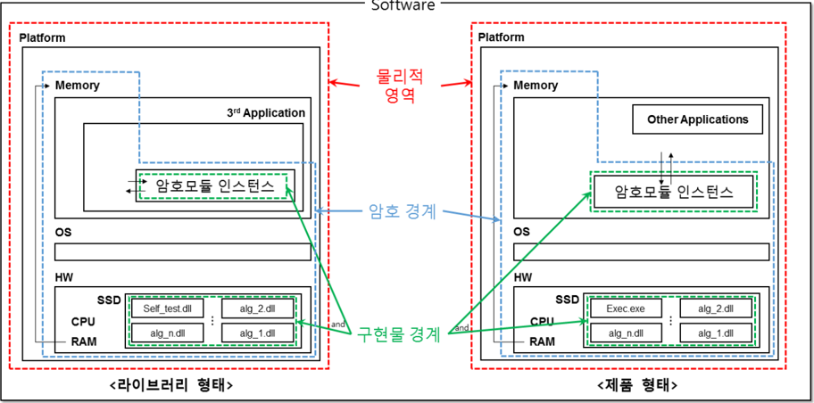

## [펌웨어  암호모듈]

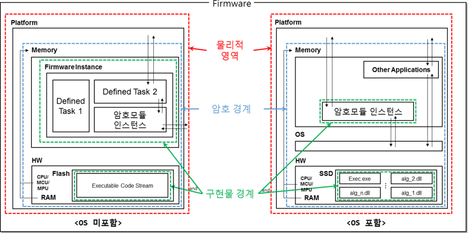

[하드웨어  암호모듈]

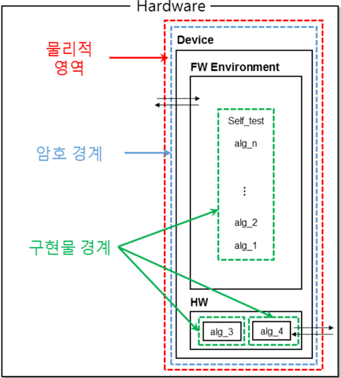

[하이브리드  소프트웨어  암호모듈]

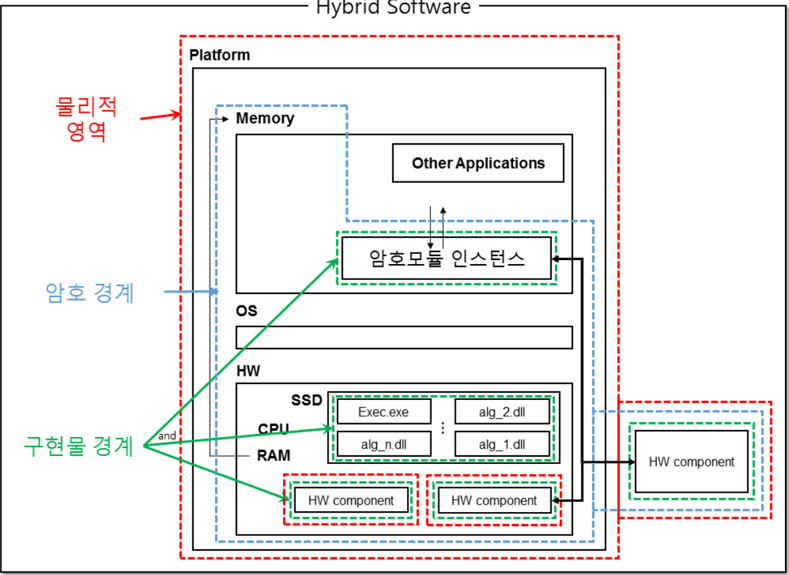

## [하이브리드  펌웨어  암호모듈]

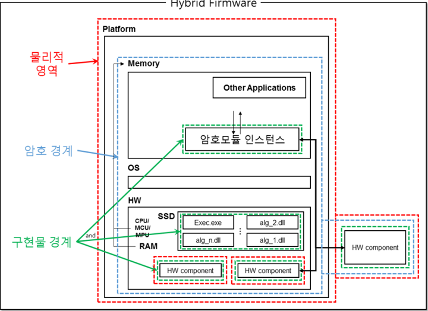

- ∎ 운영환경(Operational  Environment)은  OS  뿐만  아니라  하드웨어  플랫폼도  포함되므로,  기본  및  상세설계서와  시험  결과 보고서에  암호모듈의  운영환경을  명세할  때는  '암호  경계'  내부에  포함되는  [OS와  하드웨어(예:  CPU/MCU,  RAM, SSD/HDD  등)]  구성요소에  대한  상세  정보를  모두  명세해야  한다.

## 2.2  다중  검증대상  동작모드

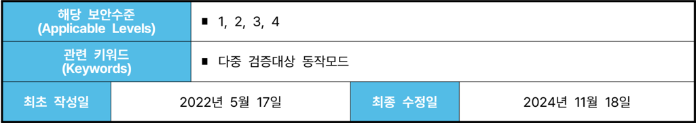

| 해당 보안수준 (Applicable Levels)   | 해당 보안수준 (Applicable Levels)   | ∎ 1, 2, 3, 4           | ∎ 1, 2, 3, 4           |
|-------------------------------------|-------------------------------------|------------------------|------------------------|
| 관련 키워드 (Keywords) ∎            | 관련 키워드 (Keywords) ∎            | 다중 검증대상 동작모드 | 다중 검증대상 동작모드 |
| 최초 작성일                         | 2022년 5월 17일                     | 최종 수정일            | 2024년 11월 18일       |

## 배경

- ∎ [KS  X  ISO/IEC  19790]  7.2.4절에서  암호모듈을  단일  검증대상  동작모드로만  제한하고  있지  않기  때문에  모듈은 복수  개의  검증대상  동작모드로  설계될  수  있다.
- ∘ 예를  들어,  하나의  검증대상  동작모드에서는  모든  함수,  서비스,  CSP를  사용하고  다른  검증대상  동작모드에서는 일부만  사용하도록  구현할  수  있다.

## 질문

- ∎ 복수  개의  검증대상  동작모드를  갖는  암호모듈을  구현해도  되는가?  가능한  경우  요구사항은  무엇인가?

## 답변

- ∎ 다음  조건을  만족하는  경우  복수  개의  검증대상  동작모드를  갖는  암호모듈을  구현할  수  있다.
- ∘ 보안정책서가 각각의 검증대상 동작모드에 대해 다음 정보들을 포함해야 한다.
-  각  검증대상  동작모드에  대한  정의
-  각  검증대상  동작모드  설정  방법
-  각  검증대상  동작모드에서  이용  가능한  서비스
-  각  검증대상  동작모드에서  사용되는  알고리즘
-  각  검증대상  동작모드에서  사용되는  CSP
-  각  검증대상  동작모드에서  수행되는  자가시험
- ∘ 하나의 검증대상 동작모드에서 다른 검증대상 동작모드로 전환될 때 마다 암호모듈은 재초기화되고 전환된 검증대상 동작모드에  해당하는  모든  동작  전  자가시험과  조건부  자가시험을  수행해야  한다.
-  전환된  검증대상  동작모드에  정의된  모든  동작  전  자가시험을  수행해야  한다.
-  전환된  검증대상  동작모드에서  보호함수가  처음  호출되는  경우  조건부  암호알고리즘  시험을  수행해야  한다. (이전  검증대상  동작모드에서  수행된  자가시험  결과는  초기화  된다)

## 2.3  H/W  암호모듈  부품별  시험  요구사항  적용  방법

| 해당 보안수준 (Applicable Levels)   | 해당 보안수준 (Applicable Levels)   | ∎ 1, 2, 3, 4              | ∎ 1, 2, 3, 4              | ∎ 1, 2, 3, 4              |
|-------------------------------------|-------------------------------------|---------------------------|---------------------------|---------------------------|
| 관련 키워드 (Keywords)              | 관련 키워드 (Keywords)              | ∎ 암호모듈 명세 관련 항목 | ∎ 암호모듈 명세 관련 항목 | ∎ 암호모듈 명세 관련 항목 |
| 최초 작성일                         | 2022년 5월 17일                     | 2022년 5월 17일           | 최종 수정일               | 2022년 5월 17일           |

## 배경

- ∎ KCMVP에서는 암호모듈 검증을 진행할 때 개발 문서 및 구성 요소의 소스코드 검토 이후, 시험 대상 암호모듈의 서비 스  정상  수행  및  정상  동작  여부를  확인하기  위한  동작시험을  수행한다.
- ∎ 암호모듈에서 제공하는 모든 서비스와 오류처리에 관련된 동작을 시험하기 때문에 시나리오 수립과 운영환경에 따른 시험환경  구성에  많은  자원의  투입이  필수적이다.
- ∎ 위와 관련하여, S/W 형태의 암호모듈의 경우 운영환경의 차이가 연산 및 메모리 관리 등 직접적인 영향을 끼치는 부분이 많 아  각각의  운영환경에 따른 모든 동작시험을 수행해야 하는 것이 맞지만, 직접적인 영향을 끼치지 않는 차이점이 존재할 수 있는  F/W,  H/W  형태의  암호모듈에도  똑같은  기준이  적용되어야  하는지  여부에  대한  문의사항이  업체로부터  존재하였다.
-  간단한 예시로 기존의 기준을 따른다면 저장장치(HDD)의 용량만 다른(512GB/1TB) 두 형상의 다중칩 독립형 암호모듈 은  동작에  큰  차이가  없음에도  불구하고  모든  동작시험을  똑같이  수행해야  한다.

## 질문

- ∎ 업체에서 여러 종류의 형상을 갖는(내부 부품의 차이에 따른) H/W 암호모듈을 하나의 암호모듈 버전으로써 시험하고, 같은  암호모듈명으로  효력을  보유하고자  하는  경우  각  종류에  대한  모든  동작시험이  필수적으로  진행되어야  하는가?
- ∎ 만약 각 차이점에 따라 갈음되거나 생략될 수 있는 시험 요구사항들이 존재한다면 그 차이점의 기준은 무엇이며, 해당 시험  요구사항의  종류에는  어떤  것들이  있는가?

## 답변

- ∎ 본  항목에서는  암호모듈에  적용되는  각  세부  부품에  기반하여  동일한  동작시험을  생략할  수  있는  확인  기준을  별도로 제공하며,  관련된  간단한  구분은  아래  표와  같다.

| 메모리/저장장치       | · HDD, SSD, DRAM, NAND, NOR, ROM, ODD, USB 등   |
|-----------------------|-------------------------------------------------|
| 동작 보조장치         | · 전원, 환풍기(fan) 등                          |
| 인터페이스 장치       | · 포트 개수, line card 개수 등                  |
| 인터페이스 장치       | · 시리얼 포트(RS232 등), SAS, SATA, eSATA 등    |
| 인터페이스 장치       | · Fiber Optic, FCoe, 이더넷, DVI, USB 등        |
| 연산 및 설계 보조장치 | · CAVS, CPLD, FPGA, PAL 등                      |
|                       | 패키징 · 핀 개수, 패키지 타입 등                |

- ∎ 각 항목에 따라 암호모듈에 적용되는 각 세부 부품별로 유형을 분류할 수 있으며, 해당 유형에 따라 아래의 시험 방법이 정해진다.

| 구분      | 설명                                                                                                                                                                                   |
|-----------|----------------------------------------------------------------------------------------------------------------------------------------------------------------------------------------|
| 비교 시험 | 각 항목에 해당하는 '다른' 세부 부품이 실제로 존재하는지 여부에 대해서만 확인하고, 하나의 부품에 대 한 모든 동작시험이 이루어졌을 경우 다른 부품에 대한 동작시험을 모두 생략할 수 있다. |
| 별도 시험 | 각 항목에 해당하는 '다른' 세부 부품이 실제로 존재하는지 여부를 확인하고, 기존 부품에 시험되었던 모 든 동작시험을 별도로 수행해야 한다.                                                 |

## ∎ 예시

- ∘ 두  암호모듈의  HDD  용량만  상이한  경우,  '비교  시험'  유형에  해당한다.
- ∘ 두  암호모듈이  하나는  HDD,  하나는  SSD를  장착한  경우,  '별도  시험'  유형에  해당한다.

## 2.4  프로세서  가속  기능(PAA/PAI)

| 해당 보안수준 (Applicable Levels)   | 해당 보안수준 (Applicable Levels)   | ∎ 1, 2, 3, 4                                                                     | ∎ 1, 2, 3, 4                                                                     |
|-------------------------------------|-------------------------------------|----------------------------------------------------------------------------------|----------------------------------------------------------------------------------|
| 관련 키워드 (Keywords)              | 관련 키워드 (Keywords)              | ∎ Processor Algorithm Accelerator(PAA) ∎ Processor Algorithm Implementation(PAI) | ∎ Processor Algorithm Accelerator(PAA) ∎ Processor Algorithm Implementation(PAI) |
| 최초 작성일                         | 2024년 9월 13일                     | 2024년 9월 13일                                                                  | 2024년 11월 18일                                                                 |

## 배경

- ∎ 칩(Chip) 제조 기술이 발전하면서, 단일 칩 프로세서 제조업체가 암호 알고리즘을 지원하기 위한 가속 기능을 자사 칩에 추가하여  제공하고  있음
- ∘ 해당  가속  기능이  검증대상  암호  알고리즘으로 선정된  각  알고리즘의  표준을 따르는  완전한  암호  알고리즘을  구현한 것인지  아니면  단순히  수학적  연산의  가속  기능을  구현한  것인지  판별해야  함
- ∎ 가속 기능이 완전한 암호 알고리즘을 구현한 경우, 해당 요소는 보안 관련 하드웨어 구성요소로 분류되므로 벤더는 HDL을 포함한  전체  구성  요소에  대한  완전한  자료(문서  및  소스코드)를  시험기관에  제출해야  함.  이러한  유형의  구현물은 PAI(Processor  Algorithm  Implementation)로  취급됨
- ∎ 가속 기능이 수학적 구성의 단순한 가속 기능인 경우 해당 요소는 보안 관련 하드웨어 구성요소로 분류되지 않음. 따라서, HDL을 포함한 전체 구성요소에 대한 자료(문서 및 소스코드) 제출이 필수적으로 요구되지 않음. 이러한 유형의 구현물은 PAA(Processor  Algorithm  Accelerator)로  취급됨

## 질문

- ∎ 가속  기능이  PAA  또는  PAI로  분류되기  위한  하드웨어  구성요소의  조건은  무엇인가?
- ∎ 가속  기능이  PAA  또는  PAI  중  어디에  해당하는지  구분하는  기준은  무엇인가?  PAA  또는  PAI  시험을  수행하기  위해 벤더가  제출해야  하는  자료는  무엇인가?
- ∎ PAA 또는 PAI 기능을 활용하는 암호모듈은 어떤 유형으로 분류되며, 이러한 기능을 활용한다는 정보를 어떻게 명세해야 하는가?

## 답변

-  하드웨어로  구현된  모든  가속  기능이  PAA  또는  PAI에  해당하는  것은  아니다.  일반적으로  범용  컴퓨터의  중앙처리장치 (CPU)와  같이 프로세서라 칭할 수 있는 단일 칩 내부에 하드웨어 가속 기능이 포함(구현)된 경우, PAA 또는 PAI로 분류 될  수  있다.
-  완전한  암호  알고리즘을  구현(from  Input  to  Output)한  PAI와  달리  PAA는  가속  기능의  구현  범위가  제한되어  있지 않다.  PAI에  해당하는  구현  범위의  일부분을  구현한  경우에는  모두  PAA로  취급될  수  있다.  PAI는  기본적으로  HDL을 포함한 전체 구성요소에 대한 자료(문서 및 소스코드)의 제출이 요구되지만, PAA는 이러한 자료의 제출이 요구되지 않는다.
-  그러나,  가속  기능이  PAA로  분류되는  경우라  하더라도  해당  PAA에  암호모듈의  CSP가  직접  입력되는  경우에는  보안 관련  하드웨어  구성요소로  분류되므로  구성  요소에  대한  관련  자료를  제출해야  한다.  업체는  ①  관련  자료를  제출하고 사용  가능한  모든  부분에  PAA를  적용하거나,  ②  관련  자료  제출없이  알고리즘의  일부분에만  PAA를  적용할  수  있다.
-  만약  암호모듈이  PAA  또는  PAI  기능을  포함하는  프로세서  칩과  같은  하드웨어  구성요소를  활용하도록  설계되었으면, 벤더는 해당 하드웨어 구성요소의 정보(운영환경에 해당)를 개발문서에 명세해야 한다. 이러한 프로세서 가속 기능을 활용 하는  소프트웨어/펌웨어  암호모듈은  다음과  같이  [소프트웨어/펌웨어  모듈]로  정의된다.

-  암호모듈의  소프트웨어 또는 펌웨어 구성요소가 자체적으로 암호 알고리즘을 지원함과 동시에 PAA/PAI 기능을 활용한 동작이 가능한 경우(PAA 또는 PAI 기능이 사용 불가한 경우에도 암호 알고리즘이 동작하는 경우), 또는 PAA/PAI 기능만을 활용하여 암호 알고리즘이 동작하도록 구현되어 있는 경우(PAA 또는 PAI 기능이 없으면 암호 알고리즘이 동작하지  않는  경우)  모두  해당  암호모듈은  소프트웨어/펌웨어  모듈로  정의된다.
-  기본  및  상세설계서와 시험결과보고서에 모듈의 운영환경 관련 정보를 명세할 때 PAA 및 PAI 관련 하드웨어 구성 요소의  정보가  반드시  포함되어야  한다.
-  가속  기능이  지원되는 알고리즘은 [소프트웨어/펌웨어 구성요소에 의한 동작] 및 [PAA 및 PAI 기능에 의한 동작]이 모두  시험되어야  한다.
-  기본  및  상세설계서와  시험결과보고서에 다음 예시와 같은 내용이 모듈의 운영환경 관련 정보에 포함되어야 한다. ①  PAA인  경우

[PAA  기능만을  활용하여  암호  알고리즘이  동작하는  경우]

예시)  본  암호모듈은  PAA  기능을  사용한  &lt;Platform&gt;  상에서  동작하는  &lt;OS&gt;에서  실행되어  보안수준  X를  충족하는 것으로  시험됨

예시)  본  암호모듈은  &lt;Hardware&gt;의  PAA  기능을  사용하여  보안수준  X를  충족하는  것으로  시험됨

[자체적인  알고리즘을  지원함과  동시에  PAA  기능을  활용하는  동작이  가능한  경우]

예시)  본  암호모듈은  PAA  기능을  사용한  &lt;Platform&gt;  상에서  동작하는  &lt;OS&gt;에서  실행되어  보안수준  X를  충족하는 것으로 시험됨. 또한 본 암호모듈은 PAA 기능을 사용하지 않은 &lt;Platform&gt; 상에서 동작하는 &lt;OS&gt;에서 실행되어 보안수준 X를  충족하는  것으로  시험됨

예시) 본 암호모듈은 &lt;Hardware&gt;의 PAA 기능을 사용하여 보안수준 X를 충족하는 것으로 시험됨. 또한 본 암호모듈은 &lt;Hardware&gt;의  PAA  기능을  사용하지  않도록  실행되어  보안수준  X를  충족하는  것으로  시험됨

## ②  PAI인  경우

[PAI  기능만을  활용하여  암호  알고리즘이  동작하는  경우]

예시) 본 암호모듈은 PAI 기능을 사용한 &lt;Platform&gt; 상에서 동작하는 &lt;OS&gt;에서 실행되어 보안수준 X를 충족하는 것으로 시험됨

예시)  본  암호모듈은  &lt;Hardware&gt;의  PAI  기능을  사용하여  보안수준  X를  충족하는  것으로  시험됨

[자체적인  알고리즘을  지원함과  동시에  PAI  기능을  활용하는  동작이  가능한  경우]

예시) 본 암호모듈은 PAI 기능을 사용한 &lt;Platform&gt; 상에서 동작하는 &lt;OS&gt;에서 실행되어 보안수준 X를 충족하는 것으로 시험됨. 또한 본 암호모듈은 PAI 기능을 사용하지 않은 &lt;Platform&gt; 상에서 동작하는 &lt;OS&gt;에서 실행되어 보안 수준  X를  충족하는  것으로  시험됨

예시)  본  암호모듈은  &lt;Hardware&gt;의  PAI  기능을  사용하여  보안수준  X를  충족하는  것으로  시험됨.  또한  본  암호모듈은 &lt;Hardware&gt;의  PAI  기능을  사용하지  않도록  실행되어  보안수준  X를  충족하는  것으로  시험됨

-  프로세서  제조업체가  가속  기능을  지원하기  위해  디바이스  드라이버를  제공할  수도  있는데,  해당  디바이스  드라이버는 PAA  또는  PAI를  호출/사용하기 위한  역할  외에  PAA 또는  PAI의 정의된  동작에  영향을  미칠  수  있는 추가적인  기능을 제공하면  안된다.

3.2  내용추가  예정

## 3장  암호모듈  인터페이스

GVI Part  1

Guide  for Vendor Implementations

## 4장  역할,  서비스  및  인증

4.1  인가받은  역할 4.2  다중  운영자  인증  메커니즘 4.3  동시  운영자 4.4  우회기능 4.5  운영체제  인증  메커니즘  활용

## 4.1  인가받은  역할

| 해당 보안수준 (Applicable Levels)   | 해당 보안수준 (Applicable Levels)   | ∎ 2, 3, 4                              | ∎ 2, 3, 4                              |
|-------------------------------------|-------------------------------------|----------------------------------------|----------------------------------------|
| 관련 키워드 (Keywords)              | 관련 키워드 (Keywords)              | ∎ 인가된 역할 ∎ 인증이 필요없는 서비스 | ∎ 인가된 역할 ∎ 인증이 필요없는 서비스 |
| 최초 작성일                         | 2022년 5월 17일                     | 2022년 5월 17일                        | 2022년 5월 17일                        |

## 배경

- ∎ [KS  X  ISO/IEC  19790]  7.4.1  역할,  서비스  및  인증  일반  요구사항에  따라  암호모듈은  운영자에게  인가된  역할을 지원함과 동시에 각 역할에 대응하는 서비스를 제공해야 한다. 만약 모듈의 보안에 영향을 주지 않는 서비스를 수행하는 경우에는  인가된  역할을  맡을  필요가  없다.
- ∎ [KS  X  ISO/IEC  19790]  7.4.4  인증  요구사항에  따라  운영자가  암호모듈  내  역할  담당  및  서비스  수행에  대한  인가 여부를  검증하기  위해  인증  메커니즘이  필요할  수  있다.
- ∎ [KS  X  ISO/IEC  24759]  AS04.03에  따라  [KS  X  ISO/IEC  19790]  부속서  A.2.4를  충족하는  개발  문서가 제출되어야  한다.
-  암호모듈이  지원하는  모든  인가받은  역할과  서비스간의  관계
-  특이사항  (예:  인가받은  역할이  필요하지  않은  서비스)
- ∎ [KS  X  ISO/IEC  19790]  7.9.1  중요  보안매개변수  관리 일반 요구사항에 따라, CSP는 인가되지 않은 접근, 사용, 노출, 변경  및  대체로부터  보호되어야  하며  PSP는  인가되지  않은  변경과  대체로부터  보호되어야  한다.

## 질문

- ∎ 검증대상 동작모드에서, 보안수준 2, 3, 4에 해당하는 암호모듈이 제공하는 서비스들 중 운영자의 인증을 요구하지 않 는 (암호모듈에 정의된 특정 역할을 부여받을 때 인증이 필요하지 않은 역할에서 수행할 수 있는) 서비스에는 어떤 것들 이  있는가?

## 답변

- ∎ [KS  X  ISO/IEC  19790]은  '인가된(Authorized)'  역할에  대해  다루고  있다.  인가된  역할은  암호모듈에  의해  정의된 모든 역할이다. 이러한 (정의된) 역할들 중 일부는 운영자에게 해당 역할을 맡을 권한이 부여되기 전에 운영자의 인증을 요구할  수  있다.
- ∎ 암호모듈의  서비스를  수행하려면  반드시  역할이  부여되어야  한다.  본  GVI  항목은  일부  역할이  인증을  요구하지  않는 상태로 유지될 수 있는 조건을 설명하는 것이다. [KS X ISO/IEC 19790]에서 "특정 서비스를 수행하기 위해 운영자가 인가된  역할을  맡을  필요가  없다"라고  명시한  것은,  보안수준  2  이상의  검증필  암호모듈에서  본  GVI  항목에  명시된 서비스를  수행하기  위한  역할이  운영자의  인증을  요구하지  않을  수  있다는  것을  의미한다.
- ∎ 보안수준  2  이상에  해당하는  암호모듈의  검증대상  동작모드에서,  아래의  서비스를  제외한  다른  모든  (검증대상  보안 기능을  활용하는)  서비스를  사용하기  위해  역할이  부여될  때  운영자는  반드시  인증되어야  한다.
1.  해시  알고리즘  (SHA-2,  LSH,  SHA-3)
2.  DRBG  (만약  동일한  DRBG  서비스 구현물이 인증된 운영자에게도 제공될 경우, DRBG에 입력되는 엔트로피 소스는 암호모듈의 구현물 경계(Materialization Boundary) 내에서 암호모듈이 직접 생성한 것이거나 암호 경계(Cryptographic

Boundary) 內 운영환경에 포함되어 있는 알려진 엔트로피 소스여야 한다. 미인증 운영자가 엔트로피를 암호모듈의 경계(Cryptographic  Boundary)  밖에서  입력할  수  있다면  이는  암호모듈의  CSP로  관리되는  DRBG의  내부  상태 정보값에  직접적인  영향력을  행사할  수  있는  것이며,  동일한  DRBG  서비스를  사용하는  인증된  사용자의  보안성이 손실(loss)되거나  약화(weakening)되는  결과를  야기하는  것이기  때문이다.

3.  전자서명  검증
4.  운영자  인증을  수행하기  위한  인증  절차  그리고/또는  운영자의  인증데이터를  설정하기  위한  초기화  절차
5.  운영자가  CSP를  변경,  노출  또는  대체하는  것을  허용하지  않고,  모듈  또는  모듈에  의해  보호되는  정보의  보안에 영향을  미치지  않는  서비스들  (예:  상태  표시,  자가시험  및  기타  서비스)
4. ∎ 즉,  인증이  요구되지  않는  역할을  부여받은  운영자에게  상기  명시된  서비스들(모듈의  [CSP를  생성,  노출,  변경  및 대체하지  않는]  그리고/또는  [PSP를  변경  및  대체하지  않는]  서비스들)이  제공될  수  있다.
5. ∎ 상기  명시된  서비스  리스트의  항목  5에  인증되지  않은  운영자에게  제공될  수  있는  서비스는  모듈의  CSP를  변경하지 않아야  한다고  명시되어  있다.  그러나  이  규칙은  다음과  같은  예외를  허용한다.  검증대상  난수발생기는  인증을  요구하지 않는 역할이나 비검증대상 서비스를 포함하는 다른 역할에 의해 사용될 수 있다. DRBG 서비스 호출은 암호모듈의 CSP로 관리되는  DRBG의  내부  상태정보  값을  변경시킨다.  그러나,  이러한  변경으로  인해  CSP의  보안성이  손실(loss)되거나 약화(weakening)되지  않기  때문에,  이와  같은  간접적인  CSP의  변경은  허용된다.
6. ∎ [KS  X  ISO/IEC  19790]의  7.9.7  요구사항에  의해  수행되는  암호모듈의  보호되지  않은  SSP에  대한  제로화는  이러한 보안  파라미터의  "변경"으로  보지  않는다.  따라서,  보호되지  않는  SSP에  대한  제로화  서비스는  인증을  요구하지  않는 역할에  의해  수행될  수  있다.

## 4.2  다중  운영자  인증  메커니즘

| 해당 보안수준 (Applicable Levels)   | 해당 보안수준 (Applicable Levels)   | ∎ 2, 3, 4                                       | ∎ 2, 3, 4                                       |
|-------------------------------------|-------------------------------------|-------------------------------------------------|-------------------------------------------------|
| 관련 키워드 (Keywords)              | 관련 키워드 (Keywords)              | ∎ 운영자 인증 ∎ 역할 기반 인증 ∎ 신원 기반 인증 | ∎ 운영자 인증 ∎ 역할 기반 인증 ∎ 신원 기반 인증 |
| 최초 작성일                         | 2022년 5월 17일                     | 2022년 5월 17일                                 | 2022년 5월 17일                                 |

## 배경

- ∎ [KS  X  ISO/IEC  24759]  AS04.01에  따라,  암호모듈은  인가받은  역할과  상응하는  서비스를  제공해야  한다.
- ∎ [KS  X  ISO/IEC  24759]  AS04.36과  AS04.37에  따라,  역할  기반  인증  메커니즘은  암시적  또는  명시적으로  선택된 역할을  부여하고  확인해야  한다.
- ∎ [KS  X  ISO/IEC  24759]  AS04.39과  AS04.40,  AS04.41에  따라,  신원  기반  인증  메커니즘은  개별적이고  유일하게 식별된  운영자에게  암시적  또는  명시적으로  선택된  역할을  부여하고  확인해야  한다.

## 질문

- ∎ 암호모듈이  운영자  역할  별로  다른  인증  메커니즘을  적용하여  다음과  같이  구현할  수  있다.
- (예시  1)  관리자  역할은  신원  기반  인증  사용,  사용자  역할은  역할  기반  인증  사용
- (예시  2)  관리자  역할은  역할  기반  인증,  사용자  역할은  인증  사용  안함
- (예시  3-1)  관리자  및  사용자  역할에  대해  역할  기반  인증과  신원  기반  인증  동시  지원
- (예시  3-2)  동일한  역할에  대해  어떤  운영자는  역할  기반  인증,  다른  운영자는  신원  기반  인증  사용
- ∎ 이러한  구현  방법이  시험  기준을  준수하는  것인가?  만약  준수하는  것이라면,  상기  케이스  별  암호모듈은  어떤  등급의 보안수준으로 검증받을 수  있는가?

## 답변

- ∎ (예시  1),  (예시  2),  (예시  3)의  경우  모두  시험기준을  만족하는  것으로  판단  가능하다.
- ∘ (예시 1)의 경우, 신원 기반 인증 메커니즘의 요구사항이 역할 기반 인증 요구사항을 모두 포함하는 것으로 간주된다. 따라서 (예시 1)의 암호모듈은 보안수준 2를 만족한다. (역할 기반 및 신원 기반 인증 메커니즘이 동시 지원될 경우, 낮은  보안수준을  따르는  것이  합리적)
- ∘ (예시  2)의  경우,  만약  사용자  역할이  암호모듈의 보안에 영향을 미치는 어떠한 서비스도 호출하지 않는 경우에는 보 안수준 2를 만족한다. 이러한 서비스의 정의는 본 GVI 4-1을 참고한다 (GVI 4-1은 검증대상 보안 서비스 수행을 위 한  인가된  역할과  인증이  필요없는  서비스에  대해  다룬다).  그렇지  않을  경우,  암호모듈은  보안수준  1에  해당된다.
- ∘ (예시  3)의  경우,  암호모듈은  보안수준  2에  해당된다.  시험기관은  각  역할을  보안수준  2로  바라보고  다루어야  한다. 또한,  보안정책서는  각  역할에  대해  인증이  어떻게  수행되는지  반드시  명세해야  한다.
- ∎ 상기  명시된  케이스  외에도  다른  혼합된  구현  케이스들이  존재할  수  있다.  이러한  다양한  구현  케이스들을  어떻게 처리해야하며  또  시험기준에  따른  암호모듈의  보안수준은  몇에  해당하는지  결정하기  위한  충분한  정보가  본  GVI 항목에 담겨있다. 예를 들어, 사용자 역할은 역할 기반 인증과 신원 기반 인증을 동시에 지원하고 관리자 역할은 신원 기반  인증만  지원하는  경우,  암호모듈은  보안수준  2로만  검증  받을  수  있다.  그러나  만약  사용자  역할이  GVI  4-1에 명시된 모듈의 보안에 영향을 미치지 않는 서비스들만 호출하는 케이스에 해당하면, 암호모듈은 보안수준 3으로도 검증 가능하다.

- ∎ 동일한 역할에 대해(예시 3의 경우) 또는 다른 역할에 대해(예시 1의 경우) 역할 기반 인증과 신원 기반 인증이 동시에 지원되는 경우,  시험기관은  암호모듈  시험보고서를  작성할  때  역할  기반  인증(보안수준  2)와  신원  기반  인증(보안수준 3)에  해당하는  시험  항목을  모두  다루어야  한다  (시험은  높은  보안수준으로,  검증  결과는  낮은  보안수준으로).

## 4.3  동시  운영자

| 해당 보안수준 (Applicable Levels)   | 해당 보안수준 (Applicable Levels)   | ∎ 1, 2, 3, 4                                      | ∎ 1, 2, 3, 4                                      |
|-------------------------------------|-------------------------------------|---------------------------------------------------|---------------------------------------------------|
| 관련 키워드 (Keywords)              | 관련 키워드 (Keywords)              | ∎ 복수 운영자 ∎ 동시 운영자 (Concurrent Operator) | ∎ 복수 운영자 ∎ 동시 운영자 (Concurrent Operator) |
| 최초 작성일                         | 2022년 5월 17일                     | 2022년 5월 17일                                   | 2022년 5월 17일                                   |

## 배경

- ∎ [KS  X  ISO/IEC  19790]  7.4.1  역할,  서비스  및  인증  일반  요구사항에 따라 다수의  운영주체가 암호모듈을 동시에 이용 하는  것을  지원하는  경우  암호모듈은  각  운영주체를  분리하여  동작할  수  있어야  한다.
- ∎ [KS  X  ISO/IEC  24759]  AS04.02에  따라  다음의  내용이  개발문서에  작성되어야  한다.
-  다수의  운영주체에  대한  암호모듈  동시  이용  허용  여부
-  동시에  암호모듈을  이용하는  다수의  운영주체를  분리하는  방법과  모든  제한사항

## 질문

- ∎ [KS  X  ISO/IEC  19790]과  [KS  X  ISO/IEC  24759]의  복수  운영자는  다수의  운영자를  의미하는가?

## 답변

- ∎ [KS  X  ISO/IEC  19790]과  [KS  X  ISO/IEC  24759]  시험기준의  '복수  운영자'는  다수의  운영자(Multiple  Operator)가 아닌  동시  운영자(Concurrent  Operator)를  의미한다.  즉,  동시  운영자(Concurrent  Operators)는  특정  시점에 암호모듈을  동시에  이용하는  다수의  운영주체를  의미하며,  아래  예시와  같은  케이스가  존재할  수  있다.
- 1)  둘  이상의  운영주체자가  서로  다른  역할을  부여받아  동시에  암호모듈을  이용하는  경우
- 2)  둘  이상의  운영주체가  동일한  역할을  부여받아  동시에  암호모듈을  이용  +  운영주체  간  자원  공유  없음
- 3)  둘  이상의  운영주체가  동일한  역할을  부여받아  동시에  암호모듈을  이용  +  운영주체  간  일부  자원  공유
- ∎ 상기  명시된  케이스  외에  동시  운영자를  지원하는  다른  형태의  암호모듈  설계가  존재할  수  있다.  동시  운영자의  정의 및  설정은  벤더의  암호모듈  설계  방식에  달려있다.  어떤  형태로  동시  운영자가  정의되는지와  무관하게,  암호모듈은 반드시  자체적으로  다수의  운영주체를  구분할  수  있도록  설계  및  구현되어야  한다.
- ∎ 벤더는  AS04.02의  요구사항에  따라,  ①  동시  운영자가  암호모듈을  동시에  이용하는  것을  허용하는  방법을  명세하고, ②  설계  방식을  준수하기  위해  각  운영주체  별로  할당되어  있는  인가된  역할  및  서비스를  분리하는  방법을  서술하고, ③ 동시에 이용하는 다수의 운영주체에 대한 모든 제한사항을 서술해야 한다. 시험기관은 벤더의 개발 문서와 동일하게 암호모듈이 동작하는지 확인하기 위해, 정의된 제한사항을 위반하는 행위의 가능 여부를 시험해야 하고 이를 방지하는 제한  조치를  암호모듈이  수행하고  있는지  확인해야  한다.
- ∎ 운영자란  역할을  부여받아  작업을  수행하는  주체로써,  이  때  동시  운영자의  정의와  구현  방식,  그에  따른  암호모듈의 제한사항은  벤더의  설계를  따른다.

## 4.4  우회기능

| 해당 보안수준 (Applicable Levels)   | 해당 보안수준 (Applicable Levels)   | ∎ 1, 2, 3, 4    | ∎ 1, 2, 3, 4   | ∎ 1, 2, 3, 4    |
|-------------------------------------|-------------------------------------|-----------------|----------------|-----------------|
| 관련 키워드 (Keywords)              | 관련 키워드 (Keywords)              | ∎ 우회기능      | ∎ 우회기능     | ∎ 우회기능      |
| 최초 작성일                         | 2022년 5월 17일                     | 2022년 5월 17일 | 최종 수정일    | 2022년 5월 17일 |

## 배경

- ∎ [KS  X  ISO/IEC  24759]  AS04.18에  따라  암호모듈이  특정 데이터나 상태값을 보호되거나 보호되지 않은 형태로 출력 하는  기능을  모두  지원하고,  이들  중  하나를  선택하여  출력할  수  있다면  우회  기능이  정의되어  있어야  한다.

## 질문

- ∎ 우회  기능이란  무엇인가?

## 답변

- ∎ [KS  X  ISO/IEC  19790]에  따른  우회  기능의  정의는  다음과  같다.

## 우회  기능  (bypass  capability)  :

부분적  암호  기능  또는  전체적  암호  기능을  우회할  수  있는  서비스  기능

- ∎ 즉,  우회  기능이란  "암호모듈이  제공하는  암호  기반의  서비스(모든  동작,  서비스,  기능)가  일반적으로  수행되는  절차 (참조  표준  혹은  정상동작  상태에서  정의된  절차  등)에  따라  수행되지  않고,  암호  기능을  부분적  혹은  전체적으로 생략할  수  있는  기능"을  말한다.  우회  기능의  대상  및  행위는  벤더가  설정하는  것이며,  우회  기능과  관련된  보안 요구사항의 적용  방법은  벤더의  설계를  따른다.
- ∎ 암호모듈이 제공하는 암호 기반의 서비스는 우회 기능만 구현되어 존재할 수도 있고, 우회 기능이 전혀 구현되어 있지 않을  수도  있다.

## 4.5  운영체제  인증  메커니즘  활용

| 해당 보안수준 (Applicable Levels)   | 해당 보안수준 (Applicable Levels)   | ∎ 1, 2                       | ∎ 1, 2                       |
|-------------------------------------|-------------------------------------|------------------------------|------------------------------|
| 관련 키워드 (Keywords)              | 관련 키워드 (Keywords)              | ∎ 소프트웨어 암호모듈 ∎ 인증 | ∎ 소프트웨어 암호모듈 ∎ 인증 |
| 최초 작성일                         | 2024년 9월 13일                     | 2024년 9월 13일              | 2024년 11월 18일             |

## 배경

- ∎ 모듈에 접근하는 운영자를 인증하거나, 운영자가 요청한 역할을 부여받고 정의된 서비스를 수행할 수 있도록 인가받았음을 검증하기  위해  인증  메커니즘이  사용될  수  있다.
- ∎ 소프트웨어  암호모듈은  보안수준에  따라  다음과  같은  인증  메커니즘을  구현해야  한다.

-  보안수준  1  :  인증  메커니즘이  요구되지  않음

-  보안수준  2  :  (최소)  역할  기반  인증  메커니즘

## 질문

- ∎ 소프트웨어 암호모듈은 암호모듈에 직접 인증 메커니즘을 구현하는 대신 운영체제에 구현된 인증 메커니즘을 활용할 수 있는가?

## 답변

-  소프트웨어  암호모듈은  운영체제에  구현된  인증  메커니즘을  활용할  수  있다.
-  이  경우,  운영체제에  구현된  인증  메커니즘은 '[KS  X  ISO/IEC  19790]  7.4.4  인증'  요구사항을  만족해야  하며,  개발 업체는  각  보안요구사항에서  요구되는  상세  내용을  '암호모듈에  직접  인증  메커니즘을  구현한  경우'와  같은  수준으로 명세하여  시험기관에  제출할  수  있어야  한다.
-  현재 소프트웨어 암호모듈이 부여받을 수 있는 보안수준은 2가 최대이나, 소프트웨어 암호모듈이 역할 기반 인증 메커니즘 만을 구현해야 하는 것은 아니다. '역할, 서비스 및 인증'에서 보안수준 3, 4를 만족할 수 있으므로 신원 기반 인증 또는 다중체계  신원  기반  인증을  구현할  수  있다.

## 5장  소프트웨어/펌웨어  보안

암호모듈  구현안내서

5.1  내용추가  예정 GVI Part  1

Guide  for Vendor Implementations

26

## 6장  운영환경

암호모듈  구현안내서

6.1  내용추가  예정 GVI Part  1

Guide  for Vendor Implementations

28

## 7장  물리적  보안

7.1  보안수준  2  이상의  HW  암호모듈  탐침  방지  시험  방법 7.2  탬퍼  증거  봉인  및  코팅  시험  방법 7.3  보안수준  3  이상의  코팅  시험  방법

7.4  보안수준  2  이하의  EFP/EFT  시험  방법

## 7.1  보안수준  2  이상의  HW  암호모듈  탐침  방지  시험  방법

| 해당 보안수준 (Applicable Levels)   | 해당 보안수준 (Applicable Levels)   | ∎ 2, 3, 4                        | ∎ 2, 3, 4                        |
|-------------------------------------|-------------------------------------|----------------------------------|----------------------------------|
| 관련 키워드 (Keywords)              | 관련 키워드 (Keywords)              | ∎ 물리적 보안 탐침 관련 요구사항 | ∎ 물리적 보안 탐침 관련 요구사항 |
| 최초 작성일                         | 2022년 5월 17일                     | 최종 수정일                      | 2022년 5월 17일                  |

## 배경

- ∎ [KS  X  ISO/IEC  24759]에서  정의한  다중칩  독립형  암호모듈의  형상을  갖는  암호모듈의  경우,  일반적으로  모듈  자체에 환기구  및  틈이  존재할  수  있다.
- ∘ 다중칩  독립형  암호모듈  예시:  HSM,  라우터  등의  외장을  갖는  기기  형태
- ∎ 탬퍼  증거  라벨과  같은  기법으로  외부로부터의  비인가  접근을  방지하는  시험  요구사항이  존재하지만,  해당  환기구  및 틈은  근원적으로  취약점을  가질  수  있다.
- ∘ 위와 관련하여 암호모듈의 외장은 '불투명' 해야 하고 외부로부터의 '탐침'이 불가능해야 한다는 시험기준이 존재하지 만  '불투명',  '탐침'에  대한  용어  정의가  불분명하여  시험  내용을  파악하기  어렵다는  업체  의견  존재

## 질문

- ∎ 보안수준  2  이상의  암호모듈에  대해서는  가시광선  파장  범위(400nm  ~  750nm)에서  육안으로  확인이  불가능한 불투명한 변조-증거 물질, 코팅 혹은 봉함이 적용되어야 한다고 요구하고 있다. 이러한 경우, 일반적으로 구성된 외장의 환기구  및  틈을  통하여  내부가  육안으로  확인될  수  있는  가능성에  대해서는  시험하지  않는가?
- ∎ 보안수준 3 이상의 암호모듈에 대해서는 환기구 및 틈새에 대한 '한 개 이상의 연계 탐침기'를 사용해 외장 내부에 대한 탐침  불가능을  시험하는  요구사항이  존재한다.  그렇다면  보안수준  3  이상을  만족하지  않는  암호모듈은  환기구와  틈이 가질 수 있는 잠재적인 취약점에 대하여 보완할 수 없는 것인지, 관련된 '탐침' 행위를 필수적으로 방지하지 않아도 되는 것인가?

## 답변

- ∎ 아래는 [(KS X) ISO/IEC 24759]에서 보안수준 2 이상의 다중칩 독립형 암호모듈에 대하여 요구하는 '불투명'과 관련된 요구사항이다.
- ∘ 가시광선  영역은  400nm  ~  750nm  파장  범위를  의미하며,  육안으로  식별  가능  여부에  준한다.
- ∎ 위에  언급된  바와  같이,  시험기준에서는  이미  다중칩  독립형  형상의  암호모듈이  환기구와  틈과  같은  개폐부가  존재할 가능성에 대해 고려하고 있으며, '불투명' 성질에 대해서도 정의하고 있다. 따라서, 본 항목에서는 관련된 시험 요구사항 및  용어  정의에  대해  아래와  같이  결론을  내린다.
- ∎ Probing(탐침)  관련  시험  요구사항
- ∘ 보안수준 2 이상의 암호모듈에 대하여, 암호모듈에 환기구 및 틈이 존재하는 경우 (별도의 도구를 사용하지 않은) 직 접적인  육안  관찰을  통해  외장  내부의  구조,  구성요소(IC  등)  정보를  수집할  수  없어야  한다.
- ∘ 시험자가 별도의 도구를 사용하지 않고 시험을 수행하여 내부에 대한 정보 파악이 가능한 경우, 해당 시험은 실패한 것으로  간주한다.

| 요구사항   | · 상용 등급의 금속 혹은 단단한 플라스틱으로 제작된 외장은 개폐부가 적용될 수도 있다.   |
|------------|----------------------------------------------------------------------------------------|
| 요구사항   | · 암호모듈의 외장은 가시광선 영역에서 불투명해야 한다.                                 |

- ※  별도의 시험 도구(예: 한 개 이상의 연계 탐침기기 등)를 사용하는 probing(탐침)과 관련된 시험 요구사항은 보안 수준  3  이상에서  요구하는  항목에  대해서만  시험을  진행한다.
- ∎ Opacity(불투명)  관련  시험  요구사항
- ∘ '불투명'  해야  한다는  시험  요구사항의  존재의의는 외장 내부의 암호모듈 내부 구성요소 및 회로 구성에 대한 육안으 로의  확인  가능  여부  판단에  있다.
- ∘ 따라서,  시험  기준에  대한  해석  시  '불투명'  특성의  판단은  인위적  광원(손전등)  등으로  암호모듈  외장의  환기구  및 틈을 비추어도 내부 구성요소의 IC type 및 회로에 대해 식별이 불가능한 경우 '불투명' 하다고 판정할 수 있다고 보 아야  한다.
- ※  위에서  언급된  내부  구성요소의 경우 메모리, LDO,  LED와 같은 내부의 모든 구성요소를 의미하며, 모든 요소에 대해  동일하게  '불투명'  특성을  시험한다.

## 7.2  탬퍼  증거  봉인  및  코팅  시험  방법

| 해당 보안수준 (Applicable Levels)   | 해당 보안수준 (Applicable Levels)   | ∎ 2, 3, 4                              | ∎ 2, 3, 4                              |
|-------------------------------------|-------------------------------------|----------------------------------------|----------------------------------------|
| 관련 키워드 (Keywords)              | 관련 키워드 (Keywords)              | ∎ 탬퍼 증거 봉인 및 코팅 관련 요구사항 | ∎ 탬퍼 증거 봉인 및 코팅 관련 요구사항 |
| 최초 작성일                         | 2022년 5월                          | 2022년 5월                             | 2022년 5월 17일                        |

## 배경

- ∎ [KS  X  ISO/IEC  24759]에서는  암호모듈에  적용될  수  있는  탬퍼  증거  봉인  및  코팅에  대하여  아래와  같은  보안  요구사 항을  정의하고  있다.
- ∘ 탬퍼  증거:  외부로부터의  비인가  접근이  존재한  경우,  그와  관련된  증거를  남기는  특성(예:  라벨)
- ∎ 위의 기준에 따르면 탬퍼 증거 봉인 및 라벨에 대한 시험 세부 프로세스가 불분명하여 적용 시 어려움이 있다는 업체 의견이  존재한다.

## 질문

- ∎ 탬퍼  증거  봉인  및  코팅에  대해  시험기관에서  시험을  진행하는  경우,  그  세부적인  프로세스와  기준은  어떻게  되는가?

## 답변

- ∎ 탬퍼  증거  봉인  및  코팅에  대하여  시험을  진행하는  경우,  아래의  시험  방법  및  결과  판정  기준에  의거하여  수행  및 판단을  진행한다.
- ∘ 암호모듈에 탬퍼 증거 라벨이 적용된 경우, 해당 라벨에 대한 제거 및 교체 시도 시 반드시 탬퍼 증거를 남겨야 한다.
- → 시험  중  라벨이  증거  없이  제거  및  교체가  성공한  경우,  시험  실패로  간주한다.
- → 시험  중  제거  및  교체  시도에서  증거를  남기거나  손상된  경우,  시험  성공으로  간주한다.
- ∘ 암호모듈 배포 이후, 보안정책서에 명시된 라벨의 위치와 시험대상 암호모듈에 부착된 라벨의 위치가 상이한 경우, 이 는  명백한  라벨  제거  혹은  교체  시도의  증거로  간주되어야  한다.
- ∘ 시험기관은 탬퍼 증거 라벨의 성능 시험을 위해 증거를 남기지 않고 제거 및 교체하기 위한 별도의 시험 절차(화학적, 기계적)를  보유하며,  이는  공정성을  위해  공개하지  않는다.

## 7.3  보안수준  3  이상의  코팅  시험  방법

| 해당 보안수준 (Applicable Levels)   | 해당 보안수준 (Applicable Levels)   | ∎ 3, 4                         | ∎ 3, 4                         |
|-------------------------------------|-------------------------------------|--------------------------------|--------------------------------|
| 관련 키워드 (Keywords)              | 관련 키워드 (Keywords)              | ∎ 탬퍼 증거 코팅 관련 요구사항 | ∎ 탬퍼 증거 코팅 관련 요구사항 |
| 최초 작성일                         | 2022년 5월 17일                     | 2022년 5월 17일                | 2022년 5월 17일                |

## 배경

- ∎ [KS  X  ISO/IEC  24759]에서  보안수준 3  이상의  경우,  암호모듈에 적용된 탬퍼 증거 코팅에 대한 시험 요구사항에 '강 도  및  경도'가  높아야  한다는  특성을  요구한다.
- ∎ 위와 관련하여, 일반적인 용어인 '강도 및 경도'에 대해서는 [KS X ISO/IEC 19790]에서 하드/경도를 물리적으로 강하고 견 고하며  내구력이  있는  상태로  정의하고  있다.
- ∎ 위의 기준에 따르면 단순히 '강도 및 경도 가 높아야 한다'라는 요구사항은 너무 포괄적이며, 시험 요구사항 충족을 위해 암호모듈에 코팅을 적용할  때  보다  자세한  정보가  필요하다.

## 질문

- ∎ 보안수준  3  이상의  암호모듈을  대상으로  코팅에  대한  시험을  진행할  때,  '강도  또는  경도가  높음'을  판단하기  위해 어떠한 종류의 시험이 어떠한 방식으로 수행되는가? 개발업체는 해당 시험을 만족하기 위하여 자체적으로 어떤 시험을 수행해볼  수  있는가?

## 답변

- ∎ 보안수준 3  이상  암호모듈의  탬퍼  증거  코팅에  대한  시험은  별도의  '기계'를  사용하지  않은  '시험자'의  힘을  기준으로 수행한다. 관련된 시험 방법으로는 아래의 정의된 각 분류에 대해 최소 한 가지씩 시험을 수행하며, 모두 통과한 경우에 해당  시험을  성공으로  간주한다.
- ∘ 코팅 물질 아래의 회로에 도달하기 위하여 정의된 시험 도구(송곳, 뾰족한 도구 등)를 사용해 '기계'를 사용하지 않은 '시험자'의  힘으로  코팅  물질을 관통하려는  시험 →  드릴  및  그라인더와  같은  전자동  장비는  '기계'  분류에  속하므로 고려하지  않음
- ∘ 정의된 시험 도구를 사용해 '기계'를 사용하지 않은 '시험자'의 힘으로 코팅 물질을 암호모듈에서 벗겨내거나 파괴하려 는  시험  →  전동  밀대와  같은  전자동  장비는  '기계'로  분류하여  고려하지  않음
- ∘ 암호모듈에  적용된  코팅  물질을  구부리거나  늘이려는  시험
- ∎ 시험이 수행되는 도중 '시험자'는 시험 대상 암호모듈을 지속적으로 확인하여 손상이 발생했는지 여부를 확인해야 하며, 암호모듈이  심하게  손상되어  정상  동작이  불가한  경우  해당  시험을  성공으로  간주한다.
- ∘ 해당  시험은  암호모듈이  동작하는  일반적인  온도,  전압에서  수행되어야  한다.
- ∎ 관련된 시험 요구사항과 별개로 '시험자'는 시험 수행 이전 암호모듈에 에폭시 혹은 코팅 물질이 도포되는 과정에서 기포 및  공간이  발생했는지  여부를  확인해야  하며,  접근이  가능할  정도의  기포  및  공간이  있는  경우  해당  시험을  실패로 간주한다.

## 7.4  보안수준  2  이하의  EFP/EFT  시험  방법

| 해당 보안수준 (Applicable Levels)   | 해당 보안수준 (Applicable Levels)   | ∎ 1, 2                  | ∎ 1, 2                  | ∎ 1, 2                  |
|-------------------------------------|-------------------------------------|-------------------------|-------------------------|-------------------------|
| 관련 키워드 (Keywords)              | 관련 키워드 (Keywords)              | ∎ EFP/EFT 관련 요구사항 | ∎ EFP/EFT 관련 요구사항 | ∎ EFP/EFT 관련 요구사항 |
| 최초 작성일                         | 2022년 5월 17일                     | 2022년 5월 17일         | 최종 수정일             | 2022년 5월 17일         |

## 배경

- ∎ [KS  X  ISO/IEC  24759]에서는  보안수준  3  이상인  암호모듈에  대해  환경장애보호(EFP)  특성  혹은  환경장애시험(EFT) 특성을  만족하도록  요구하고  있다.
- ∘ 보안수준  3,  4의  경우:  환경장애보호(EFP)  특성을  충족하거나  환경장애시험(EFT)를  충족
- ∘ 보안수준  4의  경우:  환경장애보호(EFP)  특성  적용해야  함
- ∎ 그러나  일반적인  산업  표준을  만족하여  하드웨어  제품을  개발하는  경우  자연스럽게  EFP  혹은  EFT  특성을  만족하도록 설계될 수 있으며, 이러한 경우 보안수준이 2 이하일 때에는 해당 시험기준을 만족함에도 따로 표기할 방법이 없다는 업 체의  문제  제기가  있었다.
- ∎ 따라서,  관련  내용에  대한  표기  방안에  대한  가이드라인이  필요하다고  판단된다.

## 질문

- ∎ EFP/EFT  특성은  보안수준  3  이상의  암호모듈에  요구되는  보안  요구사항이지만,  만약  보안수준  2  이하의  암호모듈이 EFP/EFT  특성을  만족한다면 해당 내용에 대한 시험 신청이 가능한가? 가능하고 만족한다면, 해당 내용에 대한 표기는 어떻게  작성해야  하는가?
- ∎ 위에  대한  질문을  해결하기  위하여,  KCMVP에서는  관련된  시험항목과  방법에  대해  다음과  같이  가이드하고자  한다.

## 답변

- ∎ KCMVP  제도에서는  목표로  하는  보안수준보다  상위  단계의  보안수준에서  요구하는  시험  요구사항을  만족한  경우, 관련된  항목에  대해  요구사항을  확대  적용할  수  있도록  하고  있다.
- ∘ 즉,  보안수준  2  이하의  물리적  보안을  갖더라도,  EFP/EFT  관련  요구사항을  확대  적용할  수  있다.
- ∘ 단,  EFP/EFT  특징을  확대  적용한 경우, 해당 항목과 관련된 내용은 '기타 공격에 대한 대응' 항목에 표기할 수 있도 록  한다.

## 8장  비침투  보안

암호모듈  구현안내서

8.1  내용추가  예정 GVI Part  1

Guide  for Vendor Implementations

36

## 9장  중요  보안매개변수  관리

9.1  소수  생성방법 9.2  엔트로피  관련  보안정책서  안내문구 9.3  중요보안매개변수(SSP)  관리표  작성  방법 9.4  SSP  저장  방법 9.5  난수발생기가  지원해야  하는  최대  보안강도

## 9.1  소수  생성방법

| 해당 보안수준 (Applicable Levels)   | 해당 보안수준 (Applicable Levels)   | ∎ 1, 2, 3, 4                  | ∎ 1, 2, 3, 4                  |
|-------------------------------------|-------------------------------------|-------------------------------|-------------------------------|
| 관련 키워드 (Keywords) ∎            | 관련 키워드 (Keywords) ∎            | 소수 생성방법 ∎ 소수 판정방법 | 소수 생성방법 ∎ 소수 판정방법 |
| 최초 작성일                         | 2022년 5월 17일                     | 최종 수정일                   | 2024년 11월 18일              |

## 배경

- ∎ 검증대상 암호알고리즘인 RSAES, RSA-PSS 표준에는 암/복호화, 서명 생성/검증과 관련된 요구사항은 기술되어 있지만 키  생성과  관련된  요구사항은  기술되어  있지  않다.
- ∘ 구체적으로  소수  p,  q에  대한  길이  제한만  있을  뿐  소수  생성하는  방법에  대한  요구사항은  기술되어  있지  않다.

## 질문

- ∎ RSA  또는  다른  검증대상  암호알고리즘에서  소수를  생성하는  경우  어떠한  생성방법을  사용해야  하는가?

## 답변

- ∎ 현재  KCMVP  제도에서는  [암호알고리즘  구현안내서]를  통해  확률적인  소수  p,  q  생성방법을  안내하고  있으며  소수 판정을  위해  밀러-라빈  소수  판정법을  사용하고  있다.  본  GVI  항목에서는  확률적인  소수  생성방법  이  외에  소수를 생성할  수  있는  추가적인  방법을  안내하고자  한다.
- ∘ FIPS  186-5  또는  ANSI  X  9.80에  제안된  아래의  소수  생성방법  또한  사용  가능하다.
- 1)  증명  가능한(Provable)  Primes: 
- 2)  확률적인(Probable)  Primes:  (현재  사용하고  있는  확률적인  소수  생성방식)
- 3)  증명  가능한(Provable)  보조  소수             를  활용한  증명  가능한(Provable)  Primes: 
- 4)  증명  가능한(Provable)  보조  소수             를  활용한  확률적인(Probable)  Primes: 
- 5)  확률적인(Probable)  보조  소수             를  활용한  확률적인(Probable)  Primes: 
*  [Primes  with  Conditions]                  
- ∘ 위  표준에서  확률적인  소수를  생성하는  경우,  밀러-라빈  소수  판정법  이외의  다른  소수  판정법도  명시하고  있지만 현재  KCMVP  제도에서는  밀러-라빈  소수  판정법만을  허용한다.
- ∎ 밀러-라빈 소수 판정법 구현 시 대상 소수의 크기가 2048 비트인 경우 56회, 3072 비트인  경우 64회의 밀러-라빈 소수  판정을  수행해야  한다.  이산로그문제기반  암호에서  키  또는  파라미터  생성  시  소수를  생성해야  하는  경우  또한 본  요구사항을  적용받는다.
- ∎ 보안정책서에 어떤 소수  생성방식으로  도메인  파라미터  혹은  키  쌍을  생성하는지  명세해야  한다.
- ∘ 증명  가능한  보조  소수를  활용한  증명  가능한  소수  생성방법을  통해  키  쌍을  생성한  경우
- ①  RSA  키  쌍의  소수  생성방법:  Primes  with  conditions
-  FIPS  186-5  A.1.4(Provable  prime  with  conditions  based  on  auxiliary  provable  primes)
-  적용  대상:  RSAES  2048(SHA2-256),  RSA-PSS  3072(SHA2-256)

## 9.2  엔트로피  관련  보안정책서  안내문구

| 해당 보안수준 (Applicable Levels)   | 해당 보안수준 (Applicable Levels)   | ∎ 1, 2, 3, 4                                                    | ∎ 1, 2, 3, 4                                                    |
|-------------------------------------|-------------------------------------|-----------------------------------------------------------------|-----------------------------------------------------------------|
| 관련 키워드 (Keywords)              | 관련 키워드 (Keywords)              | ∎ 난수발생기, 씨드, 잡음원, 엔트로피, 보안강도, 키 ∎ 보안정책서 | ∎ 난수발생기, 씨드, 잡음원, 엔트로피, 보안강도, 키 ∎ 보안정책서 |
| 최초 작성일                         | 2022년 5월 17일                     | 2022년 5월 17일                                                 | 2022년 5월 17일                                                 |

## 배경

- ∎ 암호모듈이 제공하는 키 생성, 난수 생성 서비스 등의 안전성을 평가하기 위하여 시험자는 암호모듈에 탑재된 검증대상 난수발생기의 보안강도를 확인해야 하며, 이를  위해  DRBG  씨드  구성에  사용되는  잡음원의  엔트로피를  평가한다.
- ∎ 하지만 일부 암호모듈은 잡음원을 직접 호출·운영하지 않고 운영자로부터 씨드 자체 또는 씨드 구성용 데이터를 전달받 아 동작하도록 설계되며, 이 경우 시험자는 암호모듈이 제공하는 키 생성, 난수 생성 서비스에 대한 안전성을 평가할 수 없다.
- ∘ API를  통해  운영자로부터  씨드를  입력받는  소프트웨어  암호모듈
- ∘ 키  생성  등  암호  서비스에  필요한  난수  자체를  전용  포트를  통해  주입받는  하드웨어  암호모듈

## 질문

- ∎ 암호모듈이 능동적으로 잡음원을 동작시켜 엔트로피를 수집하는 경우, 엔트로피 평가 등의 시험이 요구됩니다. 반면, 암 호모듈이  엔트로피를  외부로부터  전달받는  경우,  위  시험이  적용되지  않습니다.
- ∎ 암호모듈의 능동적 엔트로피 수집 여부와 상관없이, 검증필 암호모듈이 제공하는 키 생성, 난수 생성 서비스 등의 보안 강도는  112-비트(2022년  5월  기준  KCMVP  보안강도)인가?
- ∎ 만약 암호모듈의 능동적 엔트로피 수집 여부에 따라 보안강도가 다르다면, 엔트로피 평가 결과와 관련하여 보안정책서에 포함되어야  하는  정보는  무엇인가?

## 답변

- ∎ 엔트로피  관련  보안정책서  안내문구  작성  시  일반사항은  다음과  같다.
- ∘ 암호모듈이  씨드  구성용  잡음원을  직접  호출·운영하는  경우,  TTAK.KO-12.0235  및  TTAK.KO-12.0341  표준에 따라  난수발생기  및  잡음원  관련  시험이  수행된다.
- ∘ 암호모듈이  제공하는  키  생성,  난수  생성  등  엔트로피와  관련된  모든  서비스의  보안강도를  보안정책서에  명세해야 한다.
- ∘ 만약  암호모듈이  엔트로피를  능동적으로  수집하지  않고,  사용자로부터  전달받아  동작하는  경우에는  아래의  내용에 따라  해당되는  경고문구를  보안정책서에  반드시  명세해야  한다.
- ∘ 경고  사항이  둘  이상  적용되는  경우에는  가장  보수적인  문구를  사용해야  한다.
- ∎ 암호경계  내에서  엔트로피를  자체  생성하거나  운영환경으로부터  직접  수집하는  암호모듈 의  시험  내용  및  경고  사항은 다음과  같다.
- ∘ 암호모듈  예시
- 1)  암호경계  내의  TRNG를  사용하여  씨드를  구성하는  하드웨어  암호모듈
- 2)  운영환경이  제공하는  시스템  함수를  직접  호출하여  사용하는  소프트웨어  암호모듈

- ∘ 시험  내용
- 1)  잡음원의  엔트로피  및  난수발생기의  보안강도  평가
- 2)  보안정책서에  키  생성  및  난수  생성  서비스의  최소  보안강도  명세
-  만약  보안강도가  112  미만인  경우,  검증  불가
-  만약  보안강도가  112  이상이지만  알고리즘  보안강도를  충족하지  못하는  경우,  경고  사항  명세 예시)  난수발생기  보안강도  평가  결과가  128비트의  엔트로피를  가지는  경우

이  암호모듈이  생성하는  키의  보안강도는  128로  제한된다.

- ∎ 어떠한  제어도  없이  수동적으로  엔트로피를  전달받는  암호모듈 에  대한  시험  내용과  경고  사항은  다음과  같다.
- ∘ 암호모듈  예시
- 1)  사용자로부터  API를  통해  씨드를  전달받는  소프트웨어  암호모듈
- 2)  암호경계  외부로부터  I/O  포트를  통해  씨드를  전달받는  하드웨어  암호모듈
- ∘ 시험  내용
- 1)  외부  엔트로피  전달에  사용되는  데이터  필드  크기  확인
- ※  만약  데이터  필드의  크기가  112-비트  엔트로피  제공이  불가능할  정도로  작다면,  검증  불가
- ① 예시1)  외부에서 Full  Entropy를  가지는  데이터가  전달될  수  있는  환경이라면,  데이터  필드 크기는  최소 112-비트  이상이어야  함
- ②  예시2)  외부에서  비트당  엔트로피가  0.5인  데이터가  전달될  수  있는  환경이라면,  데이터  필드  크기는 최소  224-비트  이상이어야  함
- 2)  보안정책서에  엔트로피  전달용  데이터  필드의  최소  크기  및  전달해야  하는  최소  엔트로피  명세

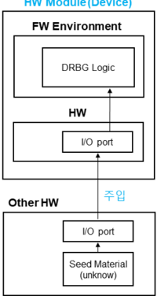

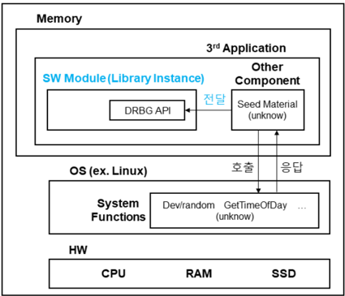

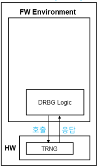

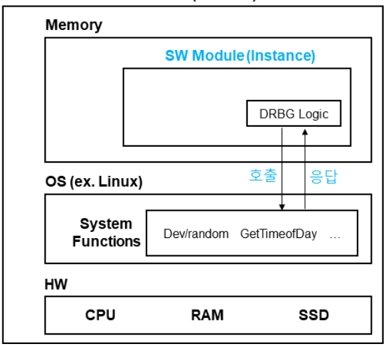

- 3)  보안정책서에  아래의  경고  사항  명세

이 암호모듈이 생성하는 난수 및 키의 보안강도는 암호모듈이 보증하지 않으며, 난수발생기 운영을 위해 운영자가 주입한 씨 드의 엔트로피에 의존한다. 운영자는 난수발생기 초기화 또는 리씨딩용 씨드를 TTAK.KO-12.0235 및 TTAK.KO-12.0341 에  준하여  목표  보안강도를  만족하도록  관리해야  하고,  이를  암호모듈에게  안전하게  전달해야  한다.

- ∎ 자체  생성  또는  직접  수집한  엔트로피와  외부에서  전달받은  엔트로피를  함께  사용하는  암호모듈 에  대한  시험  내용과 경고  사항은  다음과  같다.
- ∘ 암호모듈  예시
- 1)  암호경계  내의  TRNG를  사용해  엔트로피를  직접  수집하고  운영자가  추가적인  엔트로피를  입력할  수  있도록 별도의  물리적  포트를  제공하는  하드웨어  암호모듈
- ∘ 시험  내용 ⓐ :  외부에서  전달받은  엔트로피가  부가적인  요소로만  사용되는  경우
- 1)  암호모듈이  능동적으로  사용하는  잡음원의  엔트로피  평가
- 2)  외부  엔트로피  전달에  사용되는  데이터  필드  크기  확인
- ※  만약  내/외부  엔트로피를  통해  최소  112-비트  엔트로피  제공이  불가능하다면,  검증  불가
- 3)  보안정책서에  엔트로피  전달용  데이터  필드의  최소  크기  및  전달해야  하는  최소  엔트로피  명세
-  만약  내부에서  능동적으로  얻어진  엔트로피가  112  미만인  경우,  보안정책서에  아래의  경고  사항  명세

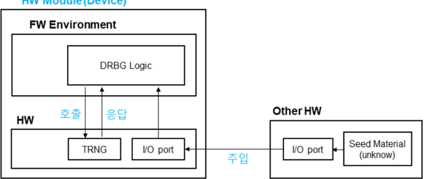

이 암호모듈이 생성하는 난수 및 키의 보안강도는 암호모듈이 보증하지 않으며, 난수발생기 운영을 위해 운영자가 주입 한  씨드의  엔트로피에  의존한다.  운영자는  난수발생기  초기화  또는  리씨딩용  씨드를  TTAK.KO-12.0235  및 TTAK.KO-12.0341에 준하여 목표 보안강도를 만족하도록 관리해야 하고, 이를 암호모듈에게 안전하게 전달해야 한다.

- ∘ 시험  내용 ⓑ :  외부에서  전달받은  엔트로피가  난수발생기  초기화  및  리씨딩  과정을  점유하는  경우
- 1)  외부  엔트로피  전달에  사용되는  데이터  필드  크기  확인
- ※  만약  데이터  필드의  크기가  112-비트  엔트로피  제공이  불가능할  정도로  작다면,  검증  불가
- 2)  보안정책서에  엔트로피  전달용  데이터  필드의  최소  크기  및  전달해야  하는  최소  엔트로피  명세
- 3)  보안정책서에  아래의  경고  사항  명세

엔트로피를 외부로부터 전달받아 난수발생기를 초기화 또는 리씨딩하는 경우, 이 암호모듈이 생성하는 난수 및 키의 보안 강도는 암호모듈이 보증하지 않으며, 난수발생기 운영을 위해 운영자가 주입한 씨드의 엔트로피에 의존한다. 운영자는 난 수발생기 초기화 또는 리씨딩용 씨드를 TTAK.KO-12.0235 및 TTAK.KO-12.0341에 준하여 목표 보안강도를 만족하도 록  관리해야  하고,  이를  암호모듈에게  안전하게  전달해야  한다.

## 9.3  중요  보안매개변수(SSP)  관리  표  작성  방법

| 해당 보안수준 (Applicable Levels)   | ∎ 1, 2, 3, 4                             | ∎ 1, 2, 3, 4                             | ∎ 1, 2, 3, 4                             |
|-------------------------------------|------------------------------------------|------------------------------------------|------------------------------------------|
| 관련 키워드 (Keywords)              | ∎ SSP 생성/설정/주입 및 출력/저장/제로화 | ∎ SSP 생성/설정/주입 및 출력/저장/제로화 | ∎ SSP 생성/설정/주입 및 출력/저장/제로화 |
| 최초 작성일                         | 2022년 5월 17일                          | 최종 수정일                              | 2024년 11월 18일                         |

## 배경

- ∎ 중요  보안매개변수(SSP)는  핵심  보안매개변수(CSP)와  공개  보안매개변수(PSP)로  구성된다.
- ∎ SSP  관리에는  난수  발생기(RBG)와  SSP  생성,  SSP  합의,  SSP  주입/출력,  SSP  저장,  보호하지  않은  SSP  제로화를 포함한다.
- ∎ CSP는  암호모듈  내에서  인가되지  않은  접근,  사용,  노출,  변경  및  대체로부터  보호되어야  한다.
- ∎ PSP는  암호모듈  내에서  인가되지  않은  변경과  대체로부터  보호되어야  한다.
- ∎ 부속서  A.2.9에  명세된  요구사항을  충족하는  개발  문서가  제공되어야  한다.

## 질문

- ∎ SSP  관리의 여러 항목 중 암호모듈이 제공하는 기능이 어떤 항목에 해당하는지 어떻게 판단할 수 있는가? 기본 및 상세 설계서의  SSP  관리  표는  어떤  기준으로  작성해야  하는가?
- ∎ 어떤  행위가  SSP  주입/출력에  해당하는가?
- ∎ 보안  수준에  따라  가능한  SSP  설정(Establishment)  방법은  무엇인가?

## 답변

- ∎ 암호모듈의  기본  및  상세설계서의  SSP  관리  표는  다음과  같이  작성할  수  있다.
- ∘ 분류  항목에는  해당  중요보안매개변수가  포함되는  카테고리를  작성한다.  카테고리의  예로는  블록암호,  전자서명, 암호모듈관리 등을  들  수  있다.
- ∘ 중요  보안매개변수  항목에는  해당  중요보안매개변수의  종류를  작성한다.  예를  들면  ARIA  비밀키,  SEED  라운드키, 난수발생기  상태값  V,  C(Key)  등이  여기에  해당한다.
- ∘ 종류(CSP/PSP)  항목에는  해당  중요  보안매개변수가  CSP에  해당하는지  PSP에  해당하는지  작성한다.
- ∘ 생성  항목은  암호모듈에  [난수발생기  또는  유도  함수를  통해  해당하는  중요  보안매개변수를  생성하는  기능]이 존재하는  경우  체크한다.
- 예)  난수발생기로  생성된  값을  ARIA  비밀키로  사용하는  경우
- ∘ 합의/전송  항목은  암호모듈에  [SSP  합의(Agreement)  또는  SSP  전송(Transport)  기능을  통해  해당하는  중요 보안매개변수를 상호간 공유하는 기능]이 존재하는  경우  체크한다.

| 분류   | 중요 보안매개변수   | 종류(CSP/PSP)   | 생성   | 합의/전송   | 주입   | 출력   | 저장   | 제로화   |
|--------|---------------------|-----------------|--------|-------------|--------|--------|--------|----------|

| 분류     | 중요 보안매개변수   | 종류(CSP/PSP)   | 생성   | 합의/전송   | 주입   | 출력   | 저장   | 제로화   |
|----------|---------------------|-----------------|--------|-------------|--------|--------|--------|----------|
| 블록암호 | ARIA 비밀키         | CSP             | ㅇ     |             |        |        |        |          |

- 예)  SSP  합의  메커니즘을  통해  생성된  키를  ARIA  비밀키로  사용하는  경우
- ∘ 주입  항목은  암호모듈에  [직접적인(Direct)  또는  전자적인(Electronic)  방법을  사용한  중요  보안매개변수  주입 기능]이  존재하는  경우  체크한다.
- 예)  암호경계  외부에  존재하는  ARIA  비밀키를  키보드를  통해  수동  입력하는  기능이  존재하는  경우
- ∘ 출력  항목은  암호모듈에  [직접적인(Direct)  또는  전자적인(Electronic)  방법을  사용한  중요  보안매개변수  출력 기능]이  존재하는  경우  체크한다.
- 예)  ARIA  비밀키를  암호화하여  암호경계  외부로  내보내는  기능이  존재하는  경우
- ∘ 저장  항목은  암호모듈에  [전원이  인가되지  않은  상태에서  해당  중요  보안매개변수가  삭제되지  않고  유지되는  경우 또는  이러한  목적을  달성하기  위한  기능이  구현된  경우]에  체크한다.
- 예)  암호경계  내부의  비휘발성  메모리에  ARIA  비밀키를  저장하는  경우
- ∘ 제로화  항목은  암호모듈에  [중요  보안매개변수를  파기하기  위한  절차적  또는  운영적  제로화  기능]이  존재하는  경우 체크한다.
- 예)  ARIA  알고리즘에  사용된  구조체의  내부  데이터  제로화를  위한  서비스  API가  존재하는  경우
- ∎ SSP  주입은  '암호모듈의  암호경계(Cryptographic  Boundary)  내부로  SSP가  들어오는  것'이다.  이와  반대의  개념인 SSP  출력은 '암호모듈의 암호경계 외부로 SSP가 나가는 것'이다. SSP가 암호 경계를 기준으로 암호모듈의 내부/외부를 넘나든다면 SSP  주입/출력에  해당하므로  관련된  요구사항을  모두  만족해야  한다.
- ∎ 각  보안수준에  따라  암호모듈에서  사용  가능한  SSP  설정(Establishment)  방법은  다음과  같다.  SSP  설정은  대국의 암호모듈(또는 암호모듈 자신)과 동일한 키를 공유하기 위한 방법을 의미하며, 자동화된 설정 방법과 직접/전자적 방법을 통한 수동 주입 및 출력이 포함된다. 아래 표는 무선 연결에는 해당하지 않으며, 무선 연결의 경우에는 [KS X ISO/IEC 24759]의  AS09.18  요구사항을  따른다.

| 분류     | 중요 보안매개변수   | 종류(CSP/PSP)   | 생성   | 합의/전송   | 주입   | 출력   | 저장   | 제로화   |
|----------|---------------------|-----------------|--------|-------------|--------|--------|--------|----------|
| 블록암호 | ARIA 비밀키         | CSP             |        | ㅇ          |        |        |        |          |

| 분류     | 중요 보안매개변수   | 종류(CSP/PSP)   | 생성   | 합의/전송   | 주입   | 출력   | 저장   | 제로화   |
|----------|---------------------|-----------------|--------|-------------|--------|--------|--------|----------|
| 블록암호 | ARIA 비밀키         | CSP             |        |             | ㅇ     |        |        |          |

| 분류     | 중요 보안매개변수   | 종류(CSP/PSP)   | 생성   | 합의/전송   | 주입   | 출력   | 저장   | 제로화   |
|----------|---------------------|-----------------|--------|-------------|--------|--------|--------|----------|
| 블록암호 | ARIA 비밀키         | CSP             |        |             |        | ㅇ     |        |          |

| 분류     | 중요 보안매개변수   | 종류(CSP/PSP)   | 생성   | 합의/전송   | 주입   | 출력   | 저장   | 제로화   |
|----------|---------------------|-----------------|--------|-------------|--------|--------|--------|----------|
| 블록암호 | ARIA 비밀키         | CSP             |        |             |        |        | ㅇ     |          |

| 분류     | 중요 보안매개변수   | 종류(CSP/PSP)   | 생성   | 합의/전송   | 주입   | 출력   | 저장   | 제로화   |
|----------|---------------------|-----------------|--------|-------------|--------|--------|--------|----------|
| 블록암호 | ARIA 비밀키         | CSP             |        |             |        |        |        | ㅇ       |

| 보안수준      | 1               | 2               | 3             | 4             |
|---------------|-----------------|-----------------|---------------|---------------|
| SSP 설정 방법 | P/E/SA/ST/TC/SK | P/E/SA/ST/TC/SK | E/SA/ST/TC+SK | E/SA/ST/TC+SK |

∘

P  :  평문  상태의  SSP  주입/출력을  의미한다.  이  경우에는  SSP가  평문의  형태로  주입/출력될  수  있다.

- ∘

E  :  암호화된  상태의  SSP  주입/출력을  의미한다.  SSP는  암호화된  상태로  주입/출력될  수  있다.

- ∘ SA  :  자동화된  설정  방법을  사용할  때,  SSP  합의(Agreement)  방법을  의미한다.

- ∘ ST  :  자동화된  설정  방법을  사용할  때,  SSP  전송(Transport)  방법을  의미한다.

- ∘ TC  :  신뢰  채널을  의미한다.  SSP는  신뢰  채널을  통해  평문으로  주입/출력될  수  있다.

∘

SK  :  신뢰  채널을  이용하는  지식  분산  방법을  의미한다.  지식  분산  방법을  적용할  경우,  각  분산된  정보는  신뢰 채널을  통해  주입/출력되어야  한다.

- ∘ TC+SK  :  TC의  사용  조건과  SK의  사용  조건을  모두  고려해야  함을  의미한다  (TC  또는  SK를  개별로  표기하였을 때,  발생할  수  있는  오용을  방지하기  위함).  보안수준  3,  4에서  CSP는  평문의  형태로  신뢰채널을  통해 주입/출력될  수  있다.  그러나  만약  CSP가  비밀키/개인키에  해당한다면  (즉,  기타  다른  CSP는  해당하지 않음),  해당  CSP에는  지식  분산  방법이  적용되어야  한다.

## 9.4  SSP  저장  방법

| 해당 보안수준 (Applicable Levels)   | 해당 보안수준 (Applicable Levels)   | ∎ 1, 2, 3, 4               | ∎ 1, 2, 3, 4               |
|-------------------------------------|-------------------------------------|----------------------------|----------------------------|
| 관련 키워드 (Keywords) ∎            | 관련 키워드 (Keywords) ∎            | SSP 저장 방법, 인증 암호화 | SSP 저장 방법, 인증 암호화 |
| 최초 작성일                         | 2022년 5월 17일                     | 2022년 5월 17일            | 2024년 11월 18일           |

## 배경

- ∎ [KS  X  ISO/IEC  19790]  7.9.6  중요  보안매개변수  저장을  만족하기  위해  암호모듈은  모듈  내에  평문이나  암호화된 형태의  SSP(Sensitive  Security  Parameter)를  저장할  수  있다.
- ∎ [KS  X  ISO/IEC  24759]  AS09.28의  요구사항에  의해  암호모듈은  내부에  보호되지  않는  SSP  또는  키  구성  요소를 제로화하기 위한  방법을  제공해야  한다.

## 질문

- ∎ 평문이나  암호화된  형태로  저장할  수  있다는  표현의  의미는  무엇인가? SSP  저장  시  별도의  요구사항이  없다는  의미인가?  평문으로  SSP를  저장할  수  있는  경우는  어떠한  경우인가?
- ∎ SSP  제로화  요구사항을  고려할  때,  저장된  SSP에  대한  '보호(protected)'를  어떻게  정의하면  되는가?
- ∎ 저장된  SSP의  보호를  위해  검증대상  암호알고리즘을  사용한다면,  안전하게  보호되었다고  할  수  있는가? (예:  ARIA-CBC,  ARIA-CBC  +  HMAC,  GCM  등)

## 답변

-  SSP  저장에  대한  별도의  제약사항은  없다.  SSP는  평문  혹은  암호화된  형태로  암호모듈  내부에  저장될  수  있으며, AS09.01  및  AS09.02의  요구사항을  만족할  수  있으면  된다.
-  저장된  SSP가 고려할 수 있는 모든 조건(암호모듈의 전체 생명주기)에서 AS09.01 및 AS09.02 요구사항을 만족할 때, 이러한 SSP는 '보호(protected)'  되었다고  말할  수  있다.  SSP를  보호하기  위해  [암호학적인  보호  방법]  혹은  [기타 (물리적  그리고/또는  논리적)  방법]이  사용될  수  있다.
-  '보호(protected)'된  SSP는  제로화의 대상이 되지 않는다. '보호(protected)'되지 않은 SSP의 제로화 시험 및 방법은 제로화  요구사항을  적용받는다.
-  다음  중  한  가지를  만족할  경우  SSP  저장에  대한  '암호학적인  보호'로  판단한다.  만약  아래  정의되지  않은  방식으로  SSP 저장을  위한  '암호학적인  보호'를  주장할  경우,  이러한  SSP는  평문으로  간주되며  제로화의  대상이  된다.
- 1)  검증대상  암호알고리즘  중  인증암호화  운영모드(GCM,  CCM)를  사용한  경우
- 2)  ISO/IEC  11770-3  또는  RSAES를  활용한  경우

## 9.5  난수발생기가  지원해야  하는  최대  보안강도

| 해당 보안수준 (Applicable Levels)   | ∎ 1, 2, 3, 4               | ∎ 1, 2, 3, 4               | ∎ 1, 2, 3, 4               |
|-------------------------------------|----------------------------|----------------------------|----------------------------|
| 관련 키워드 (Keywords)              | ∎ DRBG ∎ Security Strength | ∎ DRBG ∎ Security Strength | ∎ DRBG ∎ Security Strength |
| 최초 작성일                         | 2025년 12월 5일            | 최종 수정일                | 2025년 12월 5일            |

## 배경

- ∎ 난수는 암호알고리즘의 키 생성, 전자서명 등 다양한 암호 서비스의 안전성에 직접적인 영향을 미치는 중요한 요소임. 따라서,  난수발생기의  보안강도는  암호  서비스의  목표  안전성을  만족할  수  있도록  적절하게  설정되어야  함
- ∎ 난수발생기는 초기화(Instantiation)  단계에서  요구  보안강도를  통해  생성되는  난수의  보안강도를  설정할  수  있음 ∘ 또는,  일부  난수발생기는  보안강도를  고정하여  항상  동일한  보안강도를  갖는  난수를  생성함
- ∎ 암호모듈에 구현된 ① 난수를 사용하는 암호알고리즘의 보안강도와 ② 난수발생기가 지원하는 최대 보안강도가 서로 상이한 경우,  암호모듈의  중요보안매개변수는  적절한  방법으로  관리되어야  함

## 질문

- ∎ 암호모듈에 난수발생기를 구현할 경우, 난수발생기가 반드시 지원해야 하는 최대 보안강도는 어떻게 결정되어야 하는가?

## 답변

-  암호모듈에  난수발생기를  구현할  경우,  난수발생기는  해당  암호모듈에  구현된  암호  서비스  중  난수발생기를  사용하는 암호  서비스의  최대  보안강도  이상을  갖는  난수  생성을  지원할  수  있도록  구현되어야  한다.
- ∘ 암호  서비스의  보안강도는  해당  서비스의  목적  및  기능,  사용  환경  등을  고려하여  벤더가  설정하는  것이며,  해당 서비스를 구현하는데 사용된 암호알고리즘 조합으로 결정되는 최대 보안강도 이상으로 설정될 수 없다.
-  난수발생기가  지원해야  하는  보안강도를  결정하는  예시는  다음과  같다. (Case  1)  암호모듈의  중요보안매개변수가  아래  표와  같이  관리되고  SSP  생성에  난수발생기를  사용한다면, 암호모듈에 구현된  난수발생기는  최대  256의  보안강도를  반드시  지원해야  한다.
- ※  만약 암호모듈에 구현된 난수발생기가 128 보안강도만을 지원한다면 이 암호모듈의 ARIA-256 암호시스템의 보안강도는 128로 평가되며,  이러한  정보는  반드시  보안정책서를  통해  안내되어야  한다.

| 분류     | 중요 보안매개변수   | 종류(CSP/PSP)   | 생성   | 합의/전송   | 주입   | 출력   | 저장   | 제로화   |
|----------|---------------------|-----------------|--------|-------------|--------|--------|--------|----------|
| 블록암호 | ARIA 128 비밀키     | CSP             | O      | X           | O      | X      | X      | X        |
| 블록암호 | ARIA 256 비밀키     | CSP             | O      | X           | O      | X      | X      | X        |
| ...      | ...                 | ...             | ...    | ...         | ...    | ...    | ...    | ...      |

(Case  2)  암호모듈의  중요보안매개변수가  아래  표와  같이  관리되고  SSP  생성에  난수발생기를  사용한다면, 암호모듈에  구현된  난수발생기는  최대  128의  보안강도를  반드시  지원해야  한다.

| 분류     | 중요 보안매개변수   | 종류(CSP/PSP)   | 생성   | 합의/전송   | 주입   | 출력   | 저장   | 제로화   |
|----------|---------------------|-----------------|--------|-------------|--------|--------|--------|----------|
| 블록암호 | ARIA 128 비밀키     | CSP             | O      | X           | O      | X      | X      | X        |
| 블록암호 | ARIA 256 비밀키     | CSP             | X      | X           | O      | X      | X      | X        |
| ...      | ...                 | ...             | ...    | ...         | ...    | ...    | ...    | ...      |

(Case  3)  암호모듈의  중요보안매개변수가 아래 표와 같이 관리되고 SSP 전송에 ISO/IEC 11770-3 비밀키 전송 메커니즘1 (비대칭 암호화 시스템: RSA-OAEP 3072)를 사용한다면, ARIA-256 암호시스템의 보안강도는 128로 평가 되며  암호모듈에  구현된  난수발생기는  최대  128의  보안강도를  반드시  지원해야  한다.

| 분류        | 중요 보안매개변수   | 종류(CSP/PSP)   | 생성   | 전송   | 주입   | 출력   | 저장   | 제로화   |
|-------------|---------------------|-----------------|--------|--------|--------|--------|--------|----------|
| 블록암호    | ARIA 128 비밀키     | CSP             | X      | O      | O      | X      | X      | X        |
| 블록암호    | ARIA 256 비밀키     | CSP             | X      | O      | O      | X      | X      | X        |
| 공개키 암호 | RSAES 3072 개인키   | CSP             | O      | X      | X      | X      | X      | X        |
| 공개키 암호 | RSAES 3072 공개키   | PSP             | O      | X      | X      | X      | X      | X        |
| ...         | ...                 | ...             | ...    | ...    | ...    | ...    | ...    | ...      |

-  벤더  및  시험기관은 중요보안매개변수 관리 방법과 함께 난수발생기를 사용하는 각 암호 서비스에 대한 보안강도 평가를 먼저 수행한 후, 암호모듈에 구현된 난수발생기가 각 암호 서비스의 보안강도 중 최대 보안강도 이상의 난수 생성을 지원 하는지  확인해야  한다.

GVI Part  1

Guide  for Vendor Implementations

## 10장  자가시험 10장  자가시험

10.1  조건부  암호알고리즘  시험  방법(KAT) 10.2  KAT  간소화  방법1  -  내부  알고리즘의  KAT 10.3  KAT  간소화  방법2  -  무결성  검사를  통한  KAT 10.4  라이브러리  형태  암호모듈의  동작  전  자가시험  방법 10.5  Non-reconfigurable  메모리 상의 구성요소에 대한 무결성 검증방법 10.6  소프트웨어/펌웨어  무결성  시험 10.1  조건부  암호알고리즘  시험  방법(KAT) 10.2  KAT  간소화  방법1  -  내부  알고리즘의  KAT 10.3  KAT  간소화  방법2  -  무결성  검사를  통한  KAT 10.4  라이브러리  형태  암호모듈의  동작  전  자가시험  방법 10.5  Non-reconfigurable  메모리  상의  구성요소에  대한  무결성  검증방법 10.6  소프트웨어/펌웨어  무결성  시험 10.7  조건부  암호키  쌍  일치시험 10.8  조건부  수동  주입  시험 10.9  주기적  자가시험

## 10.1  조건부  암호알고리즘  시험  방법(KAT)

| 해당 보안수준 (Applicable Levels)   | 해당 보안수준 (Applicable Levels)   | ∎ 1, 2, 3, 4                                                 | ∎ 1, 2, 3, 4                                                 | ∎ 1, 2, 3, 4                                                 |
|-------------------------------------|-------------------------------------|--------------------------------------------------------------|--------------------------------------------------------------|--------------------------------------------------------------|
| 관련 키워드 (Keywords)              | 관련 키워드 (Keywords)              | ∎ 암호알고리즘의 기지답안검사(KAT), 조건부 암호알고리즘 시험 | ∎ 암호알고리즘의 기지답안검사(KAT), 조건부 암호알고리즘 시험 | ∎ 암호알고리즘의 기지답안검사(KAT), 조건부 암호알고리즘 시험 |
| 최초 작성일                         | 2022년 5월 17일                     | 2022년 5월 17일                                              | 최종 수정일                                                  | 2024년 11월 18일                                             |

## 배경

- ∎ 암호알고리즘 시험은 모듈에 구현된 각 암호알고리즘의 모든 암호 기능에 대해  수행되어야 하며, 정해진  입력에 대해 올바른  출력이  나오는지  확인함으로써  시험통과  여부를  판단한다.
- ∎ 정해진  입력에  대해서  다양한  출력이  나올  수  있는  경우(예:  전자서명)  구현방식에  따라  KAT를  수행하거나  조건부 암호키  쌍  일치시험에  명시된  방법을  사용하여  암호알고리즘  시험을  수행할  수  있다.
- ∎ '비교  시험'을  통해  조건부  암호알고리즘  시험을  수행할  수  있으나  본  항목에서는  다루지  않는다.

## 질문

- ∎ 가역 연산이 있는 알고리즘에 대한 조건부 암호알고리즘 시험 요구사항은 무엇인가? 다양한 운영모드 및 키 길이를 지 원하는  경우의  요구사항은  무엇인가?
- ∎ 정해진  입력에  대해  다양한  출력이  가능한  공개키  알고리즘에  대한  조건부  암호알고리즘  시험  요구사항은  무엇인가?
- ∎ 조건부 암호키 쌍 일치시험에 명시된 방법으로 조건부 암호알고리즘 시험을 수행할 수 있는 알고리즘은 어떤 것이 있는가?

## 답변

- ∎ KCMVP 제도는 모든 암호알고리즘에 대하여 기본적으로 모든 키 길이, 모든 운영모드 및 옵션에 대해 조건부 암호알고리즘 시험을  수행하도록  요구한다.  단,  아래  암호알고리즘에  한하여  일부  시험을  제외할  수  있다.
- □  RSAES,  RSA-PSS,  KCDSA,  ECDSA,  EC-KCDSA,  DH,  ECDH  알고리즘
-  지원하는  가장  큰  공개키/파라미터  크기와  해시함수에  대해서만  자가시험을  수행하는  것이  가능함
- [예시]  RSAES  3072(SHA2-256),  RSAES  2048(SHA2-256),  RSAES  2048(SHA2-224)를  구현한  경우, RSAES  3072(SHA2-256)에  대해서만  시험  수행  가능
- [예시]  RSA-PSS  3072(SHA2-256),  RSA-PSS  2048(SHA2-256),  RSA-PSS  2048(SHA2-224)를  구현한  경우, RSA-PSS  3072(SHA2-256)에  대해서만  시험  수행  가능
- [예시]  KCDSA(2048,224)(SHA2-224),  KCDSA(2048,256)(SHA2-256),  KCDSA(3072,256)(SHA2-256)를 구현한  경우,  KCDSA(3072,256)(SHA2-256)에  대해서만  시험  수행  가능
- [예시]  P-224(SHA2-224),  P-256(SHA2-256),  K-283(SHA2-256),  B-233(SHA2-224),  B-233(SHA2-256)를 구현한  경우,  P-256(SHA2-256),  B-233(SHA2-256),  K-283(SHA2-256)에  대해서만  시험  수행  가능
- [예시]  DH(2048,224),  DH(3072,256)를  구현한  경우,  DH(3072,256)에  대해서만  시험  수행  가능
- [예시]  ECDH(P-224),  ECDH(P-256),  ECDH(B-283),  ECDH(K-233)을  구현한  경우, ECDH(P-256),  ECDH(B-283),  ECDH(K-233)에  대해서만  시험  수행  가능
- ∎ 가역  연산이  있는  암호알고리즘의  경우  전방향  함수,  역방향  함수  모두에  대해  자가시험을  수행해야  한다.
- ∎ KAT  시험을 통해 조건부 암호알고리즘 시험을 수행하는 경우 또는 정해진 키 쌍을 사용하는 경우, 테스트벡터는 암호 알고리즘 표준 또는 CAVP 과정에서 사용된 테스트벡터를 사용해야 한다. 암호알고리즘 표준은 '암호알고리즘 구현안내서'의 각  알고리즘별  참조표준  목록에서  확인할  수  있다.

- ∎ 결정론적인 암호알고리즘의 경우에는 정해진 입력에 대한 출력을 확인하는 KAT를 통해 조건부 암호알고리즘 시험을 수행할 수 있으나, 전자서명과 같은 확률적인 암호알고리즘은 구현 방법에 따라 KAT가 불가할 수 있다. 이 때, 정해진 입력에 대해 다양한 출력이 가능한 공개키 암호알고리즘에 대해서는 조건부 암호키 쌍 일치시험에 명시된 방법을 활용 하여  조건부  암호알고리즘  시험을  수행할  수  있다.
*  '정해진'  입출력  및  암호키  쌍은  표준에  명세되거나  CAVP  과정에서  사용된  테스트벡터  값을  의미한다.

## □  RSAES  알고리즘

- ①  seed를  입력할  수  있는  조건부  암호알고리즘  시험  전용의  암호화  인터페이스가  구현된  경우
-  암호화를  구현한  경우,  암호화  방식에  대한  KAT  수행
-  복호화를  구현한  경우,  복호화  방식에  대한  KAT  수행
- ②  seed  입력이  불가한  경우
-  정해진 공개키를 이용하여 평문에 대한 암호문을 생성하고, 정해진 개인키를 이용하여 생성된 암호문에 대한 평문을 생성한  후  원래  평문과  비교
-  복호화  기능만  구현된  경우,  복호화  방식에  대한  KAT  수행
*  암호화  기능만  구현된  케이스는  시험  불가(조건부  암호알고리즘  자가시험  통과  불가)

## □  RSA-PSS  알고리즘

- ①  salt를  입력할  수  있는  조건부  암호알고리즘  시험  전용의  서명  생성  인터페이스가  구현된  경우
-  서명  생성을  구현한  경우,  서명  생성  방식에  대한  KAT  수행
-  서명  검증을  구현한  경우,  서명  검증  방식에  대한  KAT  수행
- ②  salt  입력이  불가한  경우
-  정해진 개인키를 이용하여 메시지에 대한 서명을 생성하고, 정해진 공개키를 이용하여 생성된 서명에 대한 검증 수행
-  서명  검증만  구현된  경우,  서명  검증  방식에  대한  KAT  수행
*  서명  생성  기능만  구현된  케이스는  시험  불가(조건부  암호알고리즘  자가시험  통과  불가)

## □  KCDSA,  ECDSA,  EC-KCDSA  알고리즘

- ①  난수  k를  입력할  수  있는  조건부  암호알고리즘  시험  전용의  서명  생성  인터페이스가  구현된  경우
-  서명  생성을  구현한  경우,  서명  생성  방식에  대한  KAT  수행
-  서명  검증을  구현한  경우,  서명  검증  방식에  대한  KAT  수행
- ②  k  입력이  불가한  경우
-  정해진 개인키를 이용하여 메시지에 대한 서명을 생성하고, 정해진 공개키를 이용하여 생성된 서명에 대한 검증 수행
-  서명  검증만  구현된  경우,  서명  검증  방식에  대한  KAT  수행
*  서명  생성  기능만  구현된  케이스는  시험  불가(조건부  암호알고리즘  자가시험  통과  불가)

## 10.2  KAT  시험  간소화  방법  1  -  내부  알고리즘의  KAT

| 해당 보안수준 (Applicable Levels)   | 해당 보안수준 (Applicable Levels)   | ∎ 1, 2, 3, 4             | ∎ 1, 2, 3, 4             | ∎ 1, 2, 3, 4             |
|-------------------------------------|-------------------------------------|--------------------------|--------------------------|--------------------------|
| 관련 키워드 (Keywords)              | 관련 키워드 (Keywords)              | ∎ KAT(Known Answer Test) | ∎ KAT(Known Answer Test) | ∎ KAT(Known Answer Test) |
| 최초 작성일                         | 2022년 5월 17일                     | 2022년 5월 17일          | 최종 수정일              | 2022년 5월 17일          |

## 배경

- ∎ [KS  X  ISO/IEC  24759]  AS10.27의  요구사항에  따라  암호모듈은  탑재된  암호알고리즘이  최초로  사용되기  이전에  해 당  알고리즘  관련  조건부  자가시험을  수행해야  한다.
- ∎ 암호  알고리즘은  종종  다른  암호  알고리즘의  내부  로직으로  사용된다. (예시)  HMAC-SHA256  알고리즘은  내부적으로  SHA-256  알고리즘을  사용

## 질문

- ∎ 무결성  검증  기술에  사용되는  암호알고리즘에  대한  KAT가  반드시  따로  구현되어야  하는가?
- ∎ 상위  수준  알고리즘의  KAT를  수행하기  이전에  내부(Embedded)  알고리즘에  대한  KAT가  필요한가?

## 답변

- ∎ 상위 수준의 알고리즘에 대한 KAT가 수행될 때, 내부(Embedded) 알고리즘에 대한 KAT도 같이 수행된다고 볼 수 있다. 따라서 상위 수준의 알고리즘에 대한 KAT를 수행하기 이전에 내부 알고리즘에 대한 KAT를 선행할 필요는 없다. 또한, 상위 수준의 알고리즘에 대한 KAT를 수행하면서 내부 알고리즘의 모든 기능에 대한 KAT가 수행되었다면 내부 알고리 즘을 대상으로 KAT를 추가로 수행할 필요는 없다(즉, KAT가 수행되지 않은 기능에 대해서는 KAT를 수행해야 한다).
- ∎ 검증대상 무결성 검증기술을 사용한 소프트웨어/펌웨어 무결성 시험은 암호모듈이 자기 자신을 알고리즘의 입력값으로 사용하고 저장된 무결성 검증값을 입력값에 대응되는 예상 출력값인 Known Answer로 사용하는 것으로 바라볼 수 있 기 때문에, 소프트웨어/펌웨어 무결성 시험은 그 자체가 KAT로 간주된다. 따라서 무결성 검증 기술 내부에 사용되는 알 고리즘에  대한  KAT를  무결성  시험  이전에  선행하지  않아도  된다.
- ∎ 내부  알고리즘  구현물(A로  표기)은  아래의  조건을  모두  만족한  경우  KAT  수행이  불필요하다.
- ∘ 상위  수준  알고리즘이  내부적으로  A를  사용할  때
- ∘ 상위  수준  알고리즘에  대한  KAT가  수행되었을  때
- ∘ 상위  수준  알고리즘에  의해  사용되지  않는  A의  모든  기능에  대한  KAT가  사전에  수행되었을  때 (Reversible  함수의  경우,  양  방향  기능에  대한  시험이  모두  수행되었다고  간주할  수  있어야  KAT를  생략할  수 있음.  예:  암호화/복호화)
- ※  동일한  알고리즘을  구현한  구현물  A와  B가  독립적으로  구현(일부  코드를  공유하는  경우도 포함함)되어  존재하는  경우,  상위  수준  알고리즘이  내부적으로  A를  사용한다면  B에  대한  KAT는  수행해야  한다.
- ∎ 내부  알고리즘에  대한  KAT  시험  간소화와  관련된  몇  가지  예를  들면  다음과  같다. 예시1-1)  HMAC-SHA256에  대한  KAT를  수행하는  경우,  SHA256에  대한  KAT  필요  없음
- 예시1-2)  검증대상  무결성  기술로  HMAC-SHA256을  사용하는  경우,  HMAC-SHA256과  SHA256에  대한  KAT 필요  없음
- 예시2)  검증대상  무결성  기술로  ARIA-GMAC을  사용하는  경우,  무결성  검사  과정에서  ARIA의  암호화  및  복호화 기능을 모두 사용하지 않을 수 있으므로 사용되지 않은 ARIA 암호화 또는 복호화 기능에 대한 KAT는 필요함

- 예시3)  검증대상  무결성  기술로  RSA  전자서명을  사용하는  경우,  RSA  전자서명의  검증  기능만  사용되고  서명  생성 기능은  사용되지  않으므로  RSA  서명  생성  기능에  대한  KAT  필요함.  그러나  내부에  사용되는  해시  함수(예: SHA256)에  대한  KAT는  필요  없음
- ∎ 즉,  다른 KAT를 통해 이미 한 번 수행된 것으로 간주될 수 있는 암호알고리즘 구현물의 기능에 대한 KAT는 불필요하다.

## 10.3  KAT  시험  간소화  방법  2  -  무결성  검사를  통한  KAT

| 해당 보안수준 (Applicable Levels)   | 해당 보안수준 (Applicable Levels)   | ∎ 1, 2, 3, 4             | ∎ 1, 2, 3, 4             | ∎ 1, 2, 3, 4             |
|-------------------------------------|-------------------------------------|--------------------------|--------------------------|--------------------------|
| 관련 키워드 (Keywords)              | 관련 키워드 (Keywords)              | ∎ KAT(Known Answer Test) | ∎ KAT(Known Answer Test) | ∎ KAT(Known Answer Test) |
| 최초 작성일                         | 2022년 5월 17일                     | 2022년 5월 17일          | 최종 수정일              | 2022년 5월 17일          |

## 배경

- ∎ [KS  X  ISO/IEC  24759]  AS10.04의  요구사항에  따라  암호모듈은  암호알고리즘  또는  프로세스와  관련된  조건부  자가 시험을  수행해야  한다.
- ∎ [KS  X  ISO/IEC  24759]  AS10.27의  요구사항에  따라  암호모듈은  탑재된  암호알고리즘이  최초로  사용되기  이전에  해 당  알고리즘  관련  조건부  자가시험을  수행해야  한다.

## 질문

- ∎ 암호알고리즘 자가시험과 관련된 요구사항 중 '최초로  사용되기 이전'을  어떻게  해석해야  하는가?
- ∎ 소프트웨어 또는 펌웨어에 구현된 암호알고리즘에 대한 KAT를 소프트웨어/펌웨어 무결성 검사로 대체 또는 감소시킬 수  있는가?

## 답변

- ∎ 시험 기관에 의해 암호모듈이 테스트 되었다는 것은 이미 모든 암호알고리즘이 올바른 결과를 출력한다는 강한 보증을 제공하는 것이다. 게다가,  운영환경에서  모듈의  무결성  검사가  성공하고  첫  번째  전원인가  후  동작하는  상황에서  모든 암호알고리즘의 KAT가 성공했다면, 동일한 운영환경에서 특정 알고리즘이 손상된다는 것은 불가능하다고 볼 수 있다. 따라서 모듈의 무결성 검증이 성공했을 때 KAT를 수행하는 것은 모듈의 정상동작 보증에 아무런 플러스 요인이 되지 않는다.  검증기준은 모든 알고리즘에 대해 KAT를 수행할 것을 요구하고 있지만, 이 요구사항은 시험기관의 시험 과정, 해당하는 운영환경에 대한 초기 설치 과정에서 수행되는 테스트(무결성 및 KAT), 그리고 매 전원인가 시 마다 수행되는 무결성  검증에  의해  충족된다고  볼  수  있다.
- ∎ 따라서 검증기준에 따라 암호모듈은 각 운영환경에서 자가시험의 모든 케이스에 대한 시험(동작 전 자가시험 + 조건부 자가 시험)을 통과해야 하지만, 초기 설치 및 구성될 때 자가시험의 모든 케이스를 통과한 경우에 해당한다면 해당 시점 이후 모 듈의 재시작 시 모듈의 무결성 검사 성공 이후 KAT를 수행하지 않아도 된다. 그러나 다음의 조건은 반드시 만족해야 한다.
- 1)  암호알고리즘에  필요한  자가시험이  수행되지  않은  경우,  해당  알고리즘은  동작하지  않아야  한다.
- 2)  소프트웨어/펌웨어  무결성  시험은  모듈이  재시작  할  때마다  수행되어야  한다.
- 3)  자가시험이  수행된  상태인지  아닌지  암호모듈이  알  수  있어야  한다.
- ∎ 본  항목은  검증기준을  변경하는  것이  아니라  벤더에게  KAT를  줄일  수  있는  선택지를  주는  것이다.  벤더는  ①  KAT를 모두 수행하거나, ② 다른 항목의 예외 사항과 같이 일부 KAT를 생략하거나, ③ 본 항목과 같이 초기 설치 시 KAT가 성공했음을 확인하고 매 전원인가시 동작 전 소프트웨어/펌웨어 무결성 시험만 수행하는 것 중 한 가지를 선택해서 적용 할  수  있다.  본  항목을  적용하기  위해  암호모듈은  처음  설치될  때  특정한  자가시험이  수행된  상태인지  아니면  새로운 환경에 처음 설치된 상태인지 알 수 있어야 한다. 만약 모듈이 주어진 환경에 이미 설치되었고 알고리즘 자가시험이 수 행되었는지 '기억'하기 위한 파라미터가 필요하다면, 이 파라미터는 반드시 PSP로 취급되어야 한다. 자가시험의 이전 실행 여부를 추적할 수 있는 이러한 파라미터가 없는 경우, 운영자는 각 운영환경에서의 과거 수행 이력과 관련된 정보 에 따라 자가시험이 수행될 필요가 있는지 결정해야 한다. 모듈 자체적으로 또는 운영자가 결정을 내릴 수 없다면, 모든 자가시험을  수행해야  한다.

- ∎ 본 안내서의 내용은 암호알고리즘이 소프트웨어/펌웨어 내에서 완전히 구현(무결성 검사의 범위에 암호 알고리즘 구현물 이  포함)되거나,  하드웨어 내부에서 일부가 구현된 경우(예: PAA의 경우) 적용할 수 있다. 암호알고리즘이 완전히 하드 웨어로 구현(예:  PAI의  경우)되거나  무결성  검사에  해당  구현물이  포함되지  않는  경우에는  본  항목을  적용할  수  없고, 암호모듈의 매 재시작시 마다 자가시험이 반드시 요구된다. 즉, 소프트웨어/펌웨어가 없는 하드웨어 모듈은 무결성으로 보장되는 부분이 없기 때문에 본 항목이 적용되지 않는다. 이러한 모듈은 매 재시작 시 마다 모든 자가시험을 수행해야 한다.
- ∎ 내부(Embedded) 알고리즘에 대해서도 동일한 기준이 적용된다. 예를 들어, 펌웨어로 구현된 RSA 서명 알고리즘이 하 드웨어로 구현된 SHA-256을 사용하는 경우 SHA-256에 대한 자가시험은 수행되어야 하지만, RSA 서명 알고리즘에 대해서는  구현물이  무결성  검증  시험의  범위에  포함되므로  본  안내서의  항목을  적용할  수  있다.
- ∎ 본  항목의 내용을 적용하더라도 암호모듈은 여전히 운영자 요청에 따라 모든 검증대상 암호알고리즘에 대해 KAT를 수 행할  수  있는  방법을  제공해야  한다.  이러한  요구사항은  암호모듈의  형상에  관계없이  모두  적용된다.

## 10.4  라이브러리  형태  암호모듈의  동작  전  자가시험  방법

| 해당 보안수준 (Applicable Levels)   | 해당 보안수준 (Applicable Levels)   | ∎ 1, 2, 3, 4                                | ∎ 1, 2, 3, 4                                | ∎ 1, 2, 3, 4                                |
|-------------------------------------|-------------------------------------|---------------------------------------------|---------------------------------------------|---------------------------------------------|
| 관련 키워드 (Keywords)              | 관련 키워드 (Keywords)              | ∎ 라이브러리, 동작 전 자가시험, 무결성 검증 | ∎ 라이브러리, 동작 전 자가시험, 무결성 검증 | ∎ 라이브러리, 동작 전 자가시험, 무결성 검증 |
| 최초 작성일                         | 2022년 5월 17일                     | 2022년 5월 17일                             | 최종 수정일                                 | 2022년 5월 17일                             |

## 배경

- ∎ [KS  X  ISO/IEC  24759]  AS10.03에  의해,  암호모듈은 데이터 출력 인터페이스를 통해 데이터가 출력되기 이전에 동작 전  자가시험을  수행해야  한다.
- ∎ 이는  암호모듈의  서비스가  동작  전  자가시험이  성공적으로  완료되어야  제공될  수  있음을  의미한다.

## 질문

- ∎ AS10.03  요구사항을  만족하는  소프트웨어  라이브러리  암호모듈은  어떻게  구현될  수  있는가?

## 답변

- ∎ 암호모듈은  동작  전  자가시험이  완료된  경우에만  암호  서비스를  제공할  수  있다.
- ∎ 라이브러리 형태 암호모듈은 동작 전 자가시험을 수행하기 위해 운영체제 및 프로그램 언어가 제공하는 DEP(Default Entry  Point)  기능  또는  모듈  동작  시  가장  먼저  수행되는  초기화  서비스를  이용할  수  있다.
- ∎ DEP를  활용하는  방법
- ∘ 대부분  운영체제는  라이브러리로  제어권을  넘겨주는  DEP  기능을  지원한다.
- ∘ 특정  프로그램  언어의  경우  DEP와  유사한  기능인  정적  생성자(constructor)  기능을  제공한다.
- ∘ 다음은  생성자  기능을  제공하는  프로그램  언어  예시이다.
- 예시1)  C++,  .NET  등  객체지향  언어  기반  라이브러리는  DEP  기능을  수행하는  정적  생성자를  지원하며,  DEP 대체를  위해  초기화  코드를  호출하는  외부  클래스의  생성자를  사용할  수  있다.
- 예시2)  정적  C++  오브젝트의  디폴트  생성자는  라이브러리  로딩  시에  자동으로  실행된다.
- 예시3)  자바의  정적  코드  블록은  JVM  클래스  로더가  클래스를  로드할  때  자동으로  실행된다.
- ∎ 초기화  서비스가  구현된  경우
- ∘ 벤더는 초기화 API 또는 초기화 절차를 통해 동작 전 자가시험이 완료된 경우에만 암호 서비스가 수행될 수 있도록 암호모듈을  설계해야  한다.
- ∘ 만약 암호모듈이 초기화되지 않았거나 동작 전 자가시험에 실패한다면, 암호모듈은 서비스를 제공할 수 없어야 하며, 데이터  출력  인터페이스를  통한  데이터  출력도  없어야  한다.

## 10.5  Non-reconfigurable  메모리  상의  구성요소에  대한  무결성  검증방법

| 해당 보안수준 (Applicable Levels)   | 해당 보안수준 (Applicable Levels)   | ∎ 1, 2, 3, 4                                  | ∎ 1, 2, 3, 4                                  | ∎ 1, 2, 3, 4                                  |
|-------------------------------------|-------------------------------------|-----------------------------------------------|-----------------------------------------------|-----------------------------------------------|
| 관련 키워드 (Keywords)              | 관련 키워드 (Keywords)              | ∎ Non-reconfigurable 메모리, ROM, 무결성 검증 | ∎ Non-reconfigurable 메모리, ROM, 무결성 검증 | ∎ Non-reconfigurable 메모리, ROM, 무결성 검증 |
| 최초 작성일                         | 2022년 5월 17일                     | 2022년 5월 17일                               | 최종 수정일                                   | 2022년 5월 17일                               |

## 배경

- ∎ 암호모듈  내의  모든  검증된  소프트웨어/펌웨어  구성요소는  동작  전에  무결성  검증이  수행되어야  한다.
- ∎ Non-reconfigurable  메모리는  제조된  후  변경  불가능하게  기계적  수단을  통해  데이터를  저장하는  메모리이다. ∘ 예시1)  마스크  ROM,  CD-ROM
- ∘ 예시2)  자외선  투과가  불가능하도록  칩  패키지를  구성한  UVEPROM(Ultra-Violet  EPROM)

## 질문

- ∎ 암호모듈  구현  시  Non-reconfigurable  메모리  사용이  가능한가?
- ∎ Non-reconfigurable  메모리의  소프트웨어/펌웨어에  대한  무결성  검증을  수행해야  하는가?

## 답변

- ∎ Non-reconfigurable  메모리는  암호모듈  수명  동안  장기간  변경되지  않고  사용되는  데이터,  실행  코드  등을  저장하기 위한  목적으로만  사용될  수  있다.
- ∘ 예시1)  중요  정보의  무결성을  검증하기  위한  값
- ∘ 예시2)  소프트웨어/펌웨어의  무결성을  검증하기  위한  값
- ∘ 예시3)  부트로더  등
- ∎ 암호모듈  수명  동안  손상이  없을  정도로  Non-reconfigurable  메모리의  성능이  충분하다면,  이  메모리에  저장된 소프트웨어  및  펌웨어에  대한  무결성  검증은  생략될  수  있다.
- ∎ 단,  암호모듈이  사용하는  Non-reconfigurable  메모리의  수명은  최소  10년  이상이어야  하며,  이는  벤더가  보장해야 한다.  또한,  벤더는  암호모듈  수명  종료에  따른  이  메모리의  파기  절차를  마련해야  한다.

## 10.6  소프트웨어/펌웨어  무결성  시험

| 해당 보안수준 (Applicable Levels)   | 해당 보안수준 (Applicable Levels)   | ∎ 1, 2, 3, 4                        | ∎ 1, 2, 3, 4                        |
|-------------------------------------|-------------------------------------|-------------------------------------|-------------------------------------|
| 관련 키워드 (Keywords) ∎            | 관련 키워드 (Keywords) ∎            | 무결성 검증, 소프트웨어/펌웨어 보안 | 무결성 검증, 소프트웨어/펌웨어 보안 |
| 최초 작성일                         | 2022년 5월 17일                     | 최종 수정일                         | 2025년 12월 5일                     |

## 배경

- ∎ 암호모듈  소프트웨어/펌웨어  무결성  보장을  위해  검증대상  무결성  검증  기술이  적용되어야  한다.

## 질문

- ∎ '검증대상  무결성  기술'은  무엇을  의미하며,  '소프트웨어/펌웨어  보안'  요구사항을  만족하기  위해  어떤  암호  알고리즘을 사용할  수  있는가?

## 답변

- ∎ 검증대상 무결성 기술은 '검증대상 암호알고리즘' 목록에 포함된 해시, 메시지 인증코드, 전자서명 알고리즘을 의미한다.
- ∎ KCMVP는 이러한 검증대상 무결성 기술 중 아래의 검증대상 암호알고리즘을 사용한 경우에만 '소프트웨어/펌웨어 보안' 요구사항을  만족하는  것으로  판단한다.

| '소프트웨어/펌웨어 보안' 요구사항의 무결성 시험 시 사용 가능한 암호 알고리즘 목록   | '소프트웨어/펌웨어 보안' 요구사항의 무결성 시험 시 사용 가능한 암호 알고리즘 목록   | '소프트웨어/펌웨어 보안' 요구사항의 무결성 시험 시 사용 가능한 암호 알고리즘 목록              |
|-------------------------------------------------------------------------------------|-------------------------------------------------------------------------------------|------------------------------------------------------------------------------------------------|
| 메시지 인증                                                                         | HMAC                                                                                | · SHA2, LSH, SHA3                                                                              |
| 메시지 인증                                                                         | GMAC                                                                                | · AES*, ARIA, SEED, LEA                                                                        |
| 메시지 인증                                                                         | CMAC                                                                                | · AES*, ARIA, SEED, LEA, HIGHT                                                                 |
| 전자서명                                                                            | RSA-PSS                                                                             | · &#124;n&#124; = 2048, 3072 · hash = SHA2-224/256                                             |
| 전자서명                                                                            | KCDSA                                                                               | · (&#124;p&#124;, &#124;q&#124;) = (2048, 224), (2048, 256), (3072, 256) · hash = SHA2-224/256 |
| 전자서명                                                                            | EC-KCDSA                                                                            | · curve = P-224/256, B-233/283, K-233/283 · hash = SHA2-224/256                                |
| 전자서명                                                                            | ECDSA                                                                               | · curve = P-224/256, B-233/283, K-233/283 · hash = SHA2-224/256                                |

## 10.7  조건부  암호키  쌍  일치시험

| 해당 보안수준 (Applicable Levels)   | 해당 보안수준 (Applicable Levels)   | ∎ 1, 2, 3, 4                              | ∎ 1, 2, 3, 4                              | ∎ 1, 2, 3, 4                              |
|-------------------------------------|-------------------------------------|-------------------------------------------|-------------------------------------------|-------------------------------------------|
| 관련 키워드 (Keywords)              | 관련 키워드 (Keywords)              | ∎ 암호키 쌍 일치시험 수행시점 및 수행방법 | ∎ 암호키 쌍 일치시험 수행시점 및 수행방법 | ∎ 암호키 쌍 일치시험 수행시점 및 수행방법 |
| 최초 작성일                         | 2024년 9월 13일                     | 2024년 9월 13일                           | 최종 수정일                               | 2024년 11월 18일                          |

## 배경

- ∎ [KS  X  ISO/IEC  24759]  AS10.35은  공개키/개인키  쌍  생성  시,  조건부  암호키  쌍  일치  시험방법을  명세하고  있다.
- ∎ 기본적으로  암호키  쌍을  생성하는  경우,  암호키  쌍  일치시험을  수행해야  한다.

## 질문

- ∎ 암호키  쌍  일치시험은 언제 수행되어야 하는가?
- ∎ 암호키  쌍  일치시험은 어떻게 수행되어야 하는가?

## 답변

## [암호키  쌍  일치시험  수행  시점]

-  암호키  쌍  생성  기능이  있는  경우,  암호키  쌍  생성  시마다  시험을  수행해야  한다.
-  [암호알고리즘 구현안내서]에 명세된 각 알고리즘별 키 생성 방법을 준용하여 개발된 암호모듈로 암호키 쌍을 생성할 경우, 별도의 암호키 쌍 일치시험을 수행하지 않아도 된다. 그렇지 않은 경우에는 암호키 쌍 생성 시마다 시험을 수행해야 한다. 암호모듈 시험 시, 시험기관은 암호모듈에 구현된 키 생성 방법을 검토하여 암호키 쌍 일치시험을 구현하도록 요구할 수 있다.
- ※  SSP  합의  알고리즘의  암호키  쌍  일치시험은  생략할  수  없음
-  주입된  암호키  쌍을  사용하는  경우,  [암호키  쌍  주입  시점]  또는  [암호키  쌍  사용  시점]에  시험을  수행해야  한다.
- ※  공개키/개인키  쌍  중  하나의  키만  주입되어  암호키  쌍  일치시험을  수행하기  어려운  경우,  가능한  키  유효성  시험을 수행해야  한다.  (암호알고리즘  구현안내서  참고)

## [암호키  쌍  일치시험  수행  방법]

-  RSAES
- ①  생성된  공개키를  이용해서  임의의  평문에  대한  암호문을  생성한다.
- ②  생성된 개인키를 이용해서 암호문에 대한 평문을 생성한 후 원래 평문과 비교하여 일치하는 경우, 암호키 쌍 일치시험을 통과한  것으로  판단한다.
-  RSA-PSS,  KCDSA,  ECDSA,  EC-KCDSA
- ①  생성된  개인키를  이용해서  임의의  메시지에  대한  서명을  생성한다.
- ②  생성된  공개키를  이용하여  서명이  검증되는  경우,  암호키  쌍  일치시험을  통과한  것으로  판단한다.
-  DH,  ECDH
- ①  상대방과 도메인 파라미터 및 설정값을 공유한다. 이 과정은 암호키 쌍 일치시험을 위한 메시지 구성방식을 포함한다.
- ②  생성된  개인키를  이용해서  공개키(키  토큰)을  생성한  후,  상대방에게  전달한다.
- ③  상대방에게  전달받은  키  토큰과  개인키를  이용하여  공유  비밀값을  생성한다.
- ④  검증대상  키  생성(유도)  방법을  사용하여  공유  비밀값으로부터  시험키와  공유키를  생성한다.

- ⑤  상대방과  동일한  공유키가  생성되었음을  확인한다.
- ※  개발문서에  공유키  검증  절차를  명세해야  한다.
- ※  ④,⑤  과정의  예시로  다음과  같은  절차가  사용될  수  있다.
- 1)  각  참여자는  공유  비밀값으로부터  MAC키와  공유키를  생성한다.
- 2)  각  참여자는 키 쌍 일치시험을 위한 메시지를 구성하고, MAC키를 사용하여 구성된 메시지에 대한 MAC값을 계산한다.  각  참여자가  구성한  메시지는  동일하지  않아야  한다.
- 3)  MAC값을  상대방에게  전달한다.
- 4)  ①  과정에서  공유된  방법에  따라  예상되는  상대방의  메시지를  구성하고  MAC키를  사용하여  메시지에  대한 MAC값을  계산한  후,  상대방으로부터  수신한  MAC값과  비교한다.
- 5)  MAC값이 동일한 경우, 동일한 공유 비밀값을 생성하였음을 확인할 수 있다. 이를 바탕으로 공유키 또한 동일하게 생성되었다고 판단할 수  있다.
- 6)  MAC값이  다를  경우,  공유  비밀값과  MAC키/공유키를  모두  제로화한다.
- ⑥  동일한  공유키가  생성되었음이  검증되는  경우,  암호키  쌍  일치시험을  통과한  것으로  판단한다.

## 10.8  조건부  수동  주입  시험

| 해당 보안수준 (Applicable Levels)   | 해당 보안수준 (Applicable Levels)   | ∎ 1, 2, 3, 4            | ∎ 1, 2, 3, 4            | ∎ 1, 2, 3, 4            |
|-------------------------------------|-------------------------------------|-------------------------|-------------------------|-------------------------|
| 관련 키워드 (Keywords)              | 관련 키워드 (Keywords)              | ∎ 조건부 수동 주입 시험 | ∎ 조건부 수동 주입 시험 | ∎ 조건부 수동 주입 시험 |
| 최초 작성일                         | 2024년 9월 13일                     | 2024년 9월 13일         | 최종 수정일             | 2024년 11월 18일        |

## 배경

- ∎ [KS  X  ISO/IEC  19790]  7.9.5  중요  보안매개변수의  주입 및 출력  요구사항에 따라 암호모듈에 직접 주입되는 평문 또는 암호화된  SSP는  주입되는  동안  조건부  수동  주입  시험을  통해  정확한  주입  여부가  확인되어야  한다.
- ∎ [KS  X  ISO/IEC  19790]  7.10.3.5  조건부  수동  주입  시험
-  SSP  또는  키  구성  요소가  수동으로  암호모듈에 직접 주입되거나 인간 운영자가 입력값을 잘못 주입하여 오류가 유발될 수 있는  경우,  수동  주입  시험이  수행되어야  한다.

## 질문

- ∎ 조건부  수동  주입  시험은 언제 수행되어야  하는가?

## 답변

-  아래에  해당하는  경우,  조건부  수동  주입  시험이  수행되어야  한다.
- ①  중요보안매개변수(SSP)  또는  키  요소가  수동(Manual)으로  직접(Directly)  주입되는  경우
- ②  수동  주입된  SSP  또는  키  요소가  모듈  내부에  저장된  SSP를  대체하는  경우
-  위  ②항의 경우를 제외하면 SSP 또는 키 요소가 전자적(Electronically)으로 수동 주입되는 경우는 조건부 수동 주입 시험 대상이 아니다. 운영주체가 암호모듈에 SSP 또는 키 요소를 주입하고자 의도한 시점 이전에 이미 해당 값이 전자적으로 존재하고, 주입되는 동안 운영주체가 해당 값에 대한 직접적인 조작 등 개입이 없다면 전자적인 수동 주입으로 판단할 수 있다.  전자적인  수동  주입의  예시는  다음과  같다.
- ∘ 범용 컴퓨터에서 동작하는 소프트웨어 암호모듈에 동일 컴퓨터에 연결된 외부 키 로더(스마트카드, CD, USB 토큰 등) 장치로  부터  주입
- ∘ 하드웨어  암호모듈에  직접  연결된  외부  키  로더  장치에서  암호모듈로  주입
- ∘ 범용  컴퓨터  상에서  동작하는  소프트웨어  암호모듈에  동일  컴퓨터에  연결된  외부  하드웨어  암호모듈로부터  주입
- ∘ 하드웨어  암호모듈(HCM1)에  직접  연결된  외부  하드웨어  암호모듈(HCM2)에서  암호모듈(HCM1)로  주입
- ∘ 범용 컴퓨터에서 동작하는 소프트웨어 암호모듈(SCM1)에 동일 컴퓨터에서 동작하는 외부 소프트웨어 암호모듈(SCM2)에서 암호모듈(SCM1)로  주입
- ※  위  예시들에서  '외부'의  의미는  주입되는  검증필  암호모듈의  암호경계  내부에  포함되지  않았음을  의미함

## 10.9  주기적  자가시험

| 해당 보안수준 (Applicable Levels)   | 해당 보안수준 (Applicable Levels)   | ∎ 1, 2, 3, 4                                    | ∎ 1, 2, 3, 4                                    |
|-------------------------------------|-------------------------------------|-------------------------------------------------|-------------------------------------------------|
| 관련 키워드 (Keywords)              | 관련 키워드 (Keywords)              | ∎ 주기적 자가시험 ∎ [동작 전]/[조건부] 자가시험 | ∎ 주기적 자가시험 ∎ [동작 전]/[조건부] 자가시험 |
| 최초 작성일                         | 2025년 12월 5일                     | 최종 수정일                                     | 2025년 12월 5일                                 |

## 배경

- ∎ 암호모듈에  대한  주기적  시험의  요청이  있으면,  암호모듈은  동작  전  또는  조건부  자가시험을  수행해야  함
- ∎ 주기적 자가시험을 시작하기 위해 암호모듈의 ① 서비스 요청, ② 리셋, ③ 리부팅, ④ 반복적인 전원 인가 등을 요청 수단으로  사용할  수  있음

## 질문

- ∎ AS10.53은 '암호모듈에 대한 주기적 자가시험의 요청이 있을 경우, 동작 전 또는 조건부 자가시험을 실행해야 한다'고 명시하고  있다.  주기적  자가시험으로  [동작  전]과  [조건부]  시험  중  하나만  수행되도록  구현해도  되는가?

## 답변

-  AS10.53의  내용은  주기적 자가시험의 요청으로 동작 전 또는 조건부 자가시험 중 하나만을 수행해도 된다는 것이 아니라, 주기적  자가시험의  요청을  통해  [동작  전  자가시험]과  [조건부  자가시험]이  모두  수행될  수  있어야  한다는  것이다.

즉,  암호모듈은 주기적 자가시험의 요청에 따라 [동작 전 자가시험] 및 [조건부 자가시험]을 모두 수행할 수 있는 방법을 제공해야  하며,  다음과  같은  방법으로  구현할  수  있다.

- ∘ 주기적  자가시험의  요청으로  동작  전  자가시험과  조건부  자가시험이  한  번에  모두  수행되도록  구현될  수  있다.
- ∘ 동작  전  자가시험과  조건부  자가시험이  서로  다른  주기적  자가시험의  요청으로  각각  수행되도록  구현될  수  있다.
-  주기적  자가시험으로  수행되는  동작  전  자가시험은  다음의  모든  동작  전  자가시험을  포함해야  한다.
- ∘ 동작  전  SW/FW  무결성  시험,  동작  전  우회  기능시험,  동작  전  핵심  기능시험
- ∘ 검증기준에  명시된  시험  외  벤더가  추가로  수행하는  다른  동작  전  자가시험
-  주기적  자가시험으로  수행되는  조건부  자가시험은  최소  조건부  암호알고리즘  시험을  포함해야  한다.
-  보안수준 3/4인 경우, 요청에 의한 주기적 자가시험 외에 정해진 시간 간격마다 자동적으로 수행되는 주기적 자가시험을 추가로  구현해야  한다.

## 11장  생명주기  보증

암호모듈  구현안내서

11.1  내용추가  예정 GVI Part  1

Guide  for Vendor Implementations

64

## 12장  기타  공격에  대한  대응

## 12.1  기타  공격에  대한  대응 12.2  기타  공격(비침투  공격)  대응기술

## 12.1  기타  공격에  대한  대응

| 해당 보안수준 (Applicable Levels)   | 해당 보안수준 (Applicable Levels)   | ∎ 1, 2, 3, 4                                       | ∎ 1, 2, 3, 4                                       |
|-------------------------------------|-------------------------------------|----------------------------------------------------|----------------------------------------------------|
| 관련 키워드 (Keywords)              | 관련 키워드 (Keywords)              | ∎ 기타 공격 대응, 비침투 보안, 유효성 ∎ 보안정책서 | ∎ 기타 공격 대응, 비침투 보안, 유효성 ∎ 보안정책서 |
| 최초 작성일                         | 2024년 9월 13일                     | 2024년 9월 13일                                    | 2024년 11월 18일                                   |

## 배경

- ∎ [KS  X  ISO/IEC  19790]  7.12  기타  공격에  대한  대응 (AS12.02)  암호모듈이  이  표준  내  어디서도  명세되지  않은  하나  이상의  특정  공격에  대응하도록  설계되었다면  개발
- 문서는  모듈이  대응하도록  설계된  공격을  열거해야  한다

## 질문

- ∎ 기타  공격에  대한  대응  항목에  작성할  수  있는  '특정  공격에  대한  대응  방법'의  예시에는  무엇이  있는가? KCMVP를  위해  필수적으로  적용되어야  하는  대응  기법이  있는가?
- ∎ 기타  공격에  대한  대응  보안요구사항의  보안수준  1,  2,  3과  4의  차이는  무엇인가?
- ∎ 암호모듈에  비침투  보안  기술을  구현했을  때,  기타  공격에  대한  대응  보안요구사항을  적용할  수  있는가?

## 답변

-  기타  공격에  대한  대응  항목에는  [KS  X  ISO/IEC  19790]에서  다루지  않지만  KCMVP  제도에서  정책적으로  요구하는 여러  대응  기법이  적용될  수  있다.  현재  필수로  적용되어야  하는  대응  기법은  아래와  같다.
-  자바로  구현된  암호모듈의  디컴파일·디스어셈블에  대응하기  위한  난독화  기술
-  무결성  검증키가  소스코드에  하드코딩  되는  경우,  무결성  검증키의  인코딩·암호화·분산  저장  등
-  비대칭키  암호알고리즘의  지수승  연산,  스칼라  곱셈에  대해  단순  시간차  공격(Simple  Timing  Attack),  단순  전력 분석(Simple  Power  Analysis)  대응  기법
-  또한,  암호모듈이 [KS X ISO/IEC 19790 및 24759]에 명세되지 않은 어떠한 공격이라도 적절히 대응하도록 설계되었다면 '기타  공격에  대한  대응'  항목에  작성하여  보안수준을  부여할  수  있으며,  이는  다른  암호모듈과의  차별점이  될  수 있다.
-  보안수준 1, 2, 3의 경우 개발업체는 기본 및 상세설계서에 암호모듈이 대응하는 특정 공격을 열거하고 암호모듈에 구현된 대응  기술을  설명해야  한다(AS12.02).
-  보안수준  4의  경우,  개발업체는  구현된  기술의  유효성을  입증하고  유효성  시험방법을  설명해야  한다(AS12.03).
-  비침투 보안 기술은 '기타 공격에 대한 대응' 항목에 적용될 수 없다. 기타 공격에 대한 대응은 19790 및 24759 표준에 명세되지 않은 공격만을 다룬다. 따라서 암호모듈에 적용된 비침투 보안 기술을 검증받고자 하는 경우, '[KS X ISO/IEC 19790]  6.8  비침투  보안'  요구사항을  적용해야  한다.
-  AS08.01은  [KS  X  ISO/IEC  19790  부속서  F]에  명시되지  않은  비침투  공격에  대한  완화  방안을  '기타  공격에 대한 대응' 요구사항의 일부분으로 시험하도록 하고 있다. 이것은 검증된 방법으로써 부속서에 채택되지 않은 비침투 공격 완화 방안을 비침투 보안이 아닌 기타 공격 대응 기술로 간주하겠다는 것이며, 따라서 기타 공격에 대한 대응 항목으로 시험된  비침투  공격  완화  방안은  KCMVP  제도에서  비침투  보안  기술로  인정되지  않는다.
-  본  답변  첫  문단의  세 번째 예시에 해당하는 대응 기법 중 일부가 향후 부속서에 채택되면, 해당 대응 기법은 '비침투 보안'으로  이동하여  별도의  보안수준을  부여받는다.
-  개발업체는  보안정책서에  기타  공격에  대한  대응  기술을  열거할  수  있다.

## 12.2  기타  공격(비침투  공격)  대응기술

| 해당 보안수준 (Applicable Levels)   | 해당 보안수준 (Applicable Levels)   | ∎ 1, 2, 3, 4                                                       | ∎ 1, 2, 3, 4                                                       |
|-------------------------------------|-------------------------------------|--------------------------------------------------------------------|--------------------------------------------------------------------|
| 관련 키워드 (Keywords)              | 관련 키워드 (Keywords)              | ∎ 기타 공격 대응, 비침투 보안, TA, SCA, SPA, CPA, DPA ∎ 보안정책서 | ∎ 기타 공격 대응, 비침투 보안, TA, SCA, SPA, CPA, DPA ∎ 보안정책서 |
| 최초 작성일                         | 2024년 9월 13일                     | 2024년 9월 13일                                                    | 2024년 11월 18일                                                   |

## 배경

- ∎ 비침투 공격은 실제 환경에서 사용되는 암호 디바이스(Smart Card, IC Chip 등)에 적용되어 비밀 정보를 누설시킬 수 있는  위협적인  공격으로  암호모듈의  안전성을  위해  가능한  비침투  공격  대응기술  적용을  권고한다.
- ∎ 비침투 공격은 실질적인 공격 기법으로 다양한 비침투 공격 성공 사례와 새로운 공격 기법들이 꾸준히 발표되는 추세이므로, 비침투 보안에 대한 권고 대응방법 및 잘못된 대응 사례에 대한 안내가 필요하며 대응기법 목록의 지속적인 관리가 필요 하다.

## 질문

- ∎ '기타  공격에  대한  대응'  항목에서  요구되는  비침투  공격  완화를  위한  권고  대응방법  목록은  무엇인가? 목록  이외의  대응  방법을  적용해도  되는가?
- ∎ 기타 공격(비침투 공격) 완화를 위한 대응방법을 적용하였다면, 비침투 공격 대응방법에 대해 보안정책서를 어떻게 작성할 수  있는가?

## 답변

-  '기타  공격에  대한  대응'  항목에서  요구되는  비침투  공격  완화를  위한  대응방법  목록은  다음과  같다.  아래  비침투  공격 대응방법 목록은 최소한의 권고 사항이며, 목록 외의 비침투 공격 대응방법을 적용할 수 있다. 목록 외 대응방법을 적용할 경우  안전성을  입증할  수  있는  참고문헌을  제시해야  한다.
-  SPA  대응방법과  DPA/CPA  대응방법은  대응하고자  하는  비침투  공격에  따라  각각  적용되어야  한다.
-  목록에  있는  각  대응방법의  참고문헌은  다음과  같다.

| 분류        | 분류                           | 비침투 공격   | 비침투 공격 대응방법 목록                                                                                |
|-------------|--------------------------------|---------------|----------------------------------------------------------------------------------------------------------|
| 블록암호    | 블록암호                       | DPA/CPA       | Masking Method                                                                                           |
| 공개키 암호 | 이산대수/ 소인수분해 기반 암호 | SPA           | Square & Multiply Always Montgomery Powering Ladder Side-Channel Atomicity Fixed Window(non-zero) Method |
| 공개키 암호 | 이산대수/ 소인수분해 기반 암호 | DPA/CPA       | Exponent Blinding Message Blinding                                                                       |
| 공개키 암호 | 타원곡선 기반 암호             | SPA           | Double & Add Always Montgomery Powering Ladder Side-Channel Atomicity Fixed Window(non-zero) Method      |
| 공개키 암호 | 타원곡선 기반 암호             | DPA/CPA       | Random Projective Coordinate Point Blinding Scalar Blinding                                              |

| 공격     | 알고리즘   | 참고문헌                                                                     |
|----------|------------|------------------------------------------------------------------------------|
| DPA /CPA | ARIA       | '부채널 분석에 안전한 고속 ARIA 마스킹 기법', 한국정보보호학회, 2008.        |
| DPA /CPA | SEED       | "전력 분석 공격에 안전한 효율적인 SEED 마스킹 기법," 한국정보처리학회, 2010. |
| DPA /CPA | HIGHT      | 'HIGHT에 대한 부채널 분석 및 대응 방법," 정보보호학회논문지, 2015.           |
| DPA /CPA | LEA        | "LEA에 대한 부채널 분석 및 대응 방법," 정보보호학회논문지, 2015.             |

[블록암호  비침투  공격  권고  대응방법  참고문헌]

| 공격     | 대응방법                                           | 참고문헌                                                                                                                                  |
|----------|----------------------------------------------------|-------------------------------------------------------------------------------------------------------------------------------------------|
| SPA      | Square & Multiplication Always Montgomery Powering | 'Resistance against differential power analysis for elliptic curve cryptosystems', CHES 1999 'The Montgomery Powering Ladder', CHES 2003. |
| SPA      | Side-Channel Atomicity                             | 'Low-cost solutions for preventing simple side-channel analysis: side-channel atomicity', IEEE Transactions on Computers, 2004            |
| DPA /CPA | Exponent Blinding                                  | 'Power Analysis Attacks of Modular Exponentiation in Smartcards', CHES 1999.                                                              |
| DPA /CPA | Message Blinding                                   | 'Power Analysis Attacks of Modular Exponentiation in Smartcards', CHES 1999.                                                              |

[이산대수·소인수분해  기반  암호  비침투  공격  권고  대응방법  참고문헌]

| 공격     | 대응방법                     | 참고문헌                                                                                                                       |
|----------|------------------------------|--------------------------------------------------------------------------------------------------------------------------------|
| SPA      | Double & Add Always          | 'Resistance against differential power analysis for elliptic curve cryptosystems', CHES 1999                                   |
| SPA      | Montgomery Powering Ladder   | 'The Montgomery Powering Ladder', CHES 2003.                                                                                   |
| SPA      | Side-Channel Atomicity       | 'Low-cost solutions for preventing simple side-channel analysis: side-channel atomicity', IEEE Transactions on Computers, 2004 |
| DPA /CPA | Random Projective Coordinate | 'Resistance against differential power analysis for elliptic curve cryptosystems', CHES 1999                                   |

[타원곡선  기반  암호  비침투  공격  권고  대응방법  참고문헌]

-  암호모듈이 공개키 암호(RSAES), 전자서명(RSA-PSS, KCDSA, ECDSA, EC-KCDSA), 키 설정(DH, ECDH) 알고리즘을 구현한  경우에는  Timing  Attack  대응방법을  필수로  적용해야  한다.
-  기타  공격(비침투  공격)  대응방법  관련하여,  대응방법이  적용된  암호알고리즘과  비침투  공격  관련  정보를 담은 안내문구를 보안정책서에 명세할 수 있다. 해당 안내문구의 명세 여부는 선택적이므로 벤더가 불필요하다고 생각하는 경우 작성하지 않을  수  있다.

예)  보안정책서  예시  -  기타  공격에  대한  대응

이  암호모듈은  ARIA  알고리즘에  대한  DPA/CPA  대응방법,  RSA  알고리즘에  대한  SPA  대응방법을 적용하였다.

## 13장  부속서  A 문서  요구사항

GVI Part  1

Guide  for Vendor Implementations

## 14장  부속서  B

## 암호모듈  보안정책서

GVI Part  1

Guide  for Vendor Implementations

## 15장  부속서  C 검증대상  암호알고리즘

C.1  GCM  운영모드  사용  시  주의사항 C.2  메시지  패딩방법 C.3  검증대상  암호알고리즘  인증값  길이 C.4  PBKDF  사용  시  주의사항

C.5  양자내성  암호를  활용한  하이브리드  방식

## C.1  GCM  운영모드  사용  시  주의사항

| 해당 보안수준 (Applicable Levels)   | 해당 보안수준 (Applicable Levels)   | ∎ 1, 2, 3, 4                                            |
|-------------------------------------|-------------------------------------|---------------------------------------------------------|
| 관련 키워드 (Keywords) ∎ ∎          | 관련 키워드 (Keywords) ∎ ∎          | 검증대상 암호알고리즘 GCM 운영모드, IV 생성 및 관리방법 |
| 최초 작성일                         | 2022년 5월 17일                     | 최종 수정일 2024년 11월 18일                            |

## 배경

- ∎ KCMVP에서 준수하고 있는 GCM 관련 표준은 TTAK.KO-12.0271-Part1/R1 표준으로 IV 사용에 관한 별도의 제약사항을 명시하지 않고 있다. 그러나 NIST는 안전하지 않은 IV 사용에 따른 GCM 운영모드의 취약점을 고려하여 GCM 사용 시 주의사항을  NIST  SP  800-38D에  명시하고  있다.
- ※  'forbidden  attack',  Authentication  Failures  in  NIST  version  of  GCM
- ∘ NIST  SP  800-38D의  IV  요구사항

Section  8  Uniqueness  Requirement  on  IVs  and  Keys

The  IVs  in  GCM  must  fulfill  the  following  ' uniqueness '  requirement:

The  probability  that  the  authenticated  encryption  function  ever  will  be  invoked  with  the  same  IV  and  the same  key  on  two(or  more)  distinct  sets  of  input  data  shall  be  no  greater  than   .

- ∎ 현재  검증기준에는  별도의  방법이  안내되어  있지  않다.

## 질문

- ∎ GCM  운영모드의  안전한  사용을  위한  IV  생성/관리  방법은  무엇인가?

## 답변

-  GCM  운영모드에서  사용되는  IV는  암호모듈의  외부  또는  내부에서  생성될  수  있으며,  아래에  정의된  방법들  중  하나로 생성되어야  한다.
1.  IV  전체  또는  일부를  랜덤하게  생성할  수  있으며,  아래의  요구사항을  모두  만족해야  한다.
- ①  랜덤  생성  시  검증대상  난수발생기를  사용해야  함
- ②  IV  비트열  중  난수발생기로  생성되는  부분의  길이는  최소  96비트  이상이어야  함
2.  IV  전체가  결정론적인  방법으로  생성될  수  있으며,  아래의  요구사항을  모두  만족해야  한다.
- ①  최소  32비트의 고정 필드와 최소 32비트의 반복되지 않는 결정론적인 가변 필드를 결합하여 64비트 이상 길이의 IV를  구성해야  함

※

-  비트  길이의  가변  필드는  최대  cycle  길이   를  보장해야  함
- ②  모듈  내부에  구현된  가변  필드  관리  로직은  IV의  가변  필드  값이  동일한  세션키에서  반복되지  않음이  보장되는 최대치에 도달했을  때  해당  세션을  중단하도록  구현되어야  함
-  예)  가변  필드로  0에서  시작하는  8비트 카운터를 사용할 경우, 카운터 값이 255에 도달하면 세션을 중단해야 함
- ③  IV  복구(restoration)와  관련해서는  최소  다음  중  하나의  방법을  사용해야  하며,  결정론적인  IV  생성  방식이 어떻게 구현되었으며 IV 복구는 어떠한 방식을 사용하는지 상세 설계서와 보안 정책서에 관련 내용을 포함해야 함
-  (IV  복구  조건)  모듈의  전원이  꺼졌다가  재인가  되었을  경우,
- 1)  사용된  마지막  IV가  재설정되도록  모듈의  메모리가  설정되어야  함
- :  이  방법은  모듈에  의해  이루어져야  하고  시험기관에서  시험되어야  함

- 2)  사용된  마지막  IV를  재설정할  수  있는  운영자가  있어야  함
2. :  이  방법의  경우  보안정책서와  사용자  가이드에  명시되어야  함
- 3)  새로운  키가  GCM에  설정되어야  함
4. :  이  방법의  경우  보안정책서와  사용자  가이드에  명시되어야  함
5. ∎ 암호모듈  외부에서  생성된  IV를  입력하여  사용하는  경우,  IV  생성  방법을  보안정책서에  명세해야  한다. (내부  생성의  경우,  별도의  내용을  명세하지  않아도  된다)
6. ∘ 예)  결정론적인  방법을  준용하여  생성하는  경우
7. ①  GCM  IV  설정방법
-  IV  외부  생성  후  암호모듈에  주입
-  IV  생성  방법:  Deterministic  construction
10. 32비트  길이의  고정  필드값과  64비트  길이의  가변  필드값을  연접한  결과를  주입
11. ②  모듈  전원  재인가시  IV  관리  방법:  비휘발성  메모리에  마지막  IV  값  저장  및  복구
12. ※  모듈의  전원이  꺼졌다가  다시  인가되는  경우에도  IV의  중복  사용을  방지함으로써  IV의  uniqueness  보장
13. ∘ 예)  난수발생기를  이용한  방법을  준용하여  생성하는  경우
14. ①  GCM  IV  설정방법
-  IV  외부  생성  후  암호모듈에  주입
-  IV  생성  방법:  RBG-based  construction
17. 96비트  이상  256비트  이하  길이의  난수비트열을  주입
18. ②  모듈  전원  재인가시  IV  관리  방법:  키  재설정
19. ※  모듈의  전원이  꺼졌다가  다시  인가되는  경우,  키를  바꿈으로써  동일한  키에  대한  IV  중복  사용을  방지
20. ∎ GCM  운영모드  동작  시  IV는  사용이  완료될  때(암호화  완료  시점)까지  CSP  수준으로  안전하게  관리되어야  한다.
21. ※  본  요구사항은  GCM  암호화  시에만  적용되며  GCM  복호화  시에는  암호화  과정에서  설정  또는  생성/출력된  IV를
22. 입력받아  복호화를  수행함
23. ∎ 어떤 IV 생성/관리 방식을 사용하는가에 상관없이 동일한 키에 대한 GCM 암호화 호출 횟수는   번을 초과하지 않아야 한다.  GCM  암호화  프로세스를    번  수행한  후에는  반드시  비밀키를  변경(갱신)해야  한다.
24. ∘ 단,  결정론적인  방법으로  96비트  길이의  IV를  생성한  경우에는  아래  횟수만큼의  암호화  호출이  가능하다.
-  결정론적인  방법으로  비트  길이의  가변  필드와  비트  길이의  고정  필드를  결합하여  96비트  IV를  생성한 경우,    번  호출  가능함.  이  때,  고정  필드는  GCM  운영모드  동작과  관련된  모든  장치/모듈/인스턴스를 유일하게 구분할  수  있도록  충분한  길이를  가져야  함
26. ∘ IV  복구와  관련하여,  모듈  전원  재인가시 새로운 키를 설정하는 방법을 제외한 다른 모든 복구 방법으로 구현된 경우 암호모듈은 GCM 암호화 호출 횟수를 관리할 수 있어야 하며, 호출 가능한 최대치에 도달했을 때 동작을 중단하고 키를  갱신하도록  구현되어야  한다.

## C.2  메시지  패딩방법

| 해당 보안수준 (Applicable Levels)   | 해당 보안수준 (Applicable Levels)   | ∎ 1, 2, 3, 4      | ∎ 1, 2, 3, 4      | ∎ 1, 2, 3, 4      |
|-------------------------------------|-------------------------------------|-------------------|-------------------|-------------------|
| 관련 키워드 (Keywords)              | 관련 키워드 (Keywords)              | ∎ 메시지 패딩방법 | ∎ 메시지 패딩방법 | ∎ 메시지 패딩방법 |
| 최초 작성일                         | 2022년 5월 17일                     | 2022년 5월 17일   | 최종 수정일       | 2024년 11월 18일  |

## 배경

- ∎ 블록암호 운영모드에서 평문의 길이가 내부연산 크기에 맞지 않는 경우에는 패딩이 필요하며 스트림 암호화 운영모드의 경우  별도의  패딩은  필요  없다.
- ∎ 블록암호 운영모드 관련 표준인 TTAK.KO-12.0271-part1/R1에서는 3가지 패딩방법을 제안하고 있으나 현재 CAVP는 패딩  방법에  대한  구현적합성  검증을  지원하지  않는다.

## 질문

- ∎ 검증대상 동작모드에 사용 가능한 패딩방법이 있는가? 또는 TTA 표준에 명시되지 않은 패딩방법을 사용해도 되는가?
- ∎ 스트림  암호화  운영모드를  사용할  때도  패딩을  적용해도  되는가?

## 답변

- ∎ TTA  표준에  정의된  패딩방법은  검증대상  동작모드에서  사용  가능하며,  TTA  표준에  명시되지  않았더라도  시험기관에 의해  적절하다고  판단된  패딩방법(예:  다른  표준에  명시된  패딩방법)은  검증대상  동작모드에서  사용  가능하다.
-  다만,  TTA  표준에  정의된  패딩방법  중  '덧붙이기  방법  1(Zero-padding)'은  검증대상  동작모드에서  사용할  수  없다.
- ※  이  제한사항은 암호모듈에 패딩을 구현한 경우에 적용되는 것으로, 모듈 외부에서 사용하는 패딩방법에는 제한 없음
-  암호모듈에  구현된  패딩방법을  보안정책서에 명시해야하며,  (가능한 경우)  해당  패딩방법이 적용된 CAVP를 수행 해야  한다.
- ∎ 스트림 암호화 운영모드(CFB, OFB, CTR)에 패딩이 적용된 경우 사용은 가능하나, 현재 CAVP를 지원하지 않기 때문에 소스코드를 통해  올바르게  구현되었는지  확인되어야  하며  보안정책서에  패딩방법을  명세해야  한다.

## C.3  검증대상  암호알고리즘  인증값  길이

| 해당 보안수준 (Applicable Levels)   | 해당 보안수준 (Applicable Levels)   | ∎ 1, 2, 3, 4        | ∎ 1, 2, 3, 4   | ∎ 1, 2, 3, 4    |
|-------------------------------------|-------------------------------------|---------------------|----------------|-----------------|
| 관련 키워드 (Keywords)              | 관련 키워드 (Keywords)              | ∎ 메시지인증코드 및 | 태그 길이      |                 |
| 최초 작성일                         | 2022년 5월 17일                     | 2022년 5월 17일     | 최종 수정일    | 2025년 12월 5일 |

## 배경

- ∎ IPSec,  SSH와  같은  인터넷  프로토콜에서는 HMAC-SHA-1의  MAC을  96비트로 축약(truncation)해서  사용하고 있고, 다른 환경에서는 HMAC-SHA-384의 출력값을 192비트로 축약해서 사용하고 있다. 이처럼 환경에 따라 MAC 길이를 다르게  축약해서  사용할  수  있다.
- ∎ ISO/IEC  9797-1,  ISO/IEC  9797-2,  TTAK.KO-12.0271-Part1/R1  표준  등에  정의된  인증값  길이  범위와  암호모듈 검증제도에서 사용 가능한  인증값  길이  범위에는  차이가  있다.

## 질문

- ∎ 인증값  길이를  축약하는  경우  검증대상  동작모드에서  사용  가능한가?
- ∎ 검증대상  동작모드에서  사용  가능한  인증값(MAC  또는  Tag)의  길이는  얼마인가?

## 답변

-  축약된  인증값  길이를  112비트  이상으로  설정하는  경우에만  검증대상  동작모드에서  사용할  수  있다.  (단,  HIGHT  예외)
-  인증값의  안전성은  알고리즘에  사용되는  1)  키의  보안강도,  2)  기반  알고리즘,  3)  인증값  길이에  의해  결정되기  때문에 인증값에 대한 축약 허용 여부 및 검증대상 동작모드에서 사용 가능한 인증값 길이 등은 ISO/IEC 9797-1 및 ISO/IEC 9797-2에  명시된  forgery  attack,  key  recovery  attack과  같은  공격들을  고려해서  결정되어야  한다.
-  축약된  인증값을 검증대상 동작모드에서 사용하는 경우, full-length 인증값에 대한 암호알고리즘 구현물은 CAVP 시험을 통과해야  하고  축약된  인증값  사용에  대한  내용을  보안정책서에  명세해야  한다.
-  위  표의  암호알고리즘이  다른  검증대상  암호알고리즘의  내부  함수로  사용될  때,  외부  암호알고리즘의  절차가  본  항목에 명시된  허용  가능한  인증값  길이  범위가  아닌  길이를  요구하는  경우에는  본  항목이  적용되지  않는다.

* 블록암호 AES의 사용은 2026년 1월 1일부터 허용된다

| 분류           | 알고리즘   | 인증값 최대 길이   | 키 길이                         | 허용 가능한 인증값(  ) 길이   | 비고               |
|----------------|------------|--------------------|---------------------------------|--------------------------------|--------------------|
| HMAC           | SHA-2      | 224/256/384/512    | 224/256/384/512 224/256/384/512 | 출력크기(  )의             | 해시함수 절반 이상 |
| HMAC           | LSH        | 224/256/384/512    |                                 | 출력크기(  )의             | 해시함수 절반 이상 |
| HMAC           | SHA-3      | 224/256/384/512    | 224/256/384/512                 | 출력크기(  )의             | 해시함수 절반 이상 |
| CMAC /GCM /CCM | AES*       | 128                | 128/192/256                     | ≥                          | -                  |
| CMAC /GCM /CCM | ARIA       | 128                | 128/192/256                     | ≥                          | -                  |
| CMAC /GCM /CCM | LEA        | 128                | 128/192/256                     | ≥                          | -                  |
| CMAC /GCM /CCM | SEED       | 128                | 128                             | ≥                          | -                  |
| CMAC           | HIGHT      | 64                 | 128                             |                            | full-length        |

## C.4  PBKDF  사용  시  주의사항

| 해당 보안수준 (Applicable Levels)   | 해당 보안수준 (Applicable Levels)   | ∎ 1, 2, 3, 4                                       | ∎ 1, 2, 3, 4                                       | ∎ 1, 2, 3, 4                                       |
|-------------------------------------|-------------------------------------|----------------------------------------------------|----------------------------------------------------|----------------------------------------------------|
| 관련 키워드 (Keywords)              | 관련 키워드 (Keywords)              | ∎ 패스워드기반 키 유도 함수(PBKDF), PBKDF 운용환경 | ∎ 패스워드기반 키 유도 함수(PBKDF), PBKDF 운용환경 | ∎ 패스워드기반 키 유도 함수(PBKDF), PBKDF 운용환경 |
| 최초 작성일                         | 2022년 5월 17일                     | 2022년 5월 17일                                    | 최종 수정일                                        | 2024년 11월 18일                                   |

## 배경

- ∎ PBKDF는 낮은 엔트로피를 가지는 패스워드를 이용해서 암호학적으로 사용 가능한 키를 생성하려는 목적으로 공격복잡도를 높이기  위해  고안된  알고리즘이며  다음과  같은  동작구조를  가진다.

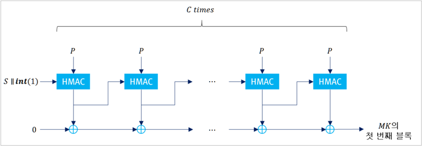

## 질문

- ∎ PBKDF  알고리즘을  사용해  키를  생성할  경우  주의사항은  무엇인가?

## 답변

-  PBKDF는  패스워드,  솔트,  반복  횟수,  출력  길이를  입력으로  키를  출력하며  내부  입력  변수에  대한  제약은  다음과  같다.
-  반복횟수의  경우  1,000회  이상  사용이  필수이지만  알고리즘이  동작하는  환경에서  허용  가능한  최대한  많은  반복횟수를 사용할 것을 권고한다. 솔트는 전체 또는 일부가 난수발생기로 생성되어야 하며, 난수발생기로 생성된 부분의 길이는 128비트 이상이어야 한다.
-  PBKDF는  다양한  입력값을  사용하고  있지만  현실적인  제약사항으로  인해  암호학적인  충분한  보안강도를  가질  수  없기 때문에  생성된  키의  사용처를  키  암호화  키(KEK)로만  한정한다.  (예:  패스워드를  이용한  인증서  개인키  암호화  등)
-  PBKDF  사용하여  인증메커니즘을  구현한  경우에는  별도의  요구사항을  따른다.

| 분류   | PRF   | 패스워드 최소 길이   | 솔트 최소 길이   | 반복횟수   | 출력길이   |
|--------|-------|----------------------|------------------|------------|------------|
| 필수   | HMAC  | 9자리                | 128비트          | 1,000회    | -          |
| 권고   | HMAC  | 10자리               | 256비트          | 100,000회  | -          |

## C.5  양자내성  암호를  활용한  하이브리드  방식

| 해당 보안수준 (Applicable Levels)   | 해당 보안수준 (Applicable Levels)   | ∎ 1, 2, 3, 4                                              |
|-------------------------------------|-------------------------------------|-----------------------------------------------------------|
| 관련 키워드 (Keywords)              | 관련 키워드 (Keywords)              | ∎ 양자내성 암호 ∎ 하이브리드 키 설정, 하이브리드 전자서명 |
| 최초 작성일                         | 2025년 12월 5일                     | 최종 수정일 2025년 12월 5일                               |

## 배경

- ∎ 국내  범국가  양자내성  암호  전환  촉진  관련,  양자내성  암호  활용을  위한  구체적  방안에  대한  논의가  진행  중임
- ∎ 이에 대해 암호모듈 검증제도는 양자내성 암호를 선제적으로 적용·활용할 수 있도록 양자내성 암호와 현용 암호를 결합하여 운용하는 하이브리드 방식에 대한 검증을 추가함

## 질문

- ∎ 양자내성  암호알고리즘을  활용한  (키  설정/전자서명)  하이브리드  방식은  어떻게  구현되어야  하는가?

## 답변

-  암호모듈 검증제도의 하이브리드 방식에 대한 검증은, 기존의 검증대상 암호알고리즘(키 설정 또는 전자서명)과 양자내성 암호알고리즘(이하  PQC)을  조합하는  방식이  요구사항에  따라  올바르게  설계·구현되었는지  확인하는  것이다.
-  PQC가 검증대상 동작모드에서 동작할 경우, PQC는 반드시 비보안 알고리즘(Non-security relevant algorithm), 비보안 기능(Non-Security  relevant  function)  또는  비보안  구성요소(Non-security  relevant  component)로  분류  및  구현 되어야  하며  암호모듈에  어떠한  보안성도  제공하지  않는다.
-  하이브리드  키  설정/전자서명  서비스를  구현하기  위해  필요한  경우에만  관련  암호알고리즘을 비보안 알고리즘/기능/구성 요소로 구현하는 것이 허용되며, 이를 다른 암호알고리즘에 확대 적용할 수 없다. 벤더는 비보안 알고리즘/기능/구성요소로 분류된  암호알고리즘이  하이브리드  키  설정/전자서명  서비스의  필수적인  요소임을  설명해야  하며,  특히  개별  서비스로 구현된  경우에는  개별  서비스  제공  필요성을  반드시  소명해야  한다.
-  비보안  알고리즘/기능/구성요소는  [KS  X  ISO/IEC  24759]  AS02.10에  따라  암호모듈의  검증대상  동작을  방해하거나 손상시키지 않는  방법으로  구현되어야  하며,  벤더  및  시험기관은  아래의  사항을  고려해야  한다.
- ∘ 벤더는 검증대상 동작모드에 사용된 PQC를 비보안 관련 목록에 작성하고, 암호모듈의 검증대상 동작모드를 방해하거나 손상시키지  않음을  증명해야  한다.
- ∘ 암호모듈에서 PQC로 생성된 결과값은 보안성을 갖지 못하므로, 검증대상 암호알고리즘과 PQC의 조합으로 생성된 결과값의  안전성은  기존  검증대상  암호알고리즘의  안전성  판단기준에  따라  평가된다.
- ∘ 암호모듈이 PQC 동작만을  수행하는 개별 서비스를  제공할 경우,  다음과  같은  문구를  보안정책서에  명시해야  한다.
-  예)  하이브리드  키  설정  방식을  구현한  경우

이 암호모듈에 탑재된 비보안 알고리즘/기능/구성요소인 [PQC-KEM 알고리즘 명칭]은 어떠한 보안성도 제공하지 않으므로,  단독으로  보안  관련  서비스로  활용될  수  없다.  따라서  아래의  서비스는  하이브리드  방식으로의  동작을 위한 목적으로만 사용되어야 한다. 그 외 다른 목적으로 아래 서비스를 사용하여 발생하는 모든 책임은 사용자에게 있다.

사용자는  아래  비보안  서비스로  설정된  키를  검증대상  암호알고리즘의  키로  사용하면  안된다.

## 하이브리드  키  설정  관련  서비스  목록

PQ\_KEM\_keygen,  PQ\_KEM\_encap,  PQ\_KEM\_decap,

-  암호모듈에  구현  가능한  하이브리드  방식에  대해서는  특별한  제한사항을  두지  않는다.  벤더는  [NIST  SP800-227], [ETSI  TS  103  744]에  명시된  방식  또는  자체  방식을  설계·구현할  수 있다. 자체  방식으로 하이브리드를 구현한 경우, 해당 방식이 기존 검증대상 암호알고리즘으로부터 제공되는 안전성을 저해하거나 영향을 미치지 않음을 입증해야 한다.
-  하이브리드  키  설정  방식의  구현  예시는  다음과  같다.
- ①  운영주체는  암호모듈의  비보안  서비스(PQC-KEM)을  사용하여  K\_PQ와  부가정보(Optional)를  획득한다.
- ② 운영주체는 암호모듈의 검증대상 하이브리드 키 설정 서비스를 요청한다. 이 때, K\_PQ와 부가정보를 하이브리드 키  설정  서비스의  추가  정보로  입력한다.
- ③ 암호모듈은 하이브리드 키 설정 서비스의 일련의 절차를 진행하는 과정에서 검증대상 키 설정 알고리즘(DH/ECDH)를 사용하여  공유  비밀값  K\_T를  생성한다.
- ④  암호모듈은  K\_T와  K\_PQ를  연접하여  새로운  공유  비밀값  K\_Z를  구성한다.
- ⑤  암호모듈은  K\_Z와  부가정보를  입력으로  키  유도  절차를  거쳐  공유키  K\_Hybrid를  생성한다.
-  키  유도  절차는  다음의  방식을  사용하거나,  [D.2  검증대상  SSP  생성방법]을  참고하여  구현할  수  있다.
- ∘ NIST  SP800-56C  Rev.2의  One-step/Two-step  방식

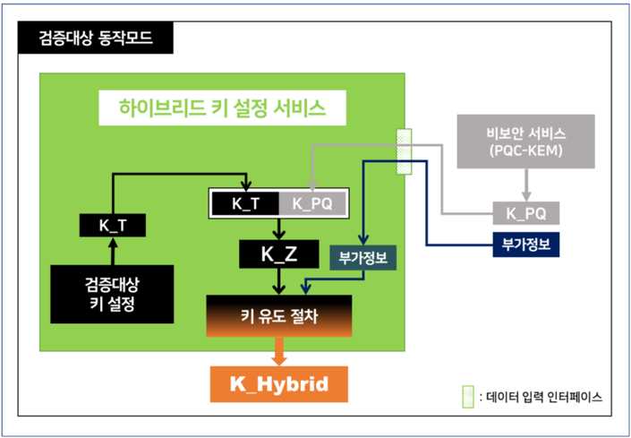

| 공통                     | ⦁ One-Step H 함수 또는 Two-Step MAC 함수를 검증대상 MAC으로 구성할 경우, 공유 비밀값 K_Z는 MAC 함수의 메시지로 사용되어야 한다.                                                                                                                                                                                                                                                                                                                                                                                    |
|--------------------------|--------------------------------------------------------------------------------------------------------------------------------------------------------------------------------------------------------------------------------------------------------------------------------------------------------------------------------------------------------------------------------------------------------------------------------------------------------------------------------------------------------------------|
| SP800-56C Rev.2 One-Step | ⦁ H 함수는 검증대상 해시 또는 검증대상 HMAC으로 구성해야 한다.                                                                                                                                                                                                                                                                                                                                                                                                                                                     |
| SP800-56C Rev.2 Two-Step | ⦁ MAC 함수는 검증대상 HMAC 또는 검증대상 CMAC으로 구성해야 한다. ⦁ KDF 함수는 검증대상 KBKDF로 구성해야 한다. ⦁ MAC 함수를 CMAC으로 구성할 경우 HIGHT 기반 CMAC은 사용할 수 없다. ※ HIGHT 출력 크기에 따른 K DK 안전성 부족 ⦁ MAC 함수와 KDF 함수는 동일한 PRF를 사용해야 한다. ※ CMAC을 사용할 경우, KDF 함수는 128비트 키 길이를 갖는 PRF가 사용된다. 예) MAC 함수: CMAC_ARIA-256 사용, KDF 함수: CMAC_ARIA-128 사용 ⦁ MAC 함수의 출력값인 K DK 는 절단(truncate)없이 모두 KDF 함수의 키 값으로 사용되어야 한다. |

- ∘ RFC  5869의  HKDF  방식
- ⦁ HMAC  함수는  검증대상  HMAC으로  구성해야  한다.
- ⦁ Extract  단계에서  공유  비밀값  K\_Z는  HMAC  함수의  메시지로  사용되어야  한다.
- ⦁ Extract  단계의  출력값  PRK는  Expand  단계에서  HMAC  함수의  키  값으로 사용되어야  한다.

## RFC  5869 HKDF

-  하이브리드  전자서명  방식의  구현  예시는  다음과  같다.

| 연접 서명 (Concatenated Signature)   | 서명 생성                                                                                                                                                               |
|--------------------------------------|-------------------------------------------------------------------------------------------------------------------------------------------------------------------------|
| 연접 서명 (Concatenated Signature)   |                    such that             and                     |
| 연접 서명 (Concatenated Signature)   | 서명 검증                                                                                                                                                               |
| 연접 서명 (Concatenated Signature)   |                      ∧                                                |
| 중첩 서명 (Nested Signature)         | 서명 생성                                                                                                                                                               |
| 중첩 서명 (Nested Signature)         |                  such that             and                |
| 중첩 서명 (Nested Signature)         | 서명 검증                                                                                                                                                               |
| 중첩 서명 (Nested Signature)         |                  ∧                                                       |

(

 :  Post  Quantum  Digital  Signature,  :  Traditional  Digital  Signature,  :  Hybrid  Signature)

-  서명 조합 기능 구현 시, 현용 검증대상 전자서명 알고리즘의 메시지(서명 대상)에 무결성 및 부인방지를 보장하고자 하는 대상이  반드시  모두  포함되도록  구성해야  한다.

GVI Part  1

Guide  for Vendor Implementations

## 16장  부속서  D 검증대상  중요보안매개변수  생성  및 설정  방법

## D.1  자동화된  SSP  설정  방법 D.2  검증대상  SSP  생성방법

## D.1  자동화된  SSP  설정  방법

| 해당 보안수준 (Applicable Levels)   | 해당 보안수준 (Applicable Levels)   | ∎ 1, 2, 3, 4            | ∎ 1, 2, 3, 4            | ∎ 1, 2, 3, 4            |
|-------------------------------------|-------------------------------------|-------------------------|-------------------------|-------------------------|
| 관련 키워드 (Keywords)              | 관련 키워드 (Keywords)              | ∎ 키 합의/전송 프로토콜 | ∎ 키 합의/전송 프로토콜 | ∎ 키 합의/전송 프로토콜 |
| 최초 작성일                         | 2022년 5월 17일                     | 2022년 5월 17일         | 최종 수정일             | 2024년 11월 18일        |

## 배경

- ∎ KCMVP 제도에서는 중요보안매개변수 설정을 위해서 자동화된 SSP 전송이나 SSP 합의 방법, 수동 SSP 주입/출력이 직접  또는  전자적  방법으로  가능하다고  명세하고  있다.
- ∘ [KS  X  ISO/IEC  24759]  AS  09.10  자동화된  SSP  설정은  부속서  D에  정의된  방법을  사용
- ∘ [KS  X  ISO/IEC  19790]  부속서  D:  검증기관이  별도로  지정하는  방법으로  SSP  생성  및  설정을  수행
- ∎ 현재  검증기준에서는  별도의  방법이  안내되고  있지  않다.

## 질문

- ∎ 검증대상  동작모드에서  사용할  수  있는  자동화된  SSP  설정  방법은  무엇인가?

## 답변

- ∎ 자동화된 SSP 설정은 둘 혹은 그 이상의 객체 간에 비밀 키 요소를 안전하게 공유하는 과정으로 본 항목에 명시된 설정 방법을  검증대상  동작모드에서  사용할  수  있다.
- ∘ 부속서  D가  공개되는  시점까지는  아래의  방법들을  검증대상  동작모드에서  사용  가능함
- ∎ 검증대상  동작모드에서  사용할  수  있는  자동화된  SSP  설정  방법은  다음과  같다.
- ∘ 키  합의(Key  agreement)
-  키  합의는  둘  혹은  그  이상인  참가자들의  정보에  대한  함수  값으로  키  요소가  만들어지며,  어떤  참여자도  다른 참여자의  도움없이  키  요소를  독립적으로  생성할  수  없음
- ∘ 키  전송(Key  Transport)
-  키  전송은  한  명의  참여자(송신자)가  비밀키  또는  키  요소를  다른  참여자(수신자)에게  안전하게  전달하는  과정
- ∎ 검증대상 키 합의 기법(KAS), 키 전송 기법(KTS)은 현재 선정되어 있지 않지만, 아래 표준에 정의된 메커니즘을 준용하는 경우  검증대상  동작모드에서  사용  가능하다.
- ∘ ISO/IEC  11770-2  Key  management  Part2:  Mechanisms  using  symmetric  techniques  (Point-to-Point)
- ∘ ISO/IEC  11770-3  Key  management  Part3:  Mechanisms  using  asymmetric  techniques
- ※  ISO/IEC  표준에  정의된  메커니즘의  프리미티브는  검증대상  암호알고리즘만  사용할  수  있음

## D.2  검증대상  SSP  생성방법

| 해당 보안수준 (Applicable Levels)   | 해당 보안수준 (Applicable Levels)   | ∎ 1, 2, 3, 4                             | ∎ 1, 2, 3, 4                             |
|-------------------------------------|-------------------------------------|------------------------------------------|------------------------------------------|
| 관련 키워드 (Keywords)              | 관련 키워드 (Keywords)              | ∎ SSP 생성, 검증대상 난수발생기, 키 유도 | ∎ SSP 생성, 검증대상 난수발생기, 키 유도 |
| 최초 작성일                         | 2022년 5월 17일                     | 최종 수정일                              | 2024년 11월 18일                         |

## 배경

- ∎ 키 생성은 다양한 입력 소스로부터 암호학적 키를 안전하게 도출하는 과정으로, 암호모듈은 AS09.09 요구사항에 따라 검증대상 난수발생기를 이용하거나 다른 SSP로부터 유도할 수 있으며 검증대상 SSP 생성방법은 부속서 D로 제공된다.

## 질문

- ∎ 보안 요구사항은 검증대상 난수발생기를 '이용'하여 모듈 내부에서 생성할 것을 명시하고 있다. 이 때, 검증대상 난수발생기 출력을  가공한  결과를  SSP로  사용하는  것이  가능한가?
- ∎ 암호모듈에 주입된 SSP로부터 '유도'하여 SSP를 생성하는 것이 가능한데, 검증대상 동작모드에서 사용 가능한 SSP 유도 방법은  무엇인가?

## 답변

-  검증대상 난수발생기를 이용하여 SSP를 생성하는 경우 별도의 가공없이 난수발생기 출력을 직접 SSP로 사용 해야 한다. 예를 들어, ARIA-128의  키를  생성하기  위해  난수발생기가  사용되는  경우  난수발생기가  128비트를  출력하도록 설정  후 128비트의  난수발생기  출력을  키로  직접  사용해야  한다.
-  공개키  암호의  경우,  해당  공개키  암호알고리즘의  표준  또는  암호모듈/암호알고리즘  구현안내서의  요구사항을  준수하여 SSP를  생성해야 한다.  SSP를 생성하는 과정에서 난수가 사용된다면 그 값들은 '검증대상 SSP 생성방법'에 따라 생성 되어야  한다.
- 예)  RSA-PSS  알고리즘의  키  생성과정에서  소수  생성을  위해  9.1장에  정의된  방법  중  선택적으로  사용  가능하며  p,  q, p1,  p2,  q1,  q2  등  생성  시  난수가  사용된다면  해당  난수는  난수발생기  출력을  직접  사용해야  한다.
-  모듈에  주입된 SSP로 부터 유도된 SSP를 생성하는 경우에는 검증대상 키 유도함수(PBKDF, KBKDF)를 포함하여 해시 함수, 블록암호, 메시지 인증코드 등 업체가 정의한 다양한 방법을 적용하여 검증대상 동작모드에서 사용할 수 있다. 이 때, 다음의  요구사항을  반드시  충족해야  한다.
-  주입된  SSP와  유도된  SSP의  성질은  기본적으로  반드시  동일해야  한다.
*  입력된  CSP로부터  유도된  SSP는  CSP로  사용될  수  있으나,  PSP로부터  유도된  SSP는  CSP로  사용할  수  없다. 다만,  CSP로부터  유도된  SSP는  PSP로  사용될  수  있으나  이  경우  유도된  PSP로부터  기존  CSP에  대한  정보가 노출되지  않도록  안전한  방법이  사용되어야  하며,  벤더는  시험기관에게  안전성을  입증해야  한다.
-  암호학적 키를 요구하는 검증대상 암호알고리즘을 유도함수로 사용하는 경우, 주입된 SSP가 SSP 유도를 위한 목적의 CSP인  경우에만  검증대상  암호알고리즘의  키  값으로  사용할  수  있다.
*  그  외의  모든  경우  입력된  SSP는  검증대상  암호알고리즘의  메시지  또는  메시지의  일부로  사용되어야  한다.
- 이  때,  검증대상  암호알고리즘의  키  값은  암호모듈을  통해  직접  설정하거나  난수발생기를  통해  생성되어야  한다.
-  검증대상  암호알고리즘의 출력 길이를 초과하는 길이의 SSP를 유도하기 위해 검증대상 암호알고리즘이 반복 호출될 경우,  매  호출  시마다  입력되는  메시지  값은  유일해야  한다.
-  임의  길이의 SSP를 유도하기 위한 (검증대상 암호알고리즘을 활용하는) 유도 메커니즘 출력값의 연접 및 축약은 허용된다. 그러나,  XOR  등  출력값  간의  연산은  사용할  수  없다.
-  모듈에  주입된  SSP를  직접  암호알고리즘의  키로  사용하는  경우에는  키  주입/출력  관련  항목의  요구사항을  따른다.

GVI Part  1

Guide  for Vendor Implementations

## 17장  부속서  E 검증대상  인증메커니즘

GVI Part  1

Guide  for Vendor Implementations

## 18장  부속서  F 검증대상  비침투  공격  완화  방법

GVI Part  1

Guide  for Vendor Implementations

## 참고문헌

## [참고문헌]

- [1]  KS  X  ISO/IEC  19790:2015,  정보기술-보안기술-암호모듈  보안  요구사항
- [2]  KS  X  ISO/IEC  24759:2015,  정보기술-보안기술-암호모듈  시험  요구사항
- [3]  ISO/IEC  19790:2012,  Information  technology  -  Security  techniques  -  Security  requirements  for cryptographic  modules
- [4]  ISO/IEC  24759:2014,  Information  technology  -  Security  techniques  -  Test  requirements  for  cryptographic modules
- [5]  FIPS  186-4,  Digital  Signature  Standard(DSS)
- [6]  FIPS  186-5(Draft),  Digital  Signature  Standard(DSS)
- [7]  FIPS  140-2  IG,  Implementation  Guidance  for  FIPS  140-2  and  the  Cryptographic  Module  Validation Program
- [8]  FIPS  140-3  IG,  Implementation  Guidance  for  FIPS  140-3  and  the  Cryptographic  Module  Validation Program
- [9]  ANSI  X9.80-2020,  Prime  Number  Generation,  Primality  Testing,  and  Primality  Certificates
- [10]  TTAK.KO-12.0235/R2,  운영체제별  잡음원  수집  및  응용  지침
- [11]  TTAK.KO-12.0341/R1,  소프트웨어  암호모듈에  사용되는  잡음원  시험평가  지침
- [12]  NIST  SP800-38D,  Recommendation  for  Block  Cipher  Modes  of  Operation:  Galois/Counter  Mode(GCM) and  GMAC
- [13]  FIPS  202,  SHA-3  Standard:  Permutation-Based  Hash  and  Extendable-Output  Functions
- [14]  NIST  SP800-185,  SHA-3  Derived  Functions:  cSHAKE,  KMAC,  TupleHash,  and  ParallelHash
- [15]  TTAK.KO-12.0271-Part1/R1,  n비트  블록  암호  운영  모드-제1부  일반
- [16]  ISO/IEC  9797-1:2011,  Information  technology  -  Security  techniques  -  Message  Authentication Codes(MACs)  -  Part1:  Mechanisms  using  a  block  cipher
- [17]  ISO/IEC  9797-2:2021,  Information  technology  -  Security  techniques  -  Message  Authentication Codes(MACs)  -  Part2:  Mechanisms  using  a  dedicated  hash-function
- [18]  ISO/IEC  11770-2:2018,  IT  Security  techniques  -  Key  management  -  Part2:  Mechanisms  using symmetric  techniques
- [19]  ISO/IEC  11770-3:2021,  Information  security  -  Key  management  -  Part3:  Mechanisms  using  asymmetric techniques
- [20]  ISO/IEC  11770-4:2017/AMD2:2021,  Information  technology  -  Security  techniques  -  Key  management  Part4:  Mechanisms  based  weak  secrets  -  Amendment2:  Leakage-resilient  password-authenticated  key agreement  with  additional  stored  secrets
- [21]  ISO/IEC  11770-5:2020,  Information  security  -  Key  management  -  Part5:  Group  key  management
- [22]  ISO/IEC  11770-6:2016,  Information  technology  -  Security  techniques  -  Key  management  -  Part6:  Key derivation

## 암호모듈  구현안내서

## Part  1  시험  및  구현  사례별  해설서 GVI 2025.12

